# Laporan Praktikum Jaringan Komputer

## Modul 4: Analisis dan Tracing DNS Menggunakan Wireshark

## 1. Tujuan Praktikum

* Memahami cara kerja Domain Name System (DNS).
* Menganalisis paket DNS menggunakan Wireshark.
* Memahami penggunaan perintah `nslookup` dan `ipconfig`.
* Mengidentifikasi proses DNS request dan DNS response pada jaringan komputer.

---

## 2. Alat dan Bahan

* Wireshark
* Command Prompt / Terminal
* Web Browser
* Koneksi Internet

---

## 3. Langkah Percobaan

## 3.1 Pengantar DNS

DNS atau **Domain Name System** adalah layanan yang berfungsi menerjemahkan nama domain menjadi alamat IP. Dengan DNS, pengguna cukup mengetikkan nama domain seperti `www.mit.edu` atau `www.ietf.org`, lalu komputer akan meminta alamat IP domain tersebut ke DNS server.

Secara umum, alur kerja DNS adalah sebagai berikut:

1. Client mengakses nama domain.
2. Client memeriksa cache DNS lokal.
3. Jika tidak tersedia di cache, client mengirim DNS query ke DNS server.
4. DNS server mengembalikan DNS response.
5. Client memakai IP hasil DNS untuk membuat koneksi ke server tujuan.

---

## 3.2 Nslookup

`nslookup` digunakan untuk melakukan query DNS secara manual melalui Command Prompt. Sintaks umum perintahnya adalah:

```bash
nslookup [option] [host-to-find] [dns-server]
```

Jika DNS server tidak ditentukan, maka query akan dikirim ke DNS server default milik komputer.

---

### 3.2.1 Percobaan Dasar Nslookup

#### 1. Query alamat IP `www.mit.edu`

Perintah:

```bash
nslookup www.mit.edu
```


**Hasil dan analisis:**

Perintah `nslookup www.mit.edu` digunakan untuk mencari alamat IP dari domain `www.mit.edu`. Berdasarkan screenshot, DNS server yang digunakan adalah server default pada host. Hasil query menunjukkan bahwa domain `www.mit.edu` memiliki beberapa alamat IP, yaitu alamat IPv4 dan IPv6.

Adanya lebih dari satu IP menunjukkan bahwa domain tersebut dapat menggunakan beberapa server atau mekanisme distribusi beban.

---

#### 2. Query DNS otoritatif domain `mit.edu`

Perintah:

```bash
nslookup -type=NS mit.edu
```


**Hasil dan analisis:**

Perintah `-type=NS` digunakan untuk meminta record **Name Server**. Dari hasil screenshot, domain `mit.edu` memiliki beberapa name server, seperti:

```text
ns1-173.akam.net
use5.akam.net
usw2.akam.net
asia2.akam.net
ns1-37.akam.net
use2.akam.net
use5.akam.net
asia1.akam.net
```

Jawaban bersifat **Non-authoritative answer**, artinya response berasal dari cache DNS resolver, bukan langsung dari authoritative DNS server MIT.

---

#### 3. Query menggunakan DNS server tertentu

Perintah:

```bash
nslookup www.aiit.or.kr bitsy.mit.edu
```


**Hasil dan analisis:**

Pada percobaan ini, query diarahkan ke DNS server `bitsy.mit.edu`, bukan ke DNS server default. Berdasarkan screenshot, request mengalami timeout dan hasil akhirnya menunjukkan bahwa query ditolak atau tidak mendapatkan jawaban yang diharapkan. Hal ini dapat terjadi karena server DNS tujuan tidak mengizinkan recursive query dari jaringan luar.

---

### 3.2.2 Percobaan Mandiri Nslookup

#### 1. Mendapatkan IP server web di Asia

Perintah yang digunakan:

```bash
nslookup www.u-tokyo.ac.jp
```

Pada praktikum ini, server web Asia yang digunakan adalah domain Universitas Tokyo, yaitu `www.u-tokyo.ac.jp`. Query ini mencari record A/AAAA dari domain tersebut.

---

#### 2. Mencari DNS otoritatif universitas di Eropa

Perintah yang digunakan:

```bash
nslookup -type=NS kth.se
```

Record NS digunakan untuk mengetahui DNS server yang bertanggung jawab terhadap domain universitas di Eropa.

---

#### 3. Mencari mail server Yahoo

Perintah yang digunakan:

```bash
nslookup -type=MX yahoo.com
```

Record MX digunakan untuk mencari mail exchanger yang menerima email untuk domain Yahoo.

---

## 3.3 Ipconfig

`ipconfig` digunakan untuk melihat konfigurasi jaringan pada Windows. Pada praktikum DNS, perintah ini penting untuk mengetahui alamat IP host, gateway, DNS server, dan cache DNS.

---

### 3.3.1 Menampilkan informasi TCP/IP

Perintah:

```bash
ipconfig /all
```


**Hasil dan analisis:**

Dari hasil `ipconfig /all`, terlihat beberapa adapter jaringan pada komputer. Informasi yang paling penting untuk praktikum DNS adalah:

```text
IPv6 Address      : 2001:4489:50e:102::2
Temporary IPv6    : 2001:4489:c0f0:6ed5:9b3:75f9:ae87:d7e9
IPv4 Address      : 192.168.35.50
Default Gateway   : 192.168.35.1
DNS Servers       : 2001:4489:50e:102::2
                    202.180.2.1
```

Informasi DNS server ini digunakan untuk dibandingkan dengan IP tujuan pada paket DNS di Wireshark.

---

### 3.3.2 Menampilkan cache DNS

Perintah:

```bash
ipconfig /displaydns
```


**Hasil dan analisis:**

Perintah `ipconfig /displaydns` menampilkan cache DNS yang tersimpan pada host. Pada screenshot terlihat beberapa domain beserta record, TTL, section, dan alamat IP hasil resolusi.

Cache DNS membantu mempercepat proses akses domain karena host tidak perlu selalu mengirim query DNS baru jika record masih valid.

---

### 3.3.3 Menghapus cache DNS

Perintah:

```bash
ipconfig /flushdns
```


**Hasil dan analisis:**

Perintah `ipconfig /flushdns` berhasil menghapus DNS resolver cache. Setelah cache dikosongkan, komputer akan mengirim DNS query baru saat mengakses domain.

Langkah ini penting sebelum melakukan capture Wireshark agar paket DNS yang muncul benar-benar berasal dari aktivitas pengujian.

---

## 3.4 Tracing DNS Menggunakan Wireshark

Bagian ini menganalisis paket DNS yang dihasilkan ketika mengakses website dan menjalankan perintah `nslookup`.

---

### 3.4.1 Capture DNS saat mengakses `http://www.ietf.org`

Langkah praktikum:

1. Menghapus cache DNS dengan `ipconfig /flushdns`.
2. Membuka browser dan membersihkan cache browser.
3. Membuka Wireshark.
4. Menggunakan filter berdasarkan alamat IP host.
5. Mengakses `http://www.ietf.org`.
6. Menghentikan capture.
7. Menggunakan display filter `dns`.


#### Pertanyaan 1: Apakah pesan DNS dikirim melalui UDP atau TCP?


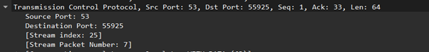

**Jawaban:**

Paket DNS dikirim menggunakan **UDP**. Pada detail paket Wireshark terlihat protokol **User Datagram Protocol** dengan port tujuan DNS.

---

#### Pertanyaan 2: Apa port tujuan request DNS dan port sumber response DNS?

**Jawaban:**

Port tujuan pada DNS request adalah:

```text
53
```

Port sumber pada DNS response adalah:

```text
53
```

Port 53 adalah port standar untuk layanan DNS.

---

#### Pertanyaan 3: Apa IP tujuan request DNS dan apakah sama dengan DNS lokal?

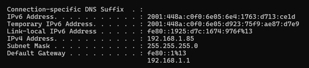

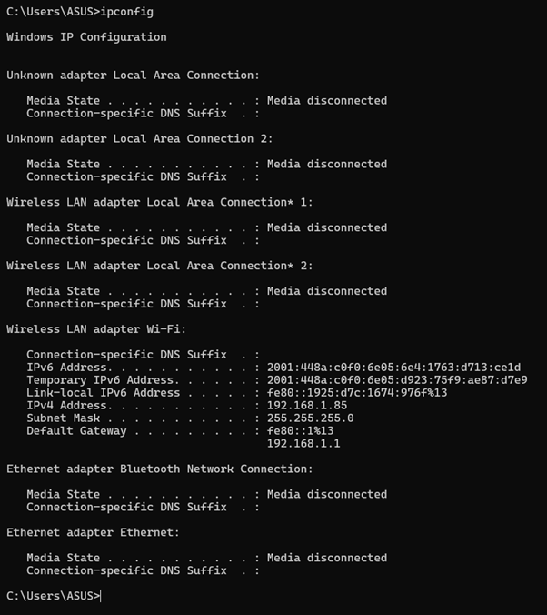


**Jawaban:**

Berdasarkan hasil `ipconfig`, DNS server lokal yang digunakan adalah:

```text
2001:4489:50e:102::2
202.180.2.1
```

Pada capture Wireshark, request DNS dikirim menuju DNS server tersebut. Jadi, alamat tujuan request DNS sesuai dengan DNS server lokal/default yang digunakan komputer.

---

#### Pertanyaan 4: Apa type DNS request dan apakah request memiliki answer?


**Jawaban:**

Type request yang terlihat adalah:

```text
A
```

Request DNS tidak memiliki answer karena paket request hanya berisi pertanyaan/query dari client ke DNS server.

---

#### Pertanyaan 5: Berapa answer pada DNS response dan apa isinya?


**Jawaban:**

DNS response untuk `www.ietf.org` memiliki **2 answer**, yaitu:

```text
www.ietf.org A 104.16.45.99
www.ietf.org A 104.16.44.99
```

Kedua alamat IP tersebut adalah hasil resolusi domain `www.ietf.org`.

---

#### Pertanyaan 6: Apakah IP pada TCP SYN sama dengan IP hasil DNS response?

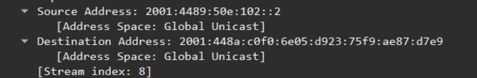

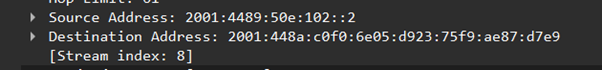

**Jawaban:**

Paket setelah DNS menggunakan alamat IP tujuan yang sesuai dengan hasil DNS response. Artinya, setelah host memperoleh IP dari DNS, host menggunakan IP tersebut untuk membuat koneksi ke server tujuan.

---

#### Pertanyaan 7: Apakah host mengirim DNS request baru untuk setiap gambar?

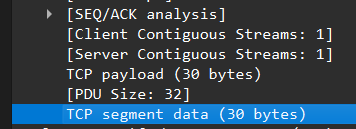

**Jawaban:**

Tidak selalu. Jika gambar masih berasal dari domain yang sama dan record DNS masih ada di cache, host tidak perlu mengirim DNS request baru. DNS request baru hanya diperlukan jika browser mengakses domain lain atau record DNS belum ada di cache.

---

### 3.4.2 Tracing DNS `nslookup www.mit.edu`

Perintah:

```bash
nslookup www.mit.edu
```


#### Pertanyaan 1: Apa port tujuan request DNS dan port sumber response DNS?

**Jawaban:**

Port tujuan request DNS adalah **53**, sedangkan port sumber response DNS juga **53**.

---

#### Pertanyaan 2: Ke IP mana request DNS dikirim?

**Jawaban:**

Request dikirim ke DNS server default/lokal yang digunakan host, yaitu DNS server yang muncul pada hasil `ipconfig /all`.

---

#### Pertanyaan 3: Apa type query dan apakah request memiliki answer?

**Jawaban:**

Query untuk `www.mit.edu` menggunakan record **A** dan/atau **AAAA**. Paket request tidak memiliki answer karena hanya berisi query.

---

#### Pertanyaan 4: Berapa answer pada response dan apa isinya?

**Jawaban:**

Response berisi alamat IP dari domain `www.mit.edu`. Pada output `nslookup`, domain tersebut mengembalikan beberapa alamat IPv4 dan IPv6.

---

#### Screenshot pendukung


---

### 3.4.3 Tracing DNS `nslookup -type=NS mit.edu`

Perintah:

```bash
nslookup -type=NS mit.edu
```

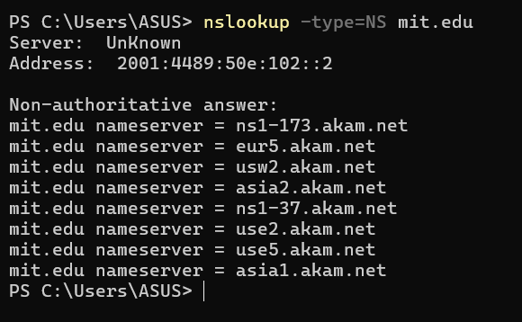

#### Pertanyaan 1: Ke IP mana request DNS dikirim?

**Jawaban:**

Request dikirim ke DNS server default/lokal. Karena perintah tidak menentukan DNS server tertentu, host menggunakan DNS server yang aktif pada konfigurasi jaringan.

---

#### Pertanyaan 2: Apa type query dan apakah request memiliki answer?


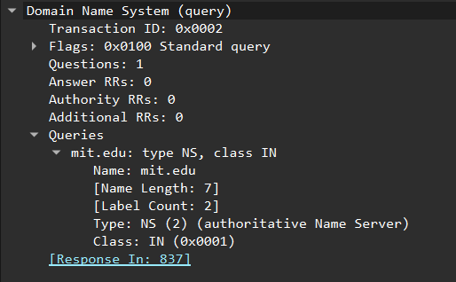

**Jawaban:**

Type query adalah:

```text
NS
```

Request tidak memiliki answer karena request hanya meminta informasi name server untuk domain `mit.edu`.

---

#### Pertanyaan 3: Apa nama server MIT yang diberikan dan apakah ada alamat IP?

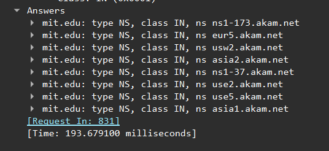


**Jawaban:**

Response memberikan beberapa name server untuk `mit.edu`, antara lain:

```text
ns1-173.akam.net
use5.akam.net
usw2.akam.net
asia2.akam.net
ns1-37.akam.net
use2.akam.net
asia1.akam.net
```

Pada response Wireshark terlihat record NS. Alamat IP untuk server dapat muncul sebagai additional record jika DNS server menyertakannya.

---

#### Screenshot pendukung


---

### 3.4.4 Tracing DNS `nslookup www.aiit.or.kr bitsy.mit.edu`

Perintah:

```bash
nslookup www.aiit.or.kr bitsy.mit.edu
```

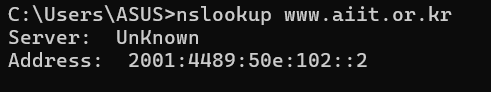

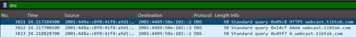

#### Pertanyaan 1: Ke IP mana request DNS dikirim dan apakah default DNS lokal?

**Jawaban:**

Request diarahkan ke DNS server yang ditentukan pada perintah, yaitu `bitsy.mit.edu`. Karena DNS server ditentukan secara manual, request tidak dikirim ke DNS server lokal/default.

---

#### Pertanyaan 2: Apa type query dan apakah request memiliki answer?

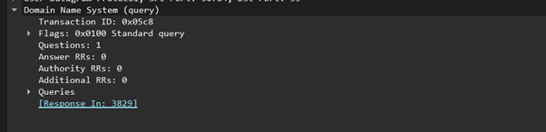

**Jawaban:**

Type query adalah:

```text
A
```

Request tidak memiliki answer karena paket request hanya membawa pertanyaan DNS dari client.

---

#### Pertanyaan 3: Berapa answer pada response dan apa isinya?

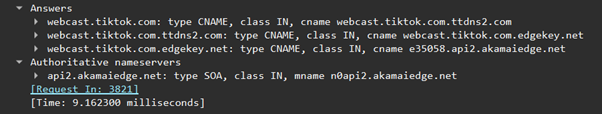

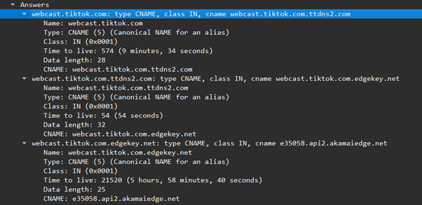

**Jawaban:**

Response berisi beberapa jawaban yang berkaitan dengan `www.aiit.or.kr`, termasuk record CNAME dan alamat IP akhir. Dari detail Wireshark terlihat chain CNAME menuju host CDN, kemudian menghasilkan alamat IP seperti:

```text
www.aiit.or.kr CNAME www-aiit-or-kr.cdn...edgekey.net
... CNAME e3588.a...akamaiedge.net
A 23.63.232.106
```

Artinya, domain `www.aiit.or.kr` diarahkan melalui layanan CDN sebelum menuju alamat IP akhir.

---


## Kesimpulan

Berdasarkan praktikum yang dilakukan, DNS berfungsi menerjemahkan nama domain menjadi alamat IP agar host dapat melakukan koneksi ke server tujuan. Perintah `nslookup` membantu melakukan query DNS secara manual, sedangkan `ipconfig` digunakan untuk melihat konfigurasi jaringan dan mengelola cache DNS.

Dari hasil capture Wireshark, DNS pada praktikum ini menggunakan protokol UDP dengan port 53. Paket request DNS hanya berisi query dan belum memiliki answer, sedangkan paket response berisi jawaban berupa record seperti A, NS, CNAME, atau record lain sesuai jenis permintaan.

Pada akses `www.ietf.org`, response DNS menghasilkan alamat IP yang kemudian digunakan oleh host untuk koneksi berikutnya. Pada percobaan `nslookup -type=NS mit.edu`, response berisi daftar name server domain MIT. Pada percobaan custom DNS, request tidak memakai DNS lokal karena server DNS tujuan ditentukan secara manual.
