# Analisis Protokol DNS Menggunakan Wireshark

# Tujuan Praktikum

Praktikum ini dilakukan untuk memahami cara kerja DNS serta menganalisis proses pertukaran paket DNS menggunakan aplikasi Wireshark. Selain itu, praktikum juga bertujuan untuk mempelajari penggunaan perintah `nslookup`, `ipconfig`, serta melihat bagaimana client melakukan request dan menerima response dari DNS server.

---

# 4.1 Pengantar DNS

DNS atau Domain Name System merupakan layanan yang digunakan untuk menerjemahkan nama domain menjadi alamat IP. Pengguna internet lebih mudah mengingat alamat seperti `www.google.com` dibandingkan alamat IP numerik, sehingga DNS berperan penting sebagai penerjemah antara nama domain dan alamat IP.

Saat user mengakses sebuah website, komputer akan mengirimkan permintaan DNS ke server DNS lokal. Jika alamat domain belum tersedia pada cache, DNS server akan mencari informasi tersebut ke server DNS lainnya hingga menemukan alamat IP yang sesuai.

Secara umum proses DNS berjalan dengan tahapan berikut:

1. User memasukkan nama domain pada browser.
2. Host memeriksa cache DNS lokal.
3. Jika tidak tersedia, host mengirim DNS query.
4. DNS server mencari record yang diminta.
5. DNS server mengirimkan response.
6. Host menggunakan IP hasil DNS untuk membangun koneksi.

---

# 4.2 Nslookup

`nslookup` adalah command line tool yang digunakan untuk melakukan query DNS secara manual. Perintah ini dapat digunakan untuk mencari alamat IP suatu domain, mencari DNS server otoritatif, maupun melihat mail server dari suatu domain.

Format umum perintah:

```bash
nslookup [opsi] [domain] [dns-server]
```

Jika DNS server tidak ditentukan, maka komputer akan memakai DNS server default.

---

## 4.2.1 Percobaan Dasar Nslookup

### 1. Mencari alamat IP dari `www.mit.edu`

```bash
nslookup www.mit.edu
```

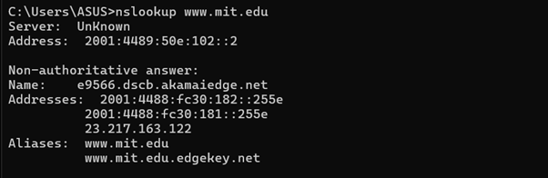

### Analisis

Perintah tersebut digunakan untuk memperoleh alamat IP dari domain `www.mit.edu`. Query DNS dikirim ke DNS server default yang digunakan komputer. Response yang diterima biasanya berisi nama domain beserta alamat IP tujuan.

Jika muncul lebih dari satu alamat IP, hal tersebut menunjukkan bahwa domain menggunakan beberapa server atau memanfaatkan sistem load balancing.

---

### 2. Mencari DNS Server Otoritatif

```bash
nslookup -type=NS mit.edu
```

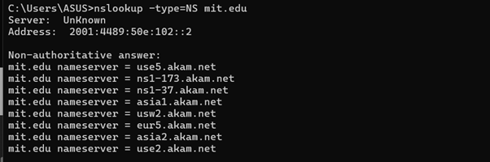

### Analisis

Opsi `-type=NS` dipakai untuk meminta record Name Server. Hasil query menampilkan daftar DNS server yang bertanggung jawab terhadap domain `mit.edu`.

Jika response bertuliskan *Non-authoritative answer*, berarti jawaban berasal dari cache DNS lokal dan bukan langsung dari authoritative server.

---

### 3. Query Menggunakan DNS Server Tertentu

```bash
nslookup www.aiit.or.kr bitsy.mit.edu
```

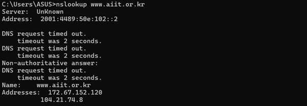

### Analisis

Pada percobaan ini, request DNS dikirim langsung ke server `bitsy.mit.edu`, bukan menggunakan DNS default. Tujuannya untuk melihat bagaimana DNS query dapat dilakukan melalui server tertentu.

Apabila server tujuan tidak menerima recursive query dari luar jaringan, kemungkinan response akan berupa timeout atau request refused.

---

## 4.2.2 Percobaan Mandiri Nslookup

### 1. Mencari Alamat IP Web Server di Asia

```bash
nslookup www.u-tokyo.ac.jp
```

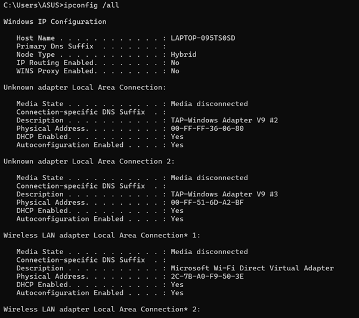

### Hasil

```text
[Isi hasil IP dari praktikum]
```

### Analisis

Domain `www.u-tokyo.ac.jp` digunakan sebagai contoh web server di Asia. Secara default, `nslookup` akan meminta record tipe A untuk mendapatkan alamat IPv4 dari domain tersebut.

---

### 2. Mencari DNS Otoritatif Universitas di Eropa

```bash
nslookup -type=NS kth.se
```

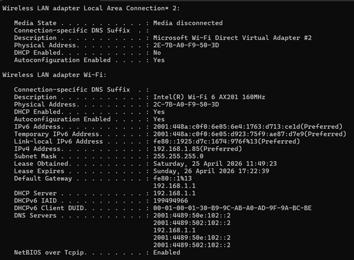

### Hasil

```text
[Isi hasil name server]
```

### Analisis

Record NS menunjukkan server DNS yang memiliki otoritas terhadap domain tertentu. Dari hasil query dapat diketahui server DNS mana saja yang bertanggung jawab terhadap domain `kth.se`.

---

### 3. Mencari Mail Server Yahoo

```bash
nslookup -type=MX yahoo.com
```

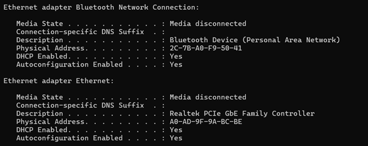

### Hasil

```text
[Isi hasil MX Yahoo]
```

### Analisis

Record MX digunakan untuk mengetahui mail server yang menerima email untuk suatu domain. Pada hasil query biasanya akan muncul beberapa mail exchanger lengkap dengan prioritasnya.

---

# 4.3 Ipconfig

Perintah `ipconfig` digunakan untuk melihat konfigurasi jaringan pada sistem operasi Windows. Informasi yang dapat dilihat antara lain alamat IP, gateway, DNS server, dan status adapter jaringan.

---

## 4.3.1 Menampilkan Informasi TCP/IP

```bash
ipconfig /all
```

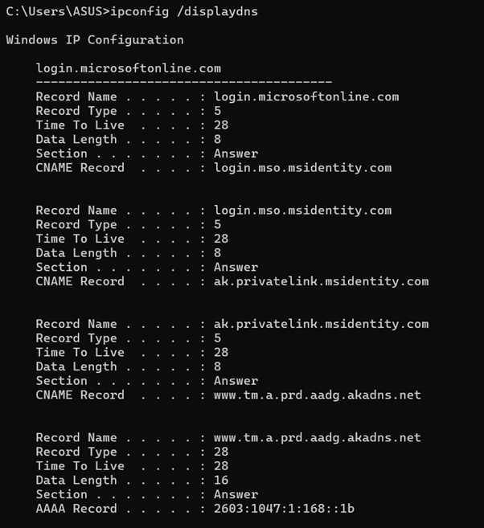

### Analisis

Perintah ini menampilkan detail konfigurasi jaringan komputer secara lengkap. Pada praktikum DNS, informasi yang paling penting adalah alamat IPv4 dan DNS server yang digunakan.

DNS server tersebut nantinya akan dibandingkan dengan alamat tujuan paket DNS pada Wireshark.

---

## 4.3.2 Menampilkan Cache DNS

```bash
ipconfig /displaydns
```

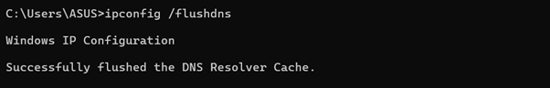

### Analisis

Perintah `displaydns` digunakan untuk melihat cache DNS yang tersimpan di komputer. Cache ini membantu mempercepat akses website karena host tidak perlu selalu mengirim query DNS baru.

Pada output terlihat nama domain, TTL, dan alamat IP hasil resolusi.

---

## 4.3.3 Menghapus Cache DNS

```bash
ipconfig /flushdns
```


### Analisis

Perintah `flushdns` dipakai untuk menghapus seluruh cache DNS pada host. Setelah cache dibersihkan, komputer akan kembali mengirim query DNS baru ketika mengakses domain tertentu.

Langkah ini penting dilakukan sebelum melakukan capture Wireshark.

---

# 4.4 Tracing DNS Menggunakan Wireshark

Pada bagian ini dilakukan analisis paket DNS menggunakan aplikasi Wireshark.

---

## 4.4.1 Capture DNS Saat Mengakses Website

### Langkah Praktikum

1. Menghapus cache DNS.
2. Membuka Wireshark.
3. Menentukan interface jaringan.
4. Menggunakan filter:

```text
ip.addr == [alamat_IP]
```

5. Memulai capture.
6. Mengakses website `http://www.ietf.org`.
7. Menghentikan capture.
8. Menggunakan filter `dns`.

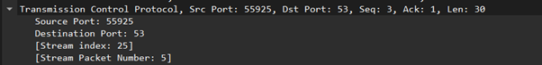

---

## Analisis

### 1. DNS menggunakan UDP atau TCP?

Pada praktikum ini paket DNS dikirim menggunakan protokol UDP.

DNS umumnya memakai UDP karena ukuran paket relatif kecil dan prosesnya lebih cepat dibandingkan TCP.

---

### 2. Port DNS

Port tujuan request DNS:

```text
53
```

Port sumber response DNS:

```text
53
```

### Analisis

DNS server menggunakan port 53 sebagai port standar layanan DNS.

---

### 3. Alamat IP Tujuan DNS

IP tujuan request DNS:

```text
[Isi hasil Wireshark]
```

IP DNS lokal:

```text
[Isi hasil ipconfig]
```

### Analisis

Jika kedua alamat IP sama, berarti komputer mengirim query ke DNS server default.

---

### 4. Type Request DNS

Type query:

```text
A
```

Apakah request memiliki answer?

```text
Tidak
```

### Analisis

Paket request hanya membawa query dari client sehingga bagian answer masih kosong.

---

### 5. Isi DNS Response

Jumlah answer:

```text
[Isi jumlah answer]
```

Isi answer:

```text
[Isi record DNS]
```

### Analisis

Response DNS dapat berisi beberapa record seperti A, AAAA, atau CNAME.

---

### 6. Paket TCP SYN

Apakah IP pada TCP SYN sama dengan hasil DNS response?

```text
[Sesuai / Tidak]
```

### Analisis

Setelah memperoleh alamat IP dari DNS, host akan menggunakan IP tersebut untuk membangun koneksi TCP.

---

### 7. DNS Request untuk Gambar

Apakah host selalu mengirim request DNS baru?

```text
Tidak selalu
```

### Analisis

Jika domain gambar masih sama dan cache DNS masih aktif, host tidak perlu mengirim query DNS ulang.

---

# 4.4.2 Tracing DNS `nslookup www.mit.edu`

```bash
nslookup www.mit.edu
```

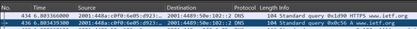

## Analisis

### 1. Port DNS

Request tujuan:

```text
53
```

Response sumber:

```text
53
```

---

### 2. Tujuan Request DNS

```text
[Isi IP DNS]
```

### Analisis

Karena tidak menentukan DNS server tertentu, query dikirim ke DNS default.

---

### 3. Type Query

```text
A / AAAA
```

Apakah request memiliki answer?

```text
Tidak
```

---

### 4. Isi Response

Jumlah answer:

```text
[Isi jumlah answer]
```

Isi response:

```text
[Isi hasil response]
```

### Analisis

Response dapat berisi alamat IP maupun CNAME dari domain tujuan.

---

# 4.4.3 Tracing DNS `nslookup -type=NS mit.edu`

```bash
nslookup -type=NS mit.edu
```

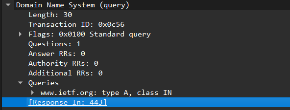

## Analisis

### 1. Tujuan Request DNS

```text
[Isi IP DNS]
```

### Analisis

Request dikirim menuju DNS server default pada komputer.

---

### 2. Type Query

```text
NS
```

Apakah request memiliki answer?

```text
Tidak
```

---

### 3. Hasil Name Server

```text
[Isi daftar NS]
```

### Analisis

Response menampilkan daftar authoritative name server milik domain `mit.edu`.

---

# 4.4.4 Tracing DNS `nslookup www.aiit.or.kr bitsy.mit.edu`

```bash
nslookup www.aiit.or.kr bitsy.mit.edu
```

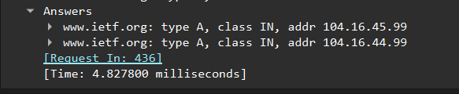

## Analisis

### 1. Tujuan Request DNS

```text
[Isi IP bitsy.mit.edu]
```

### Analisis

Pada percobaan ini query tidak dikirim ke DNS lokal, melainkan langsung ke server yang ditentukan.

---

### 2. Type Query

```text
A
```

Apakah request memiliki answer?

```text
Tidak
```

---

### 3. Isi Response

Jumlah answer:

```text
[Isi jumlah answer]
```

Isi answer:

```text
[Isi record response]
```

### Analisis

Response DNS berisi alamat IP hasil query terhadap domain `www.aiit.or.kr`.

---

# Kesimpulan

Berdasarkan hasil praktikum yang telah dilakukan, dapat diketahui bahwa DNS memiliki fungsi utama untuk menerjemahkan nama domain menjadi alamat IP. Proses DNS dimulai ketika client mengirim request ke DNS server, kemudian server memberikan response berupa record DNS yang sesuai.

Melalui perintah `nslookup`, pengguna dapat melakukan query DNS secara manual untuk mencari alamat IP, mail server, maupun authoritative name server. Sedangkan `ipconfig` digunakan untuk melihat konfigurasi jaringan serta mengelola cache DNS.

Dari hasil capture Wireshark terlihat bahwa DNS umumnya menggunakan protokol UDP dengan port 53. Paket request DNS hanya berisi query, sedangkan paket response membawa answer berupa record DNS seperti A, NS, MX, maupun CNAME.

Dengan adanya DNS, proses akses website menjadi lebih mudah karena pengguna tidak perlu menghafal alamat IP dari setiap server yang ingin diakses.

---

# Daftar Screenshot

| File        | Keterangan                                                     |
| ----------- | -------------------------------------------------------------- |
| asset1.png  | nslookup [www.mit.edu](http://www.mit.edu)                     |
| asset2.png  | nslookup -type=NS mit.edu                                      |
| asset3.png  | nslookup [www.aiit.or.kr](http://www.aiit.or.kr) bitsy.mit.edu |
| asset4.png  | nslookup server Asia                                           |
| asset5.png  | DNS otoritatif universitas Eropa                               |
| asset6.png  | MX Yahoo Mail                                                  |
| asset7.png  | ipconfig /all                                                  |
| asset8.png  | ipconfig /displaydns                                           |
| asset9.png  | ipconfig /flushdns                                             |
| asset10.png | Capture DNS [www.ietf.org](http://www.ietf.org)                |
| asset11.png | Capture nslookup [www.mit.edu](http://www.mit.edu)             |
| asset12.png | Capture nslookup -type=NS mit.edu                              |
| asset13.png | Capture nslookup custom DNS                                    |
