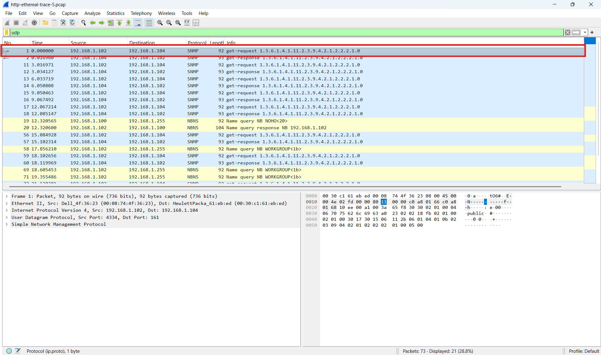
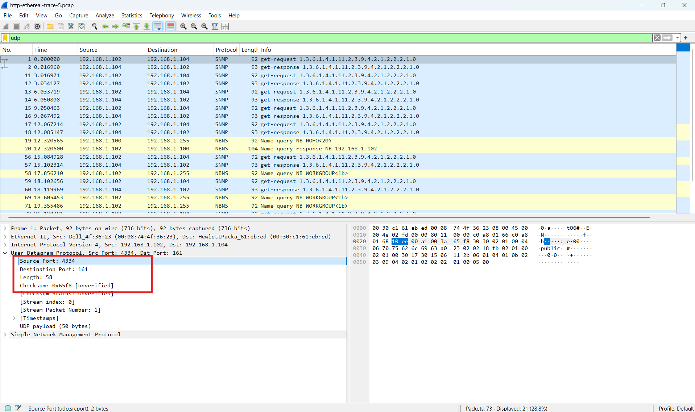

# Analisis Protokol UDP Menggunakan Wireshark

# Tujuan Praktikum

Praktikum ini bertujuan untuk memahami cara kerja protokol UDP menggunakan aplikasi Wireshark. Selain itu, praktikum dilakukan untuk mengamati struktur header UDP, hubungan antar port, serta proses pengiriman dan penerimaan paket UDP pada jaringan komputer.

---

# 5.1 Pengantar

UDP atau User Datagram Protocol merupakan salah satu protokol transport yang digunakan untuk mengirim data tanpa membangun koneksi terlebih dahulu. Berbeda dengan TCP, UDP bersifat connectionless sehingga proses pengiriman data menjadi lebih cepat dan sederhana.

Karena tidak menggunakan mekanisme handshake maupun pengecekan reliabilitas yang kompleks, UDP sering digunakan pada layanan yang membutuhkan kecepatan tinggi seperti streaming, DNS, VoIP, game online, dan SNMP.

Karakteristik UDP:

* Tidak menggunakan koneksi.
* Tidak menjamin paket diterima.
* Header lebih sederhana.
* Overhead kecil.
* Pengiriman data lebih cepat.

Pada praktikum ini dilakukan analisis paket UDP menggunakan Wireshark untuk melihat struktur header, ukuran field, nomor port, serta hubungan antar paket UDP.

---

# 5.2 Analisis Paket UDP

Pada praktikum ini dilakukan proses capture paket menggunakan Wireshark, kemudian dilakukan filter agar hanya paket UDP yang ditampilkan.

Filter yang digunakan:

```bash
udp
```

Setelah paket UDP ditemukan, salah satu paket dipilih untuk dianalisis.



---

# Pembahasan Pertanyaan

## 1. Field pada Header UDP

Berdasarkan hasil analisis di Wireshark, terdapat empat field utama pada header UDP:

1. Source Port
2. Destination Port
3. Length
4. Checksum



### Analisis

Header UDP memiliki struktur yang sederhana dibandingkan TCP. Karena hanya terdiri dari empat field utama, ukuran header UDP menjadi lebih kecil sehingga proses pengiriman data menjadi lebih ringan.

Field Source Port menunjukkan port pengirim, sedangkan Destination Port menunjukkan port tujuan. Field Length menunjukkan ukuran total segmen UDP, dan Checksum digunakan untuk mendeteksi kesalahan data.

---

## 2. Panjang Masing-Masing Field Header UDP

| Field            | Panjang |
| ---------------- | ------- |
| Source Port      | 2 byte  |
| Destination Port | 2 byte  |
| Length           | 2 byte  |
| Checksum         | 2 byte  |

Total ukuran header UDP:

```text
8 byte
```


### Analisis

Setiap field pada header UDP memiliki ukuran 16 bit atau 2 byte. Karena terdapat empat field, total panjang header UDP adalah 8 byte.

---

## 3. Fungsi Field Length

Field Length pada UDP menunjukkan total ukuran segmen UDP yang terdiri dari:

```text
Header UDP + Payload/Data
```


### Contoh

Jika panjang payload adalah 32 byte dan header UDP 8 byte, maka:

```text
40 byte
```

### Analisis

Field Length digunakan untuk menunjukkan ukuran keseluruhan segmen UDP yang dikirim.

---

## 4. Maksimum Payload UDP

Ukuran maksimum field Length UDP:

```text
65535 byte
```

Ukuran header UDP:

```text
8 byte
```

Maka maksimum payload UDP:

```text
65527 byte
```

### Analisis

Payload maksimum UDP adalah 65527 byte. Namun pada praktik jaringan nyata biasanya ukuran paket dibatasi oleh MTU agar tidak terjadi fragmentasi.

---

## 5. Nomor Port Maksimum UDP

Nomor port terbesar yang dapat digunakan:

```text
65535
```

### Analisis

Karena field port UDP memiliki ukuran 16 bit, maka rentang port berada pada 0 sampai 65535.

| Jenis Port      | Rentang       |
| --------------- | ------------- |
| Well Known Port | 0 – 1023      |
| Registered Port | 1024 – 49151  |
| Dynamic Port    | 49152 – 65535 |

---

## 6. Nomor Protokol UDP

| Format       | Nilai |
| ------------ | ----- |
| Desimal      | 17    |
| Heksadesimal | 0x11  |


### Analisis

Field Protocol pada header IP digunakan untuk menunjukkan protokol layer transport yang digunakan. Nilai 17 menunjukkan bahwa datagram IP membawa segmen UDP.

---

## 7. Hubungan Nomor Port pada Paket UDP

Contoh pasangan request dan response:

| Paket    | Source Port | Destination Port |
| -------- | ----------- | ---------------- |
| Request  | 54000       | 53               |
| Response | 53          | 54000            |


### Analisis

Pada paket request, client menggunakan source port acak dan destination port menuju layanan tertentu, misalnya port 53 untuk DNS.

Ketika server mengirim response, nomor port akan saling bertukar sehingga paket balasan dapat dikirim kembali ke aplikasi pengirim yang benar.

---

# Kesimpulan

Berdasarkan hasil praktikum, dapat diketahui bahwa UDP merupakan protokol transport yang sederhana dan bersifat connectionless. UDP tidak menggunakan mekanisme handshake maupun retransmission sehingga proses pengiriman data menjadi lebih cepat dibandingkan TCP.

Header UDP hanya memiliki empat field utama dengan total ukuran header sebesar 8 byte sehingga overhead protokol menjadi kecil.

Dari hasil analisis Wireshark juga terlihat bahwa UDP menggunakan protocol number 17 pada header IP dan memanfaatkan nomor port untuk proses komunikasi antara client dan server.

Dengan demikian, UDP cocok digunakan pada layanan jaringan yang membutuhkan kecepatan tinggi dan latensi rendah.

---

# Daftar Screenshot

| File       | Keterangan                  |
| ---------- | --------------------------- |
| asset1.png | Capture paket UDP           |
| asset2.png | Header UDP                  |
| asset3.png | Ukuran header UDP           |
| asset4.png | Field Length UDP            |
| asset5.png | Protocol UDP pada IP Header |
| asset6.png | Request dan response UDP    |
