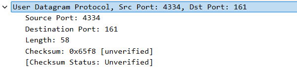
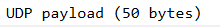
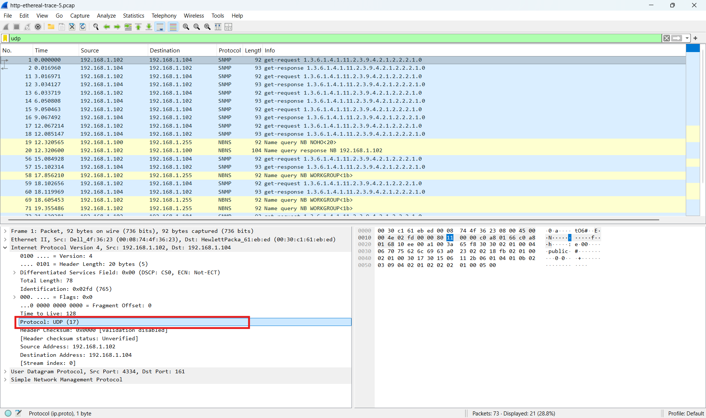
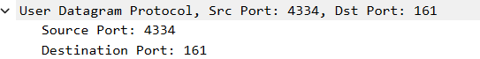
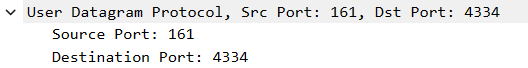

# Laporan Praktikum Jaringan Komputer
## Modul 5: Analisis Protokol UDP


## 1. Tujuan Praktikum

1. Memahami cara kerja protokol UDP menggunakan Wireshark.  
2. Mengidentifikasi field-field yang terdapat pada header UDP.  
3. Menganalisis hubungan antara paket UDP request dan response.  


## 2. Alat dan Bahan

- Wireshark  
- File trace UDP (`http-ethereal-trace-5.pcap`)  
- Komputer/Laptop  


## 3. Langkah Percobaan

1. Menjalankan aplikasi Wireshark.  
2. Membuka file trace UDP `http-ethereal-trace-5.pcap`.  
3. Menggunakan filter:

```bash
udp
````

4. Setelah paket UDP ditemukan, salah satu paket dipilih untuk dianalisis.


## 4. Hasil dan Pembahasan

### 4.1 Field pada Header UDP


Berdasarkan hasil pengamatan pada Wireshark, header UDP memiliki 4 field utama, yaitu:

1. Source Port
2. Destination Port
3. Length
4. Checksum

Keempat field tersebut digunakan untuk mengatur proses komunikasi data pada protokol UDP.

### 4.2 Panjang Masing-Masing Field UDP


Berdasarkan hasil pengamatan, panjang masing-masing field pada header UDP adalah:

| Field            | Panjang |
| ---------------- | ------- |
| Source Port      | 2 byte  |
| Destination Port | 2 byte  |
| Length           | 2 byte  |
| Checksum         | 2 byte  |

Sehingga total panjang header UDP adalah:

```text
2 + 2 + 2 + 2 = 8 byte
```

### 4.3 Analisis Field Length

<br>

<br>
Field `Length` pada UDP menunjukkan total panjang segmen UDP, yaitu gabungan antara header UDP dan payload UDP.

Pada paket yang diamati diperoleh:

* Length = 58 byte
* UDP Payload = 50 byte

Maka:

```text
58 - 50 = 8 byte
```

Dapat disimpulkan bahwa:

* Header UDP = 8 byte
* Payload UDP = 50 byte

### 4.4 Maksimum Payload UDP

Field Length pada UDP memiliki ukuran 16 bit sehingga panjang maksimum segmen UDP adalah:

```text
2^16 - 1 = 65535 byte
```

Karena header UDP selalu berukuran 8 byte, maka maksimum payload UDP adalah:

```text
65535 - 8 = 65527 byte
```

### 4.5 Nomor Port Maksimum

Nomor port UDP menggunakan field 16 bit sehingga nomor port terbesar yang dapat digunakan adalah:

```text
2^16 - 1 = 65535
```

### 4.6 Nomor Protokol UDP

Berdasarkan hasil pengamatan pada header IP, nomor protokol UDP adalah:

| Format       | Nilai |
| ------------ | ----- |
| Desimal      | 17    |
| Heksadesimal | 0x11  |

Nilai tersebut dapat dilihat pada bagian:

```text
Protocol: UDP (17)
```

### 4.7 Hubungan Port pada Paket Request dan Response

Pada paket request diperoleh:



Sedangkan pada paket response diperoleh:



Hal ini menunjukkan bahwa source port dan destination port pada paket response merupakan kebalikan dari paket request. Destination port pada paket pertama menjadi source port pada paket balasan, sedangkan source port pada paket pertama menjadi destination port pada paket balasan.

## 5. Kesimpulan

Berdasarkan hasil praktikum, protokol UDP merupakan protokol transport yang sederhana dan tidak menggunakan mekanisme koneksi maupun pengiriman ulang data. Header UDP terdiri dari empat field utama yaitu Source Port, Destination Port, Length, dan Checksum dengan total ukuran header sebesar 8 byte. Melalui Wireshark, proses pertukaran paket UDP dapat diamati secara detail termasuk hubungan antara paket request dan response serta penggunaan nomor port pada komunikasi jaringan.