# Laporan Praktikum Jaringan Komputer

## Modul 6: Analisis Protokol TCP

## 1. Tujuan Praktikum

1. Memahami mekanisme kerja protokol TCP menggunakan Wireshark.
2. Menganalisis proses pengiriman data menggunakan TCP.
3. Mengidentifikasi sequence number, acknowledgement, RTT, throughput, dan congestion control pada TCP.

## 2. Alat dan Bahan

* Wireshark
* Web browser
* Koneksi internet
* File `alice.txt`

## 3. Langkah Percobaan

### 3.1 Mengambil File Alice.txt

1. Membuka browser.
2. Mengakses:
   [http://gaia.cs.umass.edu/wireshark-labs/alice.txt](http://gaia.cs.umass.edu/wireshark-labs/alice.txt)
3. Mengunduh file `alice.txt`.

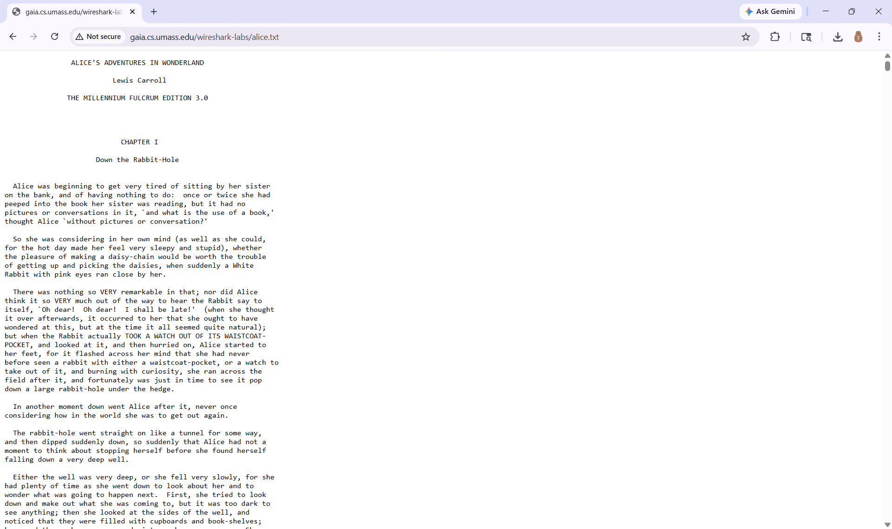

### 3.2 Upload File Menggunakan HTTP POST

1. Membuka halaman:
   [http://gaia.cs.umass.edu/wireshark-labs/TCP-wireshark-file1.html](http://gaia.cs.umass.edu/wireshark-labs/TCP-wireshark-file1.html)
2. Menjalankan Wireshark dan memulai capture.
3. Mengupload file `alice.txt`.
4. Menghentikan capture setelah upload selesai.

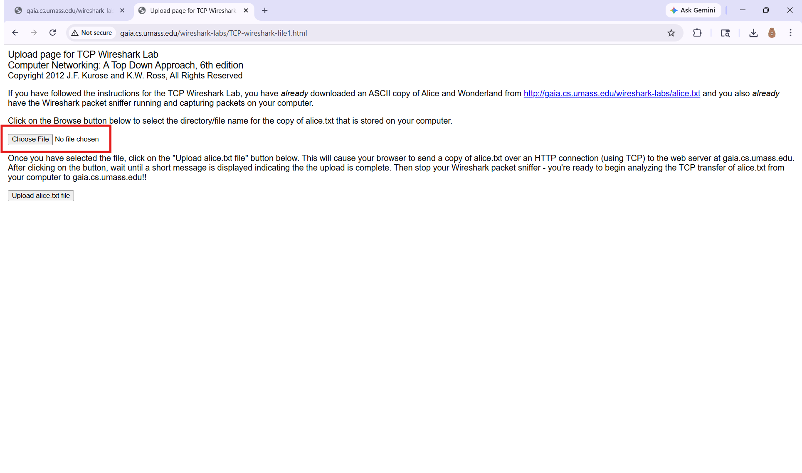

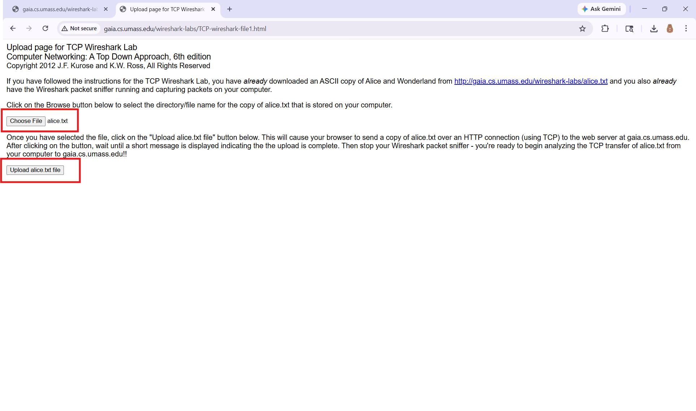

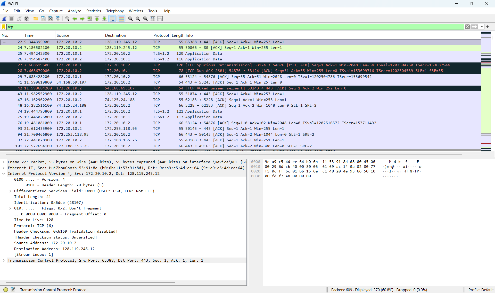

### 3.3 Filter Paket TCP

1. Menggunakan filter:

```text
tcp
```


2. Mengamati paket TCP hasil upload file.

### 3.4 Menonaktifkan HTTP Protocol

1. Membuka menu:

```text
Analyze → Enabled Protocols
```

2. Menghapus centang pada HTTP.
3. Mengamati segmen TCP secara langsung.

### 3.5 Analisis Congestion Control

1. Memilih salah satu paket TCP client → server.
2. Membuka:

```text
Statistics → TCP Stream Graph → Time-Sequence Graph (Stevens)
```
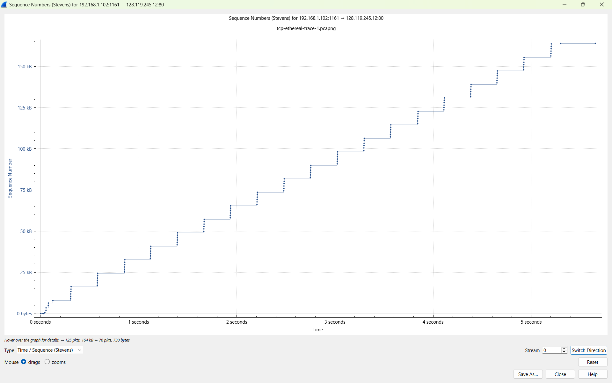
3. Mengamati grafik sequence number terhadap waktu.

## 4. Hasil dan Pembahasan

### 4.1 Soal 1: Analisis IP dan Port TCP

**Soal:**
Berapa alamat IP dan nomor port TCP yang digunakan oleh komputer klien (sumber) untuk mentransfer file ke `gaia.cs.umass.edu`? Cara paling mudah menjawab pertanyaan ini adalah dengan memilih sebuah pesan HTTP dan meneliti detail paket TCP yang digunakan untuk membawa pesan HTTP tersebut.

**Jawaban:**

Berdasarkan hasil capture, alamat IP client adalah:

```text
192.168.1.102
```
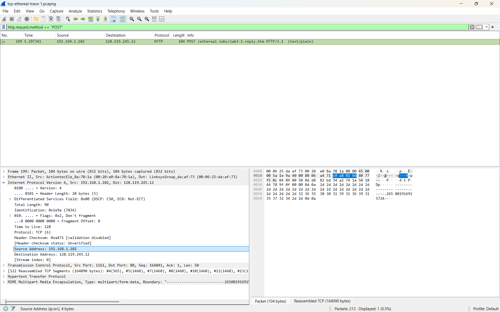

dengan source port:

```text
1161
```
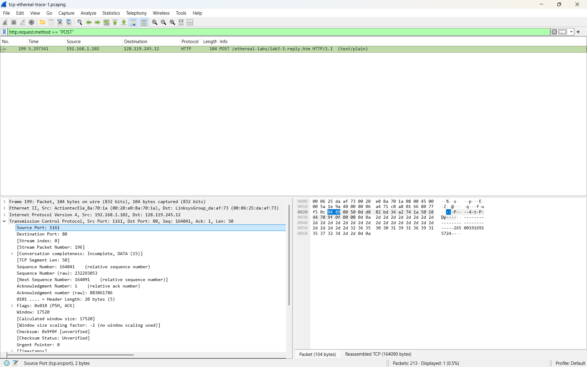

### 4.2 Soal 2: IP dan Port Server

**Soal:**
Apa alamat IP dari `gaia.cs.umass.edu`? Pada nomor port berapa ia mengirim dan menerima segmen TCP untuk koneksi ini?

**Jawaban:**

Sedangkan server `gaia.cs.umass.edu` memiliki alamat IP:

```text
128.119.245.12
```
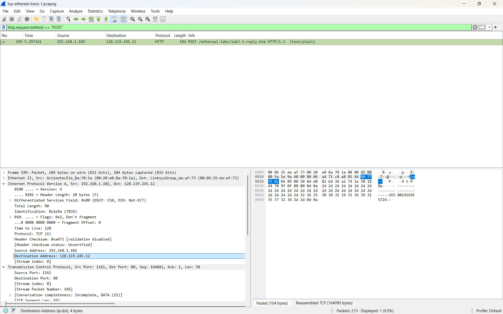

dengan destination port:

```text
80
```
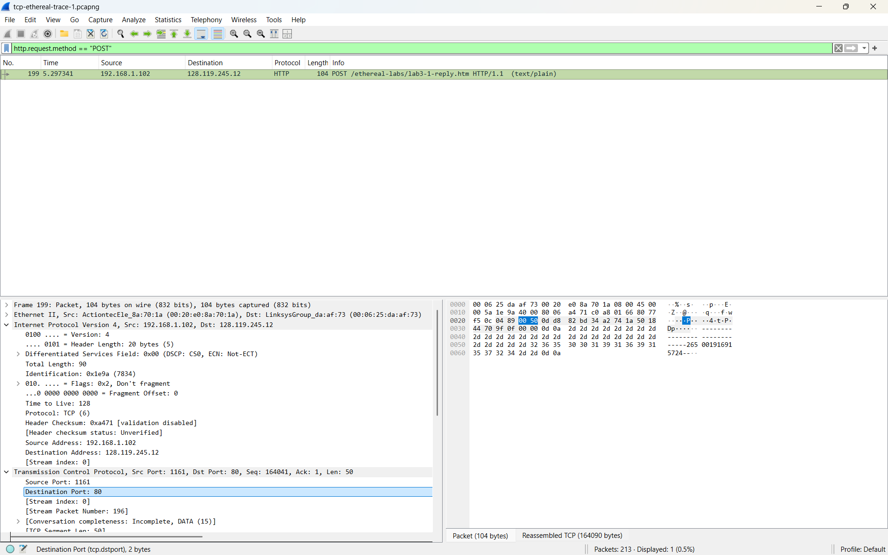

### 4.3 Soal 3: IP dan Port Client dari Capture Sendiri

**Soal:**
Berapa alamat IP dan nomor port TCP yang digunakan oleh komputer klien Anda (sumber) untuk mentransfer file ke `gaia.cs.umass.edu`?

**Jawaban:**
Berdasarkan hasil capture sendiri, alamat IP client adalah:

```text
172.20.10.2
```
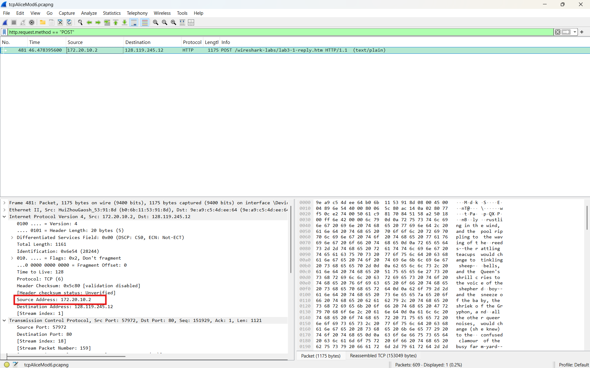

dengan source port:

```text
57972
```
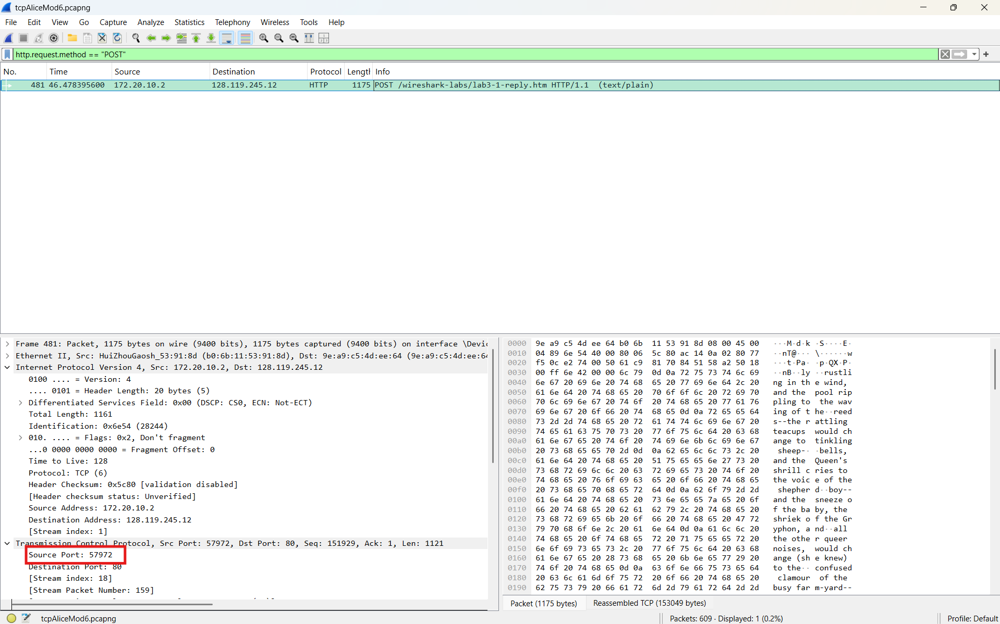

### 4.4 Soal 4: Segmen TCP SYN

**Soal:**
Berapa nomor urut segmen TCP SYN yang digunakan untuk memulai sambungan TCP antara komputer klien dan `gaia.cs.umass.edu`? Apa yang dimiliki segmen tersebut sehingga teridentifikasi sebagai segmen SYN?

**Jawaban:**
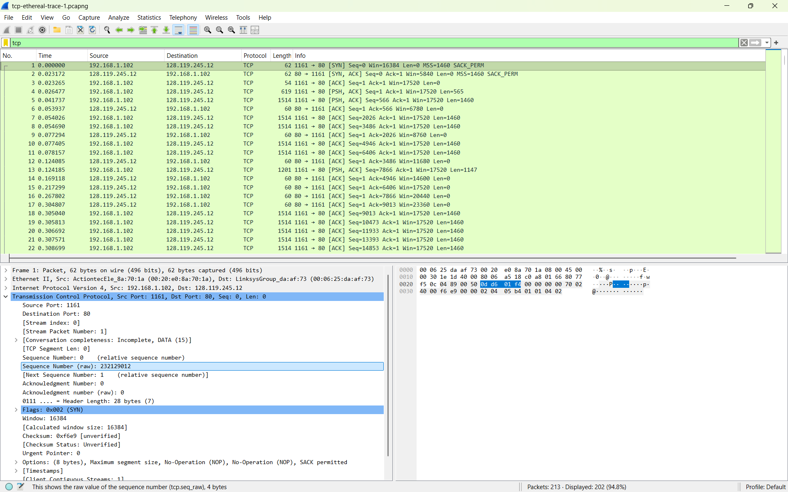

Segmen SYN memiliki nomor urut:

```text
Flags: 0x002 (SYN)
Sequence Number = 0
```

### 4.5 Soal 5: Segmen TCP SYNACK

**Soal:**
Berapa nomor urut segmen SYNACK yang dikirim oleh `gaia.cs.umass.edu` ke komputer klien sebagai balasan dari SYN? Berapa nilai field acknowledgement pada segmen SYNACK? Bagaimana server menentukan nilai tersebut? Apa yang dimiliki segmen sehingga teridentifikasi sebagai segmen SYNACK?

**Jawaban:**
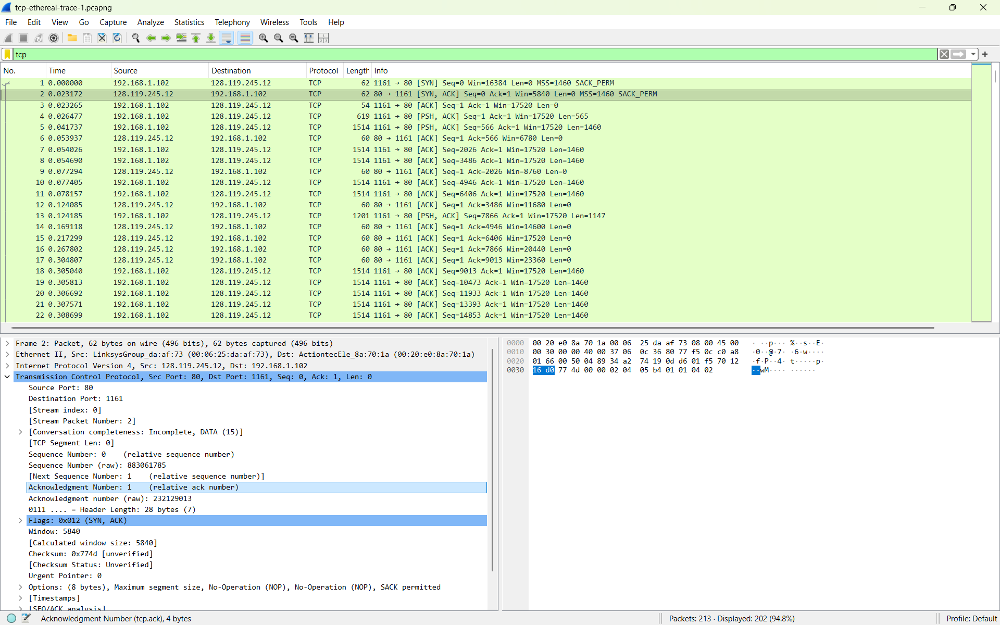

Sedangkan segmen SYNACK memiliki:

```text
Flags: 0x012 (SYN, ACK)
Acknowledgement Number = 1
```

Nilai acknowledgement diperoleh dari:

```text
ACK = Sequence Number SYN + 1
```

### 4.6 Soal 6: Segmen HTTP POST

**Soal:**
Berapa nomor urut segmen TCP yang berisi perintah HTTP POST?

**Jawaban:**
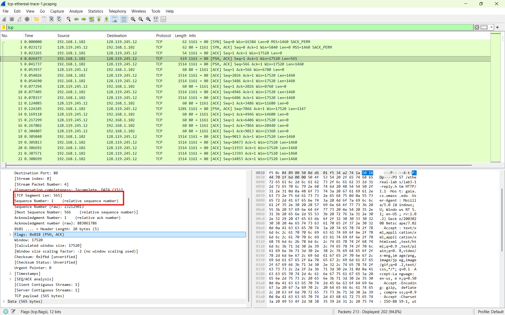

Segmen TCP yang membawa HTTP POST memiliki:

```text
Sequence Number = 1
```

Paket tersebut merupakan awal pengiriman data file dari client menuju server.

### 4.7 Soal 7: RTT dan EstimatedRTT

**Soal:**
Anggap segmen TCP yang berisi HTTP POST sebagai segmen pertama dalam koneksi TCP. Berapa nomor urut enam segmen pertama TCP? Kapan ACK diterima? Berapa nilai RTT dan EstimatedRTT?

**Jawaban:**

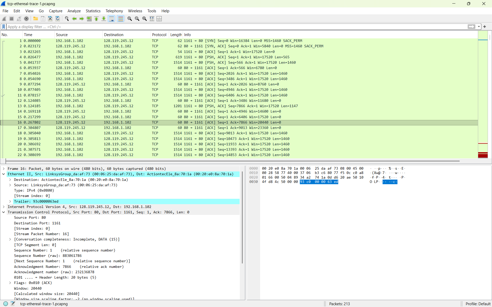

Enam segmen pertama TCP memiliki RTT sebagai berikut:

| Segmen | RTT     |
| ------ | ------- |
| 1      | 0.027 s |
| 2      | 0.035 s |
| 3      | 0.070 s |
| 4      | 0.114 s |
| 5      | 0.139 s |
| 6      | 0.189 s |

EstimatedRTT dihitung menggunakan rumus:

[
EstimatedRTT = (1-\alpha) \times EstimatedRTT + \alpha \times SampleRTT
]

dengan:

```text
α = 0.125
```

### 4.8 Soal 8: Panjang Segmen TCP

**Soal:**
Berapa panjang setiap enam segmen TCP pertama?

**Jawaban:**


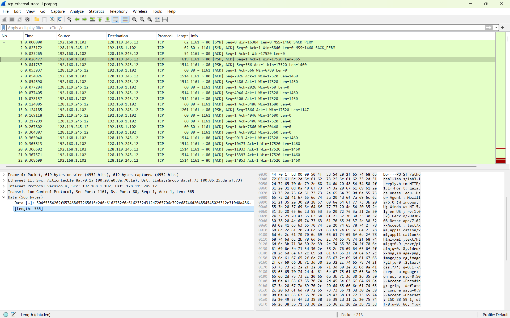

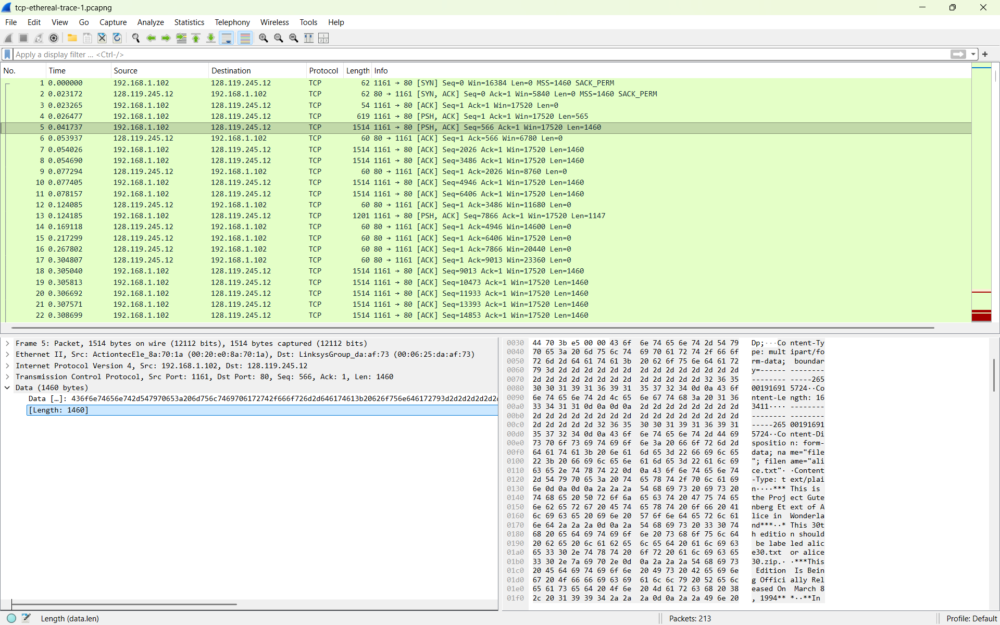

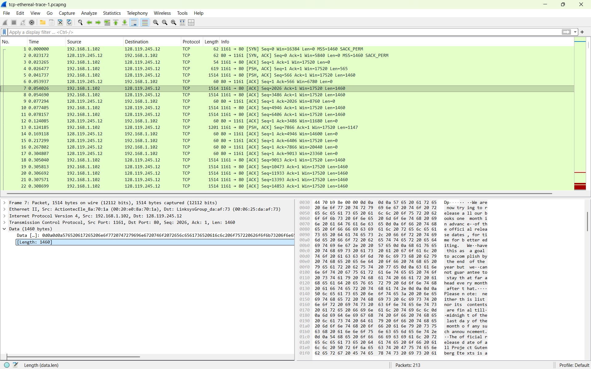

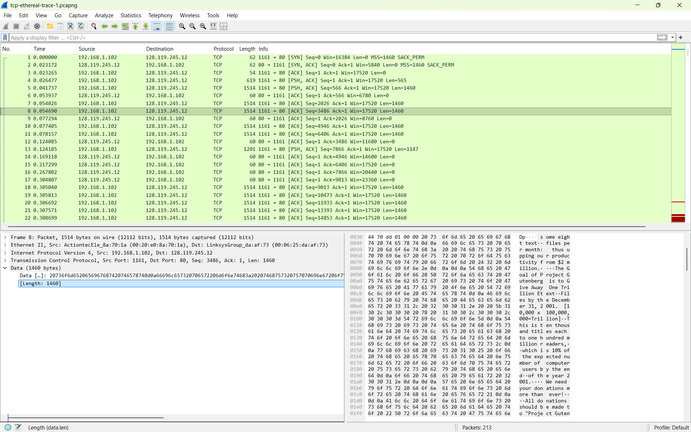

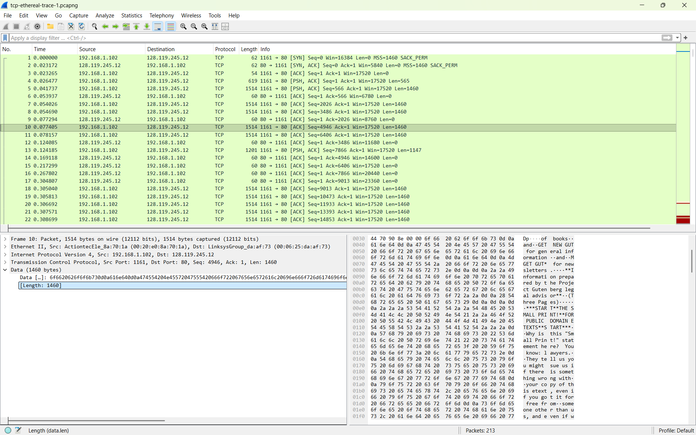

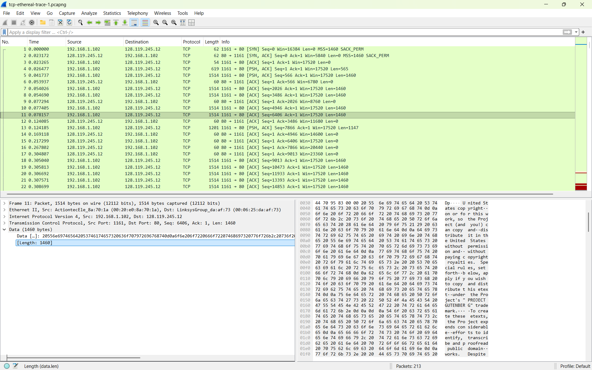

Panjang enam segmen TCP pertama adalah:

| Segmen | Panjang   |
| ------ | --------- |
| 1      | 565 byte  |
| 2      | 1460 byte |
| 3      | 1460 byte |
| 4      | 1460 byte |
| 5      | 1460 byte |
| 6      | 1460 byte |

### 4.9 Soal 9: Flow Control TCP

**Soal:**
Berapa jumlah minimum ruang buffer tersedia yang disarankan kepada penerima dan diterima untuk seluruh trace? Apakah kurangnya ruang buffer penerima pernah menghambat pengiriman?

**Jawaban:**

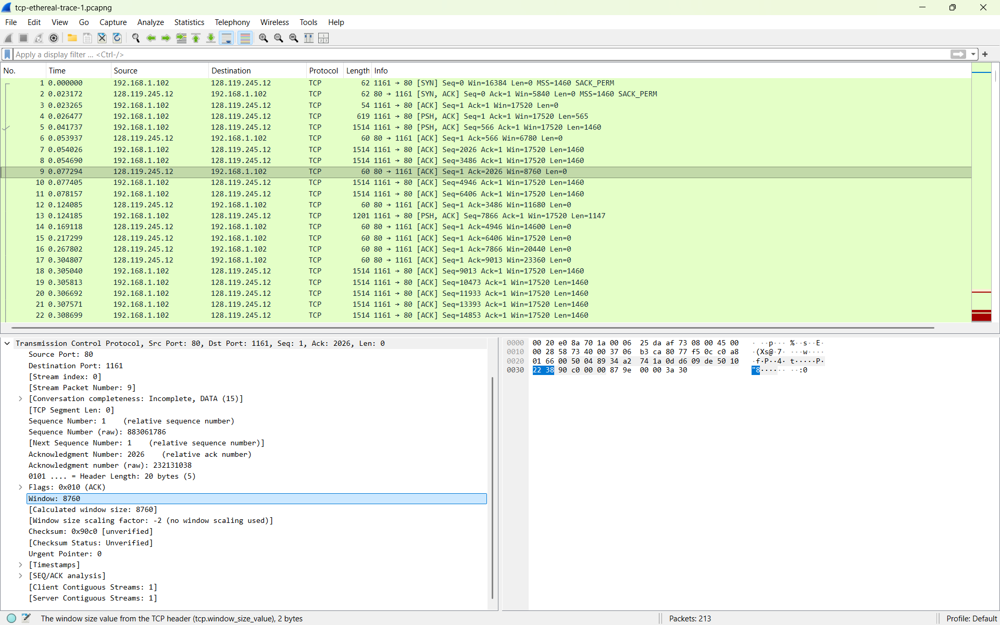

Nilai minimum receive window yang ditemukan adalah sekitar:

```text
8760 byte
```

Tidak ditemukan hambatan pengiriman akibat kekurangan buffer penerima.

### 4.10 Soal 10: Retransmission TCP

**Soal:**
Apakah ada segmen yang ditransmisikan ulang dalam file trace? Apa yang diperiksa di dalam file trace untuk menjawab pertanyaan tersebut?

**Jawaban:**

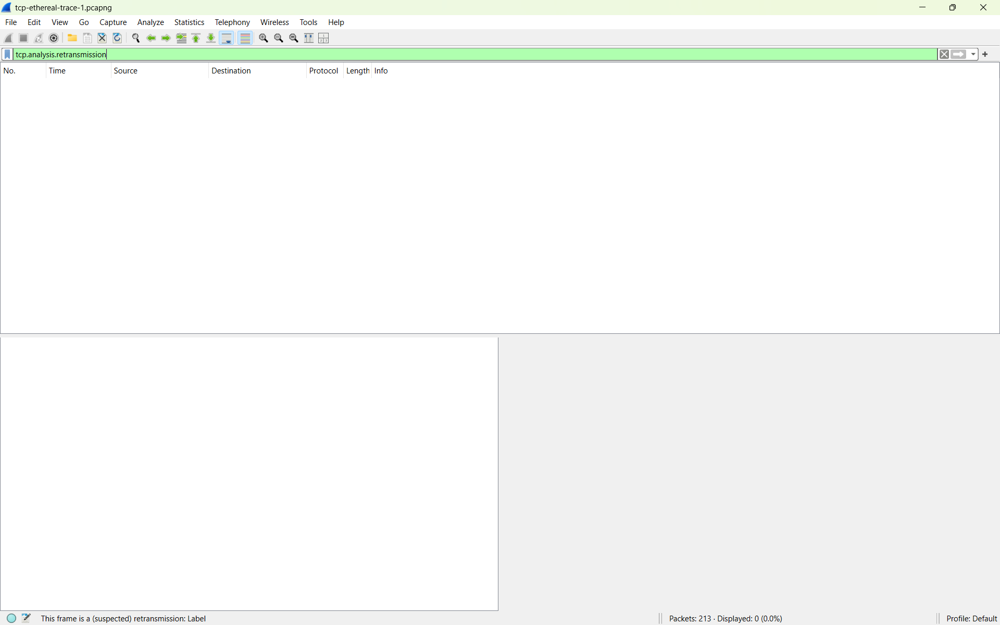

Filter berikut digunakan:

```text
tcp.analysis.retransmission
```

Tidak ditemukan retransmission pada trace sehingga pengiriman data berjalan normal.

### 4.11 Soal 11: ACK pada TCP

**Soal:**
Berapa banyak data yang biasanya diakui oleh penerima dalam ACK? Dapatkah diidentifikasi kasus ketika penerima melakukan ACK untuk setiap segmen yang diterima?

**Jawaban:**

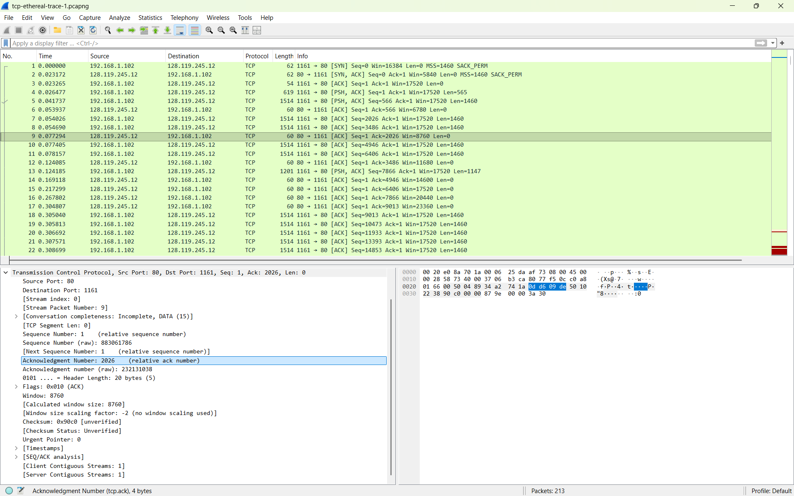

Receiver biasanya mengirim acknowledgement untuk dua segmen sekaligus. Namun pada beberapa kondisi ditemukan ACK untuk setiap segmen yang diterima.

### 4.12 Soal 12: Throughput TCP

**Soal:**
Berapa throughput untuk sambungan TCP? Jelaskan bagaimana cara menghitungnya.

**Jawaban:**

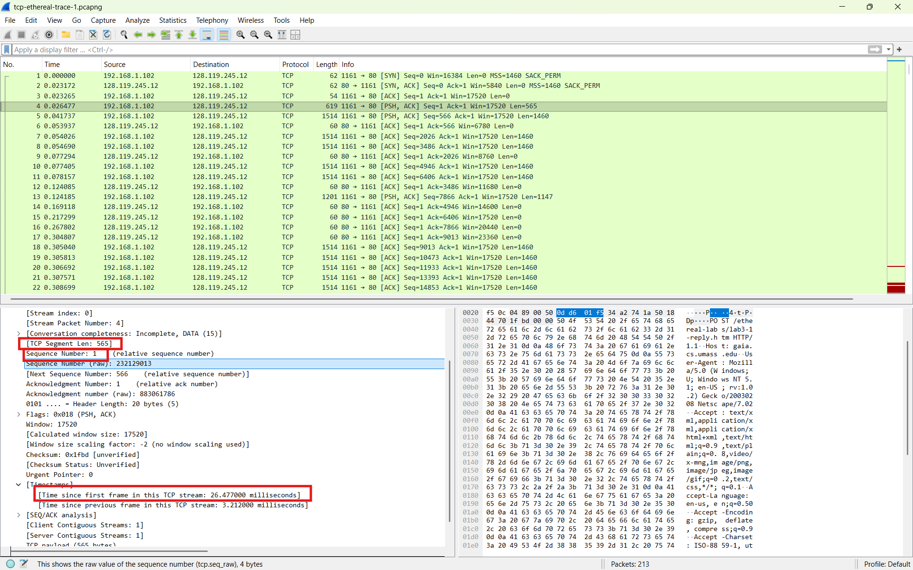

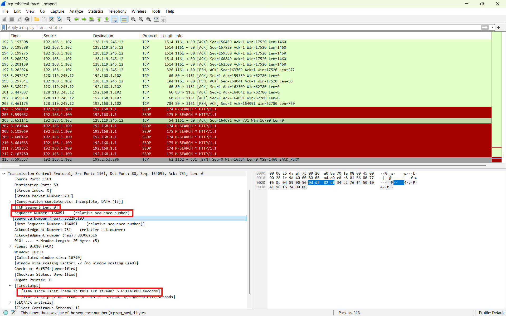

Perhitungan throughput dilakukan menggunakan:

[
Throughput = \frac{Total\ Data}{Total\ Waktu}
]

Data yang dikirim sekitar:

```text
150 KB
```

Waktu transfer:

```text
5.651141 - 0.026477 = 5.624664 detik
```

Maka throughput TCP diperoleh sebesar:

```text
≈ 26.7 KB/s
```

### 4.10 Congestion Control TCP

Pada bagian congestion control, analisis dilakukan menggunakan grafik **Time-Sequence Graph (Stevens)**. Grafik ini menunjukkan hubungan antara waktu pengiriman paket dengan sequence number TCP.

#### 4.10.1 Contoh Awal Grafik Time-Sequence


Grafik di atas merupakan contoh tampilan **Time-Sequence Graph (Stevens)**. Pada grafik ini, sumbu horizontal menunjukkan waktu, sedangkan sumbu vertikal menunjukkan sequence number. Semakin naik grafik, semakin banyak data yang dikirim oleh client ke server.

#### 4.10.2 Soal 1: Statistik dari Trace Ethernet/Modul

**Soal:**
Gunakan alat plotting **Time-Sequence-Graph (Stevens)** untuk melihat grafik nomor urut berbanding waktu dari segmen yang dikirim oleh klien ke server `gaia.cs.umass.edu`. Dapatkah Anda mengidentifikasi di mana fase **slow start** TCP dimulai dan berakhir, dan pada bagian mana algoritma **congestion avoidance** mengambil alih? Berikan komentar tentang bagaimana data yang diukur berbeda dari perilaku ideal TCP yang telah dipelajari.

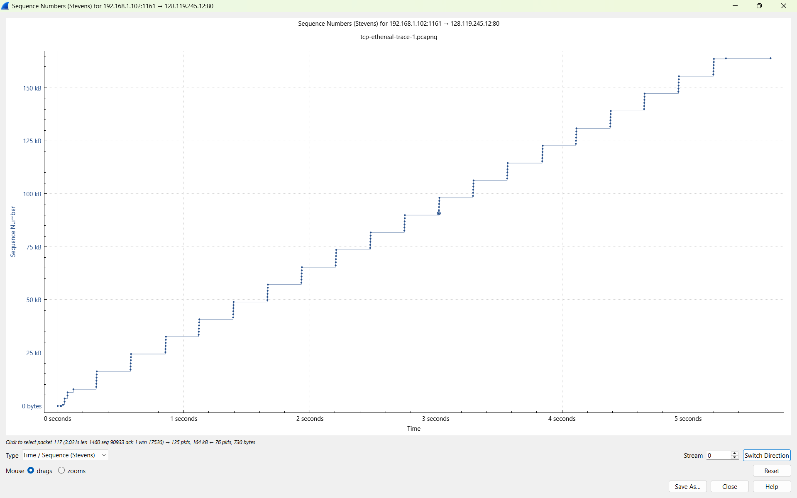

**Jawaban:**
Berdasarkan grafik dari trace `tcp-ethereal-trace-1`, fase **slow start** terjadi pada bagian awal grafik. Pada fase ini, sequence number meningkat dengan cepat karena congestion window bertambah secara eksponensial.

Fase slow start terlihat sekitar:

```text
0 – 0.5 detik
```

Setelah itu, grafik mulai menunjukkan kenaikan yang lebih stabil dan cenderung linear. Bagian tersebut menunjukkan bahwa TCP mulai masuk ke fase **congestion avoidance**.

Fase congestion avoidance terjadi sekitar:

```text
setelah 0.5 detik sampai akhir transfer
```

Perbedaan data hasil pengukuran dengan teori TCP ideal adalah grafik tidak sepenuhnya mulus. Pada praktiknya, pengiriman data dipengaruhi oleh kondisi jaringan nyata seperti variasi RTT, delay, dan waktu kedatangan ACK yang tidak selalu teratur.

#### 4.10.3 Soal 2: Statistik dari Capture Sendiri

**Soal:**
Jawablah pertanyaan di atas untuk trace yang didapatkan ketika mengirimkan file dari komputer sendiri ke `gaia.cs.umass.edu`.

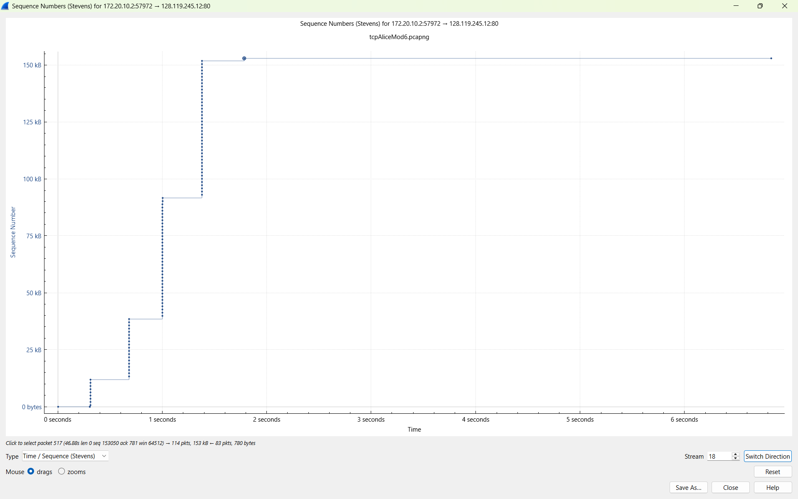

**Jawaban:**
Berdasarkan grafik capture sendiri, terlihat bahwa transfer data dilakukan dari client menuju server `gaia.cs.umass.edu`. Grafik menunjukkan kenaikan sequence number hingga sekitar 150 KB, sehingga dapat disimpulkan bahwa grafik tersebut merupakan hasil pengiriman file `alice.txt`.

Fase **slow start** terlihat pada awal proses transfer, yaitu ketika sequence number meningkat dengan cepat. Pada bagian ini TCP mulai menaikkan congestion window untuk mempercepat pengiriman data.

Fase slow start pada capture sendiri terjadi sekitar:

```text
0 – 1 detik
```

Setelah itu, grafik berubah menjadi lebih stabil dan cenderung linear. Bagian ini menunjukkan fase **congestion avoidance**, yaitu saat TCP tidak lagi menaikkan congestion window secara eksponensial, tetapi lebih perlahan untuk menghindari kemacetan jaringan.

Fase congestion avoidance terjadi sekitar:

```text
setelah 1 detik sampai akhir transfer
```

Grafik hasil capture sendiri tidak sepenuhnya sama dengan teori ideal TCP karena dipengaruhi oleh kondisi jaringan saat praktikum, seperti kecepatan internet, delay, variasi RTT, serta proses ACK dari server.

## 5. Kesimpulan

Berdasarkan hasil praktikum, protokol TCP memiliki mekanisme reliable transmission melalui sequence number dan acknowledgement. TCP juga menerapkan flow control dan congestion control untuk menjaga kestabilan jaringan. Dengan menggunakan Wireshark, proses pengiriman data, RTT, throughput, hingga congestion control dapat diamati secara detail.
