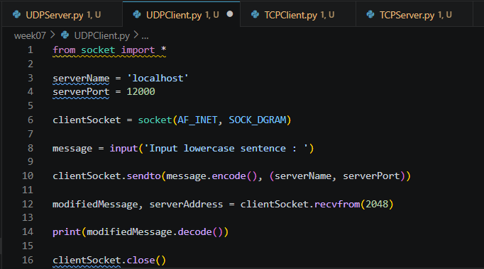
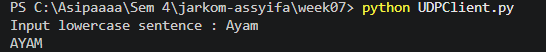
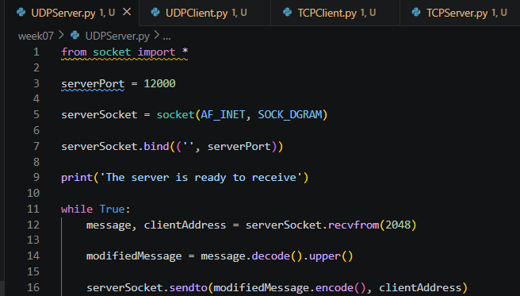
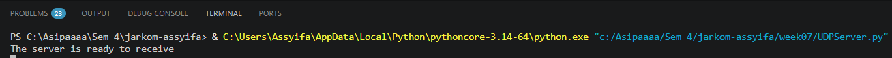
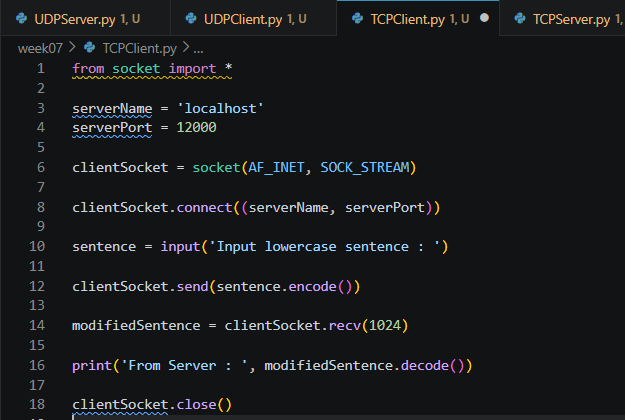
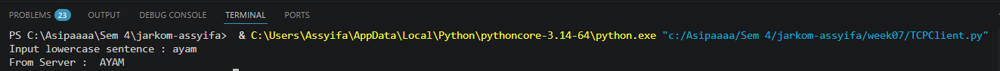
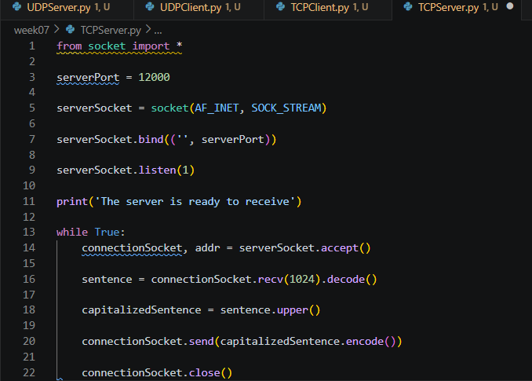
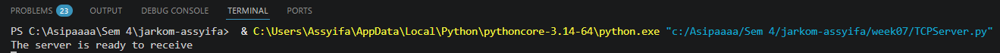

# Laporan Praktikum Jaringan Komputer

## Modul 7: Pemrograman Socket UDP dan TCP

## 1. Tujuan Praktikum

1. Memahami konsep komunikasi jaringan menggunakan socket pada Python.
2. Memahami mekanisme komunikasi menggunakan protokol UDP dan TCP.
3. Membuat program client-server sederhana menggunakan Python socket programming.
4. Menganalisis perbedaan komunikasi UDP dan TCP.

## 2. Alat dan Bahan

* Python
* Visual Studio Code
* Terminal / CMD
* Library socket Python

## 3. Langkah Percobaan

### 3.1 UDP Socket Programming

1. Membuat file `UDPServer.py`.
2. Membuat file `UDPClient.py`.
3. Menjalankan server UDP terlebih dahulu.
4. Menjalankan client UDP.
5. Mengirim pesan dari client ke server.
6. Mengamati hasil perubahan huruf kecil menjadi huruf besar.

### 3.2 TCP Socket Programming

1. Membuat file `TCPServer.py`.
2. Membuat file `TCPClient.py`.
3. Menjalankan server TCP terlebih dahulu.
4. Menjalankan client TCP.
5. Mengirim pesan dari client ke server.
6. Mengamati hasil perubahan huruf kecil menjadi huruf besar.

## 4. Hasil dan Pembahasan

### 4.1 UDP Socket Programming

Pada percobaan pertama dibuat aplikasi client-server sederhana menggunakan protokol **UDP**. UDP bersifat **connectionless**, artinya client tidak perlu membuat koneksi terlebih dahulu dengan server sebelum mengirimkan data. Client cukup mengetahui alamat server dan nomor port tujuan, lalu data langsung dikirim menggunakan socket.

Dalam modul, proses UDP dijelaskan sebagai komunikasi yang mengirimkan pesan melalui socket dengan menyertakan alamat tujuan berupa **IP address** dan **port number**. Pada program ini digunakan alamat server `localhost`, karena client dan server dijalankan pada komputer yang sama. Port yang digunakan adalah `12000`.

#### 4.1.1 Source Code UDP Client


#### 4.1.2 Output UDP Client


Program `UDPClient.py` diawali dengan mengimpor library socket:

```python
from socket import *
```

Baris tersebut digunakan agar program dapat membuat socket jaringan. Selanjutnya, variabel `serverName` dan `serverPort` digunakan untuk menentukan alamat dan port server tujuan.

```python
serverName = 'localhost'
serverPort = 12000
```

Kemudian client membuat socket UDP menggunakan:

```python
clientSocket = socket(AF_INET, SOCK_DGRAM)
```

`AF_INET` menunjukkan bahwa program menggunakan IPv4, sedangkan `SOCK_DGRAM` menunjukkan bahwa socket yang digunakan adalah socket UDP.

Client meminta input dari pengguna menggunakan fungsi `input()`. Setelah itu pesan dikirim ke server dengan fungsi `sendto()`. Pada UDP, fungsi `sendto()` membutuhkan data yang dikirim dan alamat tujuan server.

```python
clientSocket.sendto(message.encode(), (serverName, serverPort))
```

Fungsi `encode()` digunakan karena data yang dikirim melalui socket harus dalam bentuk byte. Setelah mengirim pesan, client menunggu balasan dari server menggunakan `recvfrom()`.

```python
modifiedMessage, serverAddress = clientSocket.recvfrom(2048)
```

Balasan dari server kemudian ditampilkan ke layar setelah diubah kembali dari byte menjadi string menggunakan `decode()`.

#### 4.1.3 Source Code UDP Server



#### 4.1.4 Output UDP Server



Program `UDPServer.py` digunakan untuk menerima pesan dari client. Server membuat socket UDP dengan:

```python
serverSocket = socket(AF_INET, SOCK_DGRAM)
```

Kemudian server mengikat socket ke port `12000` menggunakan:

```python
serverSocket.bind(('', serverPort))
```

Fungsi `bind()` membuat server siap menerima paket UDP yang dikirim ke port tersebut. Setelah itu server masuk ke dalam perulangan `while True` agar server terus aktif dan dapat menerima pesan dari client secara terus-menerus.

Server menerima pesan menggunakan:

```python
message, clientAddress = serverSocket.recvfrom(2048)
```

Data yang diterima kemudian diubah menjadi huruf besar menggunakan fungsi `upper()`.

```python
modifiedMessage = message.decode().upper()
```

Setelah itu server mengirimkan kembali hasilnya ke client menggunakan:

```python
serverSocket.sendto(modifiedMessage.encode(), clientAddress)
```

Pada UDP, server perlu menggunakan `clientAddress` karena UDP tidak membuat koneksi tetap dengan client. Alamat client harus ikut digunakan saat server mengirim balasan.

Berdasarkan output, client berhasil mengirim kalimat dengan huruf kecil ke server. Server menerima pesan tersebut, mengubahnya menjadi huruf besar, lalu mengirimkan kembali hasilnya ke client. Hal ini menunjukkan bahwa komunikasi UDP berhasil berjalan.

### 4.2 TCP Socket Programming

Pada percobaan kedua dibuat aplikasi client-server menggunakan protokol **TCP**. Berbeda dengan UDP, TCP bersifat **connection-oriented**, sehingga client harus membuat koneksi terlebih dahulu dengan server sebelum mengirimkan data.

Dalam modul dijelaskan bahwa TCP menggunakan proses **three-way handshake** sebelum pertukaran data dilakukan. Setelah koneksi terbentuk, data dapat dikirim melalui koneksi TCP dan akan diterima secara berurutan serta lebih andal.

#### 4.2.1 Source Code TCP Client



#### 4.2.2 Output TCP Client


Program `TCPClient.py` membuat socket TCP menggunakan:

```python
clientSocket = socket(AF_INET, SOCK_STREAM)
```

`AF_INET` menunjukkan penggunaan IPv4, sedangkan `SOCK_STREAM` menunjukkan bahwa socket yang digunakan adalah TCP.

Client kemudian membuat koneksi ke server menggunakan:

```python
clientSocket.connect((serverName, serverPort))
```

Baris ini berbeda dengan UDP. Pada TCP, fungsi `connect()` digunakan untuk memulai koneksi dengan server. Setelah koneksi berhasil dibuat, client meminta input dari pengguna, lalu mengirim pesan ke server menggunakan:

```python
clientSocket.send(sentence.encode())
```

Pada TCP, client tidak perlu menyertakan alamat tujuan saat mengirim data karena koneksi sudah terbentuk sebelumnya. Setelah mengirim data, client menerima balasan dari server menggunakan:

```python
modifiedSentence = clientSocket.recv(1024)
```

Balasan server kemudian ditampilkan ke layar. Setelah proses selesai, socket ditutup menggunakan `close()`.

#### 4.2.3 Source Code TCP Server



#### 4.2.4 Output TCP Server



Program `TCPServer.py` membuat socket TCP dengan:

```python
serverSocket = socket(AF_INET, SOCK_STREAM)
```

Kemudian server mengikat socket ke port `12000` menggunakan fungsi `bind()`.

```python
serverSocket.bind(('', serverPort))
```

Setelah itu server menunggu koneksi dari client menggunakan:

```python
serverSocket.listen(1)
```

Fungsi `listen()` membuat server berada dalam kondisi siap menerima koneksi TCP. Ketika ada client yang mencoba terhubung, server menerima koneksi tersebut menggunakan:

```python
connectionSocket, addr = serverSocket.accept()
```

Fungsi `accept()` menghasilkan socket baru, yaitu `connectionSocket`. Socket ini khusus digunakan untuk berkomunikasi dengan client yang sudah terhubung.

Server menerima data dari client menggunakan:

```python
sentence = connectionSocket.recv(1024).decode()
```

Data tersebut diubah menjadi huruf besar menggunakan `upper()`, kemudian dikirim kembali ke client.

```python
capitalizedSentence = sentence.upper()
connectionSocket.send(capitalizedSentence.encode())
```

Setelah data dikirim, koneksi dengan client ditutup menggunakan:

```python
connectionSocket.close()
```

Pada TCP terdapat dua jenis socket pada server, yaitu `serverSocket` untuk menunggu koneksi dari client dan `connectionSocket` untuk komunikasi data dengan client yang sudah terhubung.

Berdasarkan output, client berhasil terhubung ke server TCP. Setelah client mengirim pesan huruf kecil, server memproses pesan tersebut menjadi huruf besar dan mengirimkannya kembali ke client. Hal ini menunjukkan komunikasi TCP berhasil berjalan.

### 4.3 Perbandingan UDP dan TCP

| Aspek             | UDP                         | TCP                                       |
| ----------------- | --------------------------- | ----------------------------------------- |
| Jenis koneksi     | Connectionless              | Connection-oriented                       |
| Tipe socket       | `SOCK_DGRAM`                | `SOCK_STREAM`                             |
| Pengiriman data   | Menggunakan `sendto()`      | Menggunakan `send()`                      |
| Penerimaan data   | Menggunakan `recvfrom()`    | Menggunakan `recv()`                      |
| Koneksi awal      | Tidak perlu `connect()`     | Perlu `connect()`                         |
| Keandalan         | Tidak menjamin data sampai  | Menjamin data sampai                      |
| Urutan data       | Tidak dijamin berurutan     | Dijamin berurutan                         |
| Kecepatan         | Lebih cepat dan ringan      | Lebih lambat karena ada mekanisme koneksi |
| Contoh penggunaan | Streaming, DNS, game online | Web, email, file transfer                 |

### 4.4 Analisis Hasil Praktikum

Pada percobaan UDP, client dapat langsung mengirim pesan ke server tanpa melakukan proses koneksi terlebih dahulu. Server hanya menerima pesan, mengambil alamat client, lalu mengirimkan balasan ke alamat tersebut. Hal ini sesuai dengan karakteristik UDP yang sederhana dan tidak berbasis koneksi.

Pada percobaan TCP, client harus membuat koneksi terlebih dahulu menggunakan `connect()`. Server juga harus berada dalam kondisi `listen()` dan menerima koneksi dengan `accept()`. Setelah koneksi terbentuk, proses pertukaran data dapat dilakukan secara lebih reliable.

Dari kedua percobaan tersebut dapat disimpulkan bahwa UDP cocok digunakan untuk komunikasi yang membutuhkan kecepatan dan toleran terhadap kehilangan paket, sedangkan TCP cocok digunakan untuk komunikasi yang membutuhkan keandalan dan urutan data yang benar.

## 5. Kesimpulan

Berdasarkan hasil praktikum, komunikasi jaringan dapat dilakukan menggunakan protokol UDP maupun TCP dengan memanfaatkan socket programming pada Python. UDP memiliki proses komunikasi yang lebih sederhana dan cepat karena tidak menggunakan koneksi, sedangkan TCP lebih reliable karena menggunakan koneksi dan memastikan data diterima dengan benar oleh tujuan.
