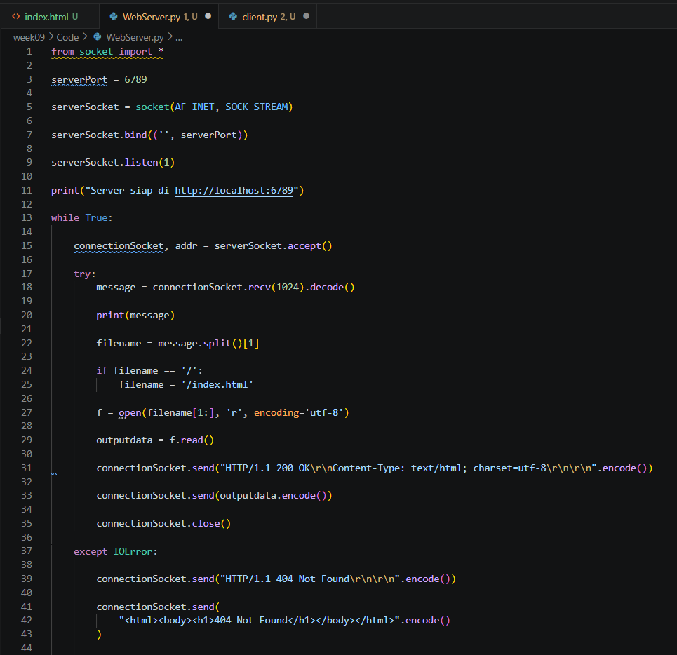
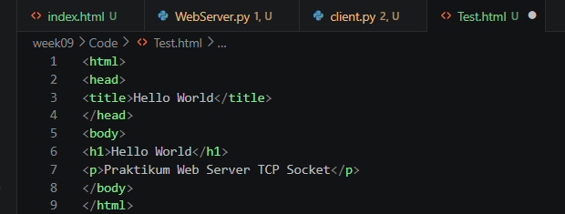
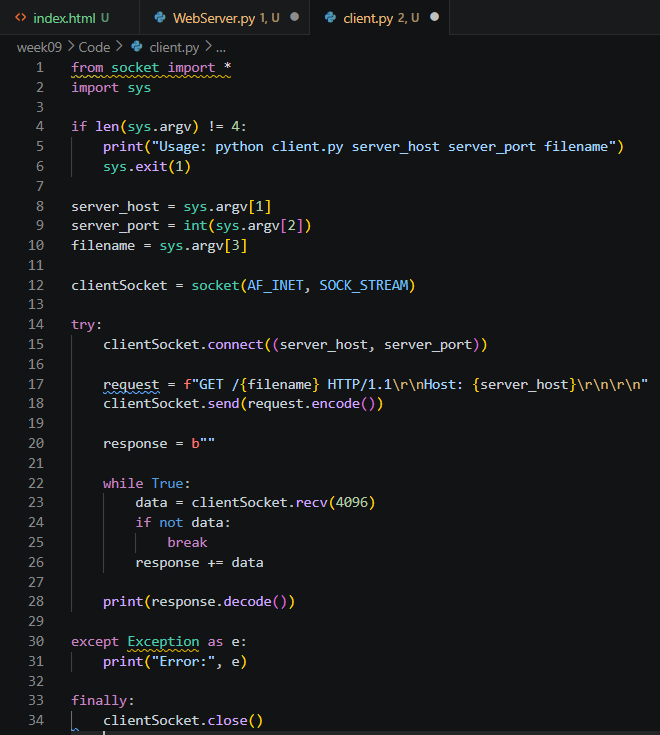
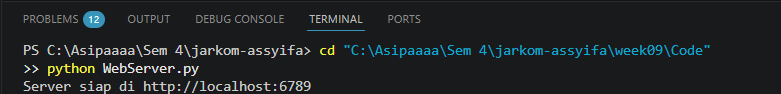
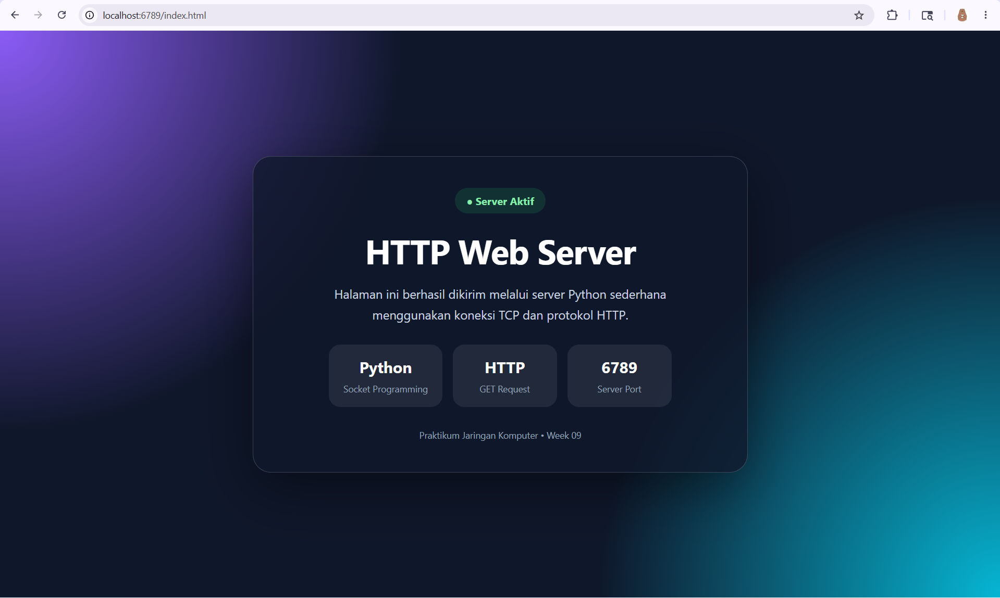
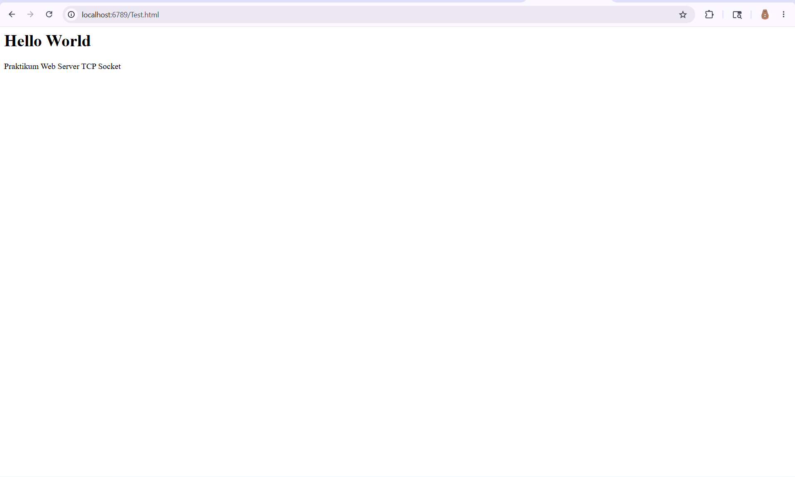
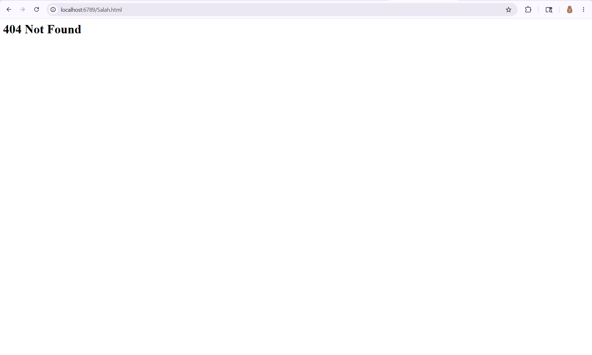

# Laporan Praktikum Jaringan Komputer

## Modul 9: Web Server

## 1. Tujuan Praktikum

1. Memahami konsep dasar web server menggunakan TCP socket programming.
2. Membuat program web server sederhana menggunakan Python.
3. Memahami proses request dan response HTTP pada web server.
4. Memahami cara pengiriman file HTML melalui koneksi TCP.
5. Menangani error HTTP 404 Not Found ketika file tidak ditemukan.

## 2. Alat dan Bahan

* Python
* Visual Studio Code
* Terminal / CMD
* Web Browser
* File HTML 

## 3. Langkah Percobaan

### 3.1 Membuat File HTML

1. Membuat file bernama `Test.html`.
2. Menyimpan file pada folder yang sama dengan program server.
3. Mengisi file HTML dengan halaman sederhana.

Contoh isi file:

```html
<html>
<head>
<title>Hello World</title>
</head>
<body>
<h1>Hello World</h1>
<p>Praktikum Web Server TCP Socket</p>
</body>
</html>
```

### 3.2 Membuat Program Web Server

1. Membuat file Python bernama `WebServer.py`.
2. Mengisi kode program web server menggunakan TCP socket programming.
3. Menentukan port server yang digunakan.
4. Menjalankan server menggunakan terminal.

### 3.3 Menjalankan Web Server

1. Membuka terminal pada folder project.
2. Menjalankan program server menggunakan perintah:

```bash
python WebServer.py
```

3. Membuka browser.
4. Mengakses URL:

```text
http://localhost:6789/Test.html
```

5. Mengamati halaman HTML yang ditampilkan browser.
6. Mencoba mengakses file yang tidak tersedia untuk melihat respon `404 Not Found`.

## 4. Hasil dan Pembahasan

### 4.1 Source Code Web Server



Program `WebServer.py` dibuat menggunakan TCP socket programming. Program ini bertugas menerima request HTTP dari browser, membaca file yang diminta, lalu mengirimkan response HTTP kembali ke client.

Program diawali dengan mengimpor library socket:

```python
from socket import *
import sys
```

Library `socket` digunakan untuk membuat komunikasi jaringan, sedangkan `sys` digunakan untuk menghentikan program jika diperlukan.

Server membuat socket TCP menggunakan:

```python
serverSocket = socket(AF_INET, SOCK_STREAM)
```

Keterangan:

* `AF_INET` menunjukkan bahwa server menggunakan IPv4.
* `SOCK_STREAM` menunjukkan bahwa server menggunakan protokol TCP.

Server kemudian menentukan port, melakukan `bind()`, dan menjalankan `listen()` agar dapat menerima koneksi dari client.

```python
serverPort = 6789
serverSocket.bind(('', serverPort))
serverSocket.listen(1)
```

Ketika browser mengakses alamat server, koneksi diterima menggunakan:

```python
connectionSocket, addr = serverSocket.accept()
```

Server membaca HTTP request dari browser menggunakan:

```python
message = connectionSocket.recv(1024).decode()
```

Kemudian nama file yang diminta browser diambil dari request:

```python
filename = message.split()[1]
```

Jika file ditemukan, server membuka file, membaca isinya, lalu mengirim header HTTP `200 OK` beserta isi file HTML ke browser.

Jika file tidak ditemukan, server masuk ke bagian `except IOError` dan mengirim response `404 Not Found`.

### 4.2 Source Code HTML

#### 4.2.1 File index.html

[Index HTML](Code/index.html)

File `index.html` digunakan sebagai halaman utama yang dikirimkan oleh web server ke browser. File ini disimpan pada folder yang sama dengan program server agar dapat dibaca ketika browser melakukan request.

Isi file HTML berupa halaman sederhana yang menampilkan teks **Hello World** dan informasi praktikum web server.

#### 4.2.2 File test.html



Selain file `index.html`, dibuat juga file `test.html` untuk melakukan pengujian tambahan pada web server.

File `test.html` digunakan untuk memastikan bahwa server dapat mengirim lebih dari satu file HTML kepada browser. Ketika browser mengakses file ini, server akan membaca isi file kemudian mengirimkannya sebagai HTTP response.

Pengujian ini membuktikan bahwa web server mampu menangani request untuk beberapa file HTML yang berbeda.

### 4.3 Source Code Client Tambahan



Selain menggunakan browser, pengujian juga dapat dilakukan menggunakan program client sederhana. Client ini dibuat dengan socket TCP untuk mengirim request HTTP ke server dan menerima response yang dikirimkan oleh server.

Client akan menghubungi server berdasarkan host, port, dan nama file yang diminta. Setelah request dikirim, client akan menampilkan response HTTP yang diterima.

### 4.4 Menjalankan Web Server



Pada terminal terlihat server berhasil dijalankan menggunakan Python. Server menampilkan pesan bahwa server berjalan pada alamat:

```text
http://localhost:6789
```

Hal ini menunjukkan bahwa server sudah siap menerima request dari browser atau client.

### 4.5 Tampilan Awal Web Server



Gambar di atas menunjukkan tampilan awal web server pada browser. Tampilan ini menunjukkan bahwa server sudah dapat diakses melalui browser dan berjalan pada port yang telah ditentukan.

### 4.6 Hasil Akses Test HTML



Browser berhasil menampilkan isi file HTML yang dikirim oleh server. Hal ini menunjukkan bahwa proses request dan response berjalan dengan benar.

Urutan prosesnya adalah:

1. Browser mengirim request HTTP ke server.
2. Server menerima request melalui socket TCP.
3. Server membaca file HTML yang diminta.
4. Server mengirim response `HTTP/1.1 200 OK`.
5. Browser menampilkan isi file HTML.

### 4.7 Hasil Error 404 Not Found



Ketika browser mencoba mengakses file yang tidak tersedia pada folder server, server mengirim response:

```text
HTTP/1.1 404 Not Found
```

Browser kemudian menampilkan halaman error `404 Not Found`. Hal ini menunjukkan bahwa mekanisme error handling pada web server berhasil berjalan.

### 4.8 Analisis HTTP Request dan Response

Pada praktikum ini browser bertindak sebagai HTTP client, sedangkan program Python bertindak sebagai web server.

Ketika browser mengakses URL:

```text
http://localhost:6789/index.html
```

browser akan mengirim HTTP request seperti:

```http
GET /index.html HTTP/1.1
```

Server menerima request tersebut, mencari file HTML yang diminta, lalu mengirim HTTP response.

Jika file ditemukan, server mengirim:

```http
HTTP/1.1 200 OK
```

Jika file tidak ditemukan, server mengirim:

```http
HTTP/1.1 404 Not Found
```

Praktikum ini menunjukkan cara kerja dasar web server dan proses komunikasi HTTP menggunakan TCP socket programming.

## 5. Kesimpulan

Berdasarkan hasil praktikum, web server sederhana dapat dibuat menggunakan TCP socket programming pada Python. Server dapat menerima HTTP request dari browser, membaca file HTML dari sistem file, kemudian mengirimkan HTTP response ke client. Selain itu, server juga dapat menangani error `404 Not Found` ketika file yang diminta tidak tersedia. Praktikum ini membantu memahami dasar komunikasi HTTP dan cara kerja web server secara sederhana.
