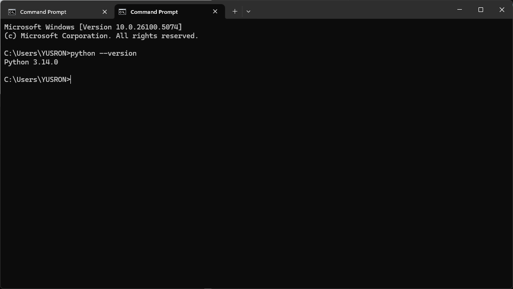
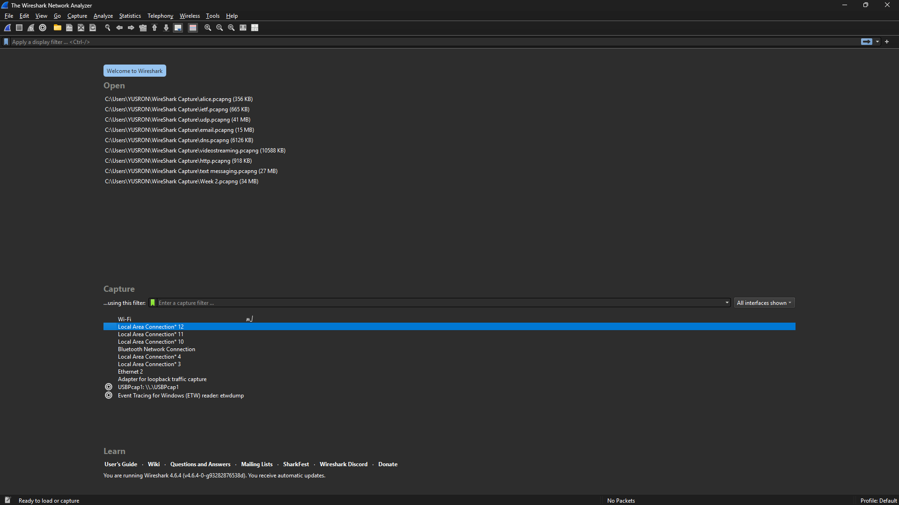

# Laporan Praktikum Jaringan Komputer
## Modul 1: Running Modul


## 1. Tujuan Praktikum
Mengetahui tata tertib pelaksanaan praktikum serta memastikan aplikasi pendukung seperti Wireshark dan Python telah terpasang dan dapat digunakan dengan baik.


## 2. Alat dan Bahan
- Wireshark (http://www.wireshark.org/)
- Python (https://www.python.org/downloads/)


## 3. Langkah Percobaan
1. Unduh aplikasi Wireshark melalui situs resminya, kemudian melakukan proses instalasi.
2. Unduh Python dari website resmi dan menginstalnya pada perangkat.
3. Melakukan pengecekan instalasi Python melalui terminal dengan perintah:
   ```bash
   python --version

## 4. Lampiran


