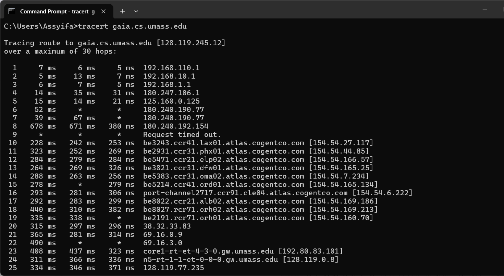
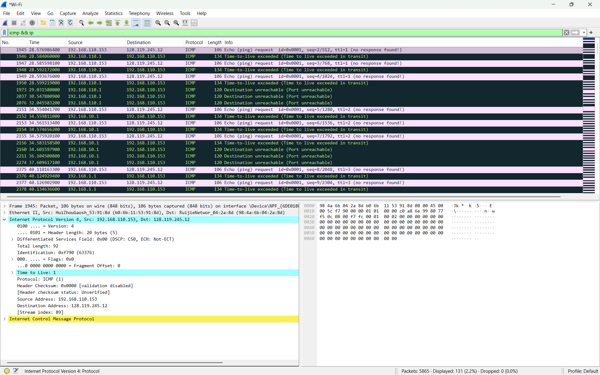
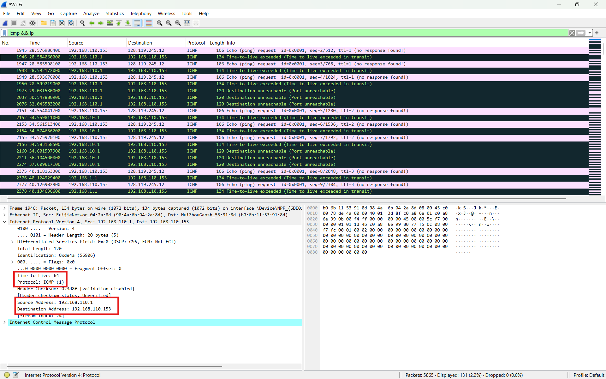
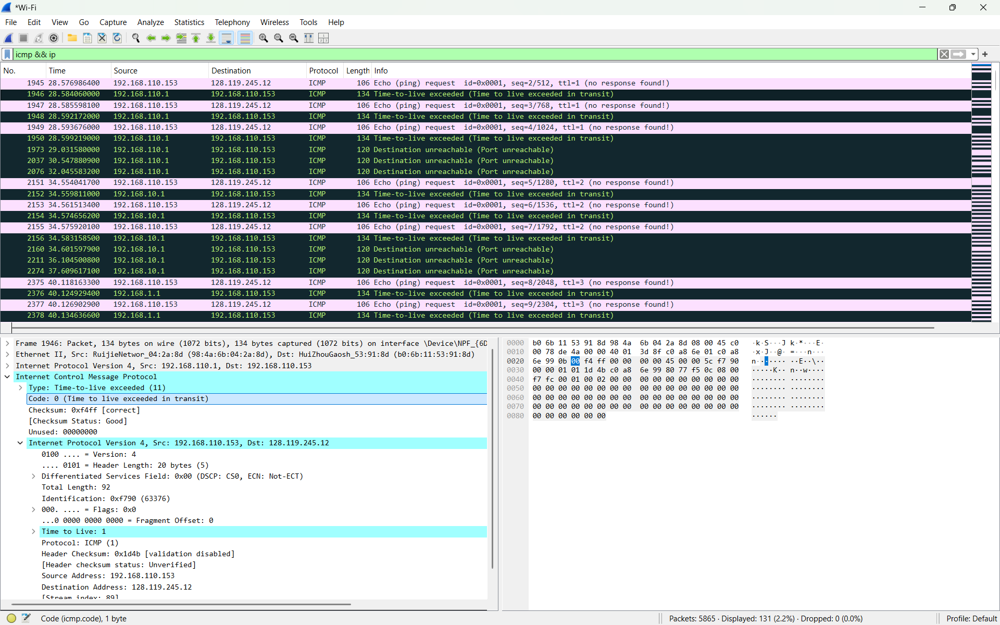
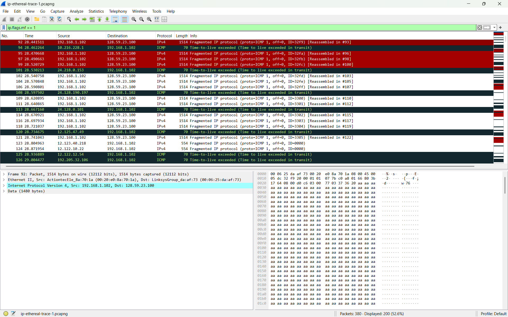
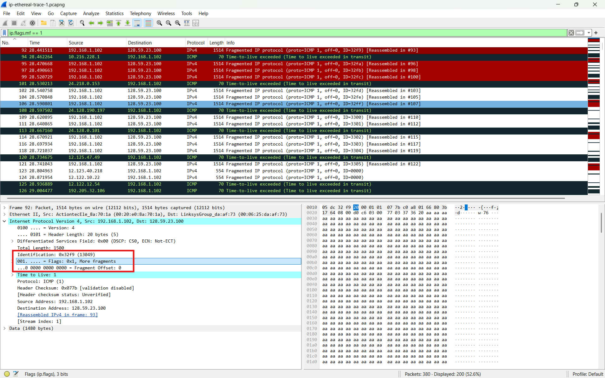
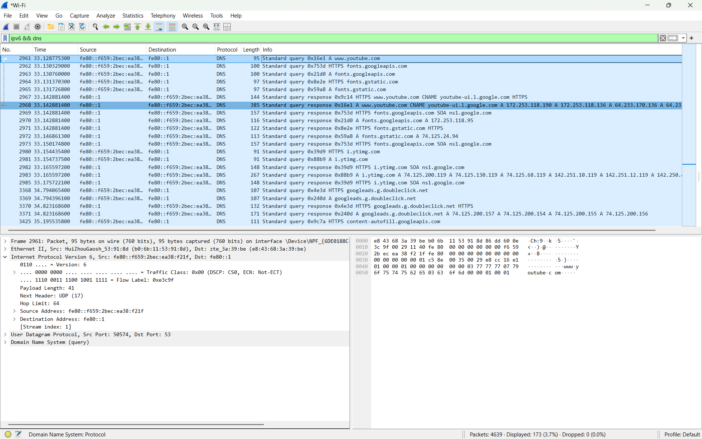
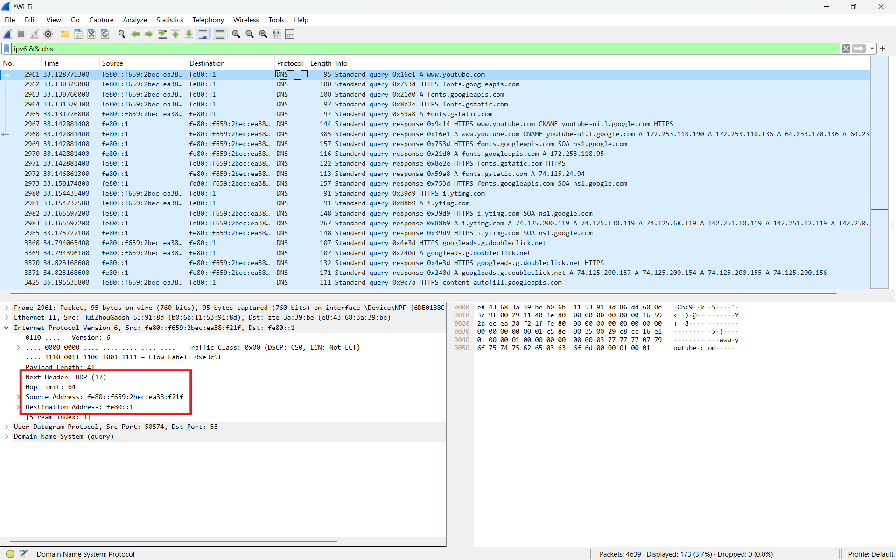

# Laporan Praktikum Jaringan Komputer
## Modul 10: Internet Protocol (IP)


## 1. Tujuan Praktikum
1. Memahami cara kerja protokol IP menggunakan Wireshark.  
2. Mengamati paket IPv4 dan IPv6 pada jaringan komputer.  
3. Menganalisis proses traceroute menggunakan ICMP dan IP.  
4. Memahami mekanisme fragmentasi pada IPv4.  
5. Mengamati penggunaan IPv6 pada jaringan komputer.  


## 2. Alat dan Bahan
- Wireshark  
- Command Prompt / Terminal  
- Koneksi internet  
- Sistem operasi Windows/Linux/MacOS  


## 3. Langkah Percobaan

### 3.1 Menjalankan Traceroute
Pada sistem operasi Windows digunakan perintah:

```bash
tracert gaia.cs.umass.edu
````

Perintah tersebut digunakan untuk mengetahui jalur router yang dilewati paket menuju host tujuan.

### 3.2 Menjalankan Wireshark

1. Membuka aplikasi Wireshark.
2. Memilih interface jaringan yang aktif.
3. Memulai proses capture paket.
4. Menjalankan perintah traceroute.
5. Menghentikan capture setelah proses selesai.

### 3.3 Menggunakan Filter Wireshark

Filter yang digunakan:

```text
icmp && ip
```

Filter ini digunakan untuk menampilkan paket ICMP dan IP yang berkaitan dengan traceroute.

## 4. Hasil dan Pembahasan

### 4.1 Hasil Traceroute



Pada gambar di atas terlihat hasil proses traceroute menuju `gaia.cs.umass.edu`.

Traceroute bekerja dengan mengirim paket menggunakan nilai TTL (Time To Live) yang berbeda-beda. Router yang menerima paket akan mengurangi nilai TTL sebesar 1.

Jika nilai TTL menjadi 0, router akan mengirim pesan:

```text
ICMP Time Exceeded
```

kepada host pengirim.

Dengan mekanisme tersebut, traceroute dapat mengetahui router-router yang dilewati paket menuju tujuan.

### 4.2 Filter ICMP dan IP



Pada Wireshark digunakan filter:

```text
icmp && ip
```

Filter ini digunakan agar hanya paket ICMP dan IP yang ditampilkan.

Paket IP digunakan oleh traceroute untuk mengirim probe packet, sedangkan paket ICMP digunakan oleh router untuk mengirim balasan ketika TTL habis.

### 4.3 Analisis Header IPv4



Pada paket IPv4 terdapat beberapa field penting:

| Field               | Fungsi                               |
| ------------------- | ------------------------------------ |
| Version             | Menunjukkan versi IP yang digunakan  |
| Header Length       | Panjang header IP                    |
| Total Length        | Panjang keseluruhan datagram         |
| Identification      | Identitas datagram untuk fragmentasi |
| Flags               | Menunjukkan fragmentasi              |
| Fragment Offset     | Posisi fragment dalam datagram       |
| TTL                 | Batas hop paket                      |
| Protocol            | Jenis protokol layer atas            |
| Source Address      | Alamat IP pengirim                   |
| Destination Address | Alamat IP tujuan                     |

Field TTL sangat penting pada traceroute karena digunakan untuk menentukan jumlah hop yang dilewati paket.

### 4.4 Analisis TTL dan ICMP Time Exceeded



Pada gambar di atas terlihat paket ICMP yang dikirim oleh router ketika nilai TTL mencapai nol.

Setiap router akan mengurangi nilai TTL sebesar 1. Ketika TTL habis, router akan membuang paket dan mengirim pesan:

```text
ICMP Time Exceeded
```

kepada host pengirim.

Mekanisme inilah yang digunakan traceroute untuk mengetahui jalur router menuju tujuan.

### 4.5 Fragmentasi IPv4





Pada praktikum ini digunakan datagram dengan ukuran besar, yaitu sekitar:

```text
3000 byte
```

Ukuran tersebut lebih besar daripada MTU (Maximum Transmission Unit) jaringan Ethernet yang umumnya sekitar:

```text
1500 byte
```

Karena ukuran datagram melebihi MTU, maka datagram IPv4 harus dipecah menjadi beberapa bagian yang lebih kecil. Proses ini disebut **fragmentasi IP**.

Pada modul dijelaskan bahwa pengguna Windows tidak dapat menghasilkan fragmentasi menggunakan perintah `tracert`, karena Windows tidak menyediakan pengaturan ukuran paket ICMP secara bebas. Oleh karena itu, analisis fragmentasi dilakukan menggunakan file trace dari modul praktikum.

Fragmentasi dapat diamati pada Wireshark melalui beberapa field penting berikut:

| Field               | Fungsi                                                 |
| ------------------- | ------------------------------------------------------ |
| Identification      | Menandai fragment yang berasal dari datagram yang sama |
| More Fragments (MF) | Menunjukkan masih ada fragment berikutnya              |
| Fragment Offset     | Menentukan posisi fragment dalam datagram asli         |
| Total Length        | Panjang masing-masing fragment                         |

Semua fragment memiliki nilai **Identification** yang sama karena berasal dari datagram yang sama.

Field **More Fragments (MF)** bernilai aktif pada fragment awal dan bernilai 0 pada fragment terakhir. Hal ini digunakan untuk memberi tahu host tujuan apakah masih ada fragment lain yang akan diterima.

Field **Fragment Offset** digunakan untuk menentukan posisi fragment ketika proses penyusunan ulang (reassembly) dilakukan di host tujuan.

Pada proses fragmentasi:

1. Datagram besar dipecah menjadi beberapa fragment kecil.
2. Setiap fragment dikirim sebagai paket IP terpisah.
3. Host tujuan akan melakukan reassembly berdasarkan nilai Identification dan Fragment Offset.

Fragmentasi diperlukan agar paket dapat melewati jaringan yang memiliki batas ukuran frame tertentu. Namun, fragmentasi dapat menambah overhead dan memperlambat proses pengiriman data karena host tujuan harus menyusun kembali fragment-fragment tersebut.

### 4.6 Analisis IPv6





Pada hasil capture ditemukan paket IPv6 dengan alamat bertipe **link-local IPv6**.

Alamat IPv6 link-local biasanya memiliki prefix:

```text
fe80::
```

Alamat ini digunakan untuk komunikasi lokal dalam satu jaringan (local network segment) dan dibuat secara otomatis oleh perangkat tanpa memerlukan DHCP server ataupun konfigurasi manual.

Berbeda dengan IPv4 yang menggunakan alamat 32-bit, IPv6 menggunakan alamat 128-bit sehingga menyediakan jumlah alamat yang jauh lebih besar.

Beberapa karakteristik IPv6:

| IPv4                  | IPv6                   |
| --------------------- | ---------------------- |
| 32-bit address        | 128-bit address        |
| Menggunakan NAT       | Tidak memerlukan NAT   |
| Header lebih kompleks | Header lebih sederhana |
| Broadcast             | Menggunakan multicast  |

Pada packet detail Wireshark terlihat field IPv6 seperti:

* Source Address
* Destination Address
* Next Header
* Hop Limit

Field **Hop Limit** pada IPv6 memiliki fungsi yang sama dengan field TTL pada IPv4, yaitu membatasi jumlah hop paket pada jaringan.

Meskipun pada capture tidak ditemukan DNS AAAA request, keberadaan alamat IPv6 link-local menunjukkan bahwa perangkat dan jaringan yang digunakan sudah mendukung protokol IPv6.

### 4.7 Analisis Cara Kerja Traceroute

Traceroute bekerja dengan mengirim paket menggunakan nilai TTL yang meningkat secara bertahap.

Contoh:

| Paket         | TTL |
| ------------- | --- |
| Paket pertama | 1   |
| Paket kedua   | 2   |
| Paket ketiga  | 3   |

Ketika paket pertama dikirim dengan TTL=1, router pertama akan mengurangi TTL menjadi 0 dan mengirim ICMP Time Exceeded.

Ketika paket kedua dikirim dengan TTL=2, router kedua akan mengirim ICMP Time Exceeded.

Proses ini berlangsung terus hingga paket mencapai host tujuan.

Dengan cara tersebut, traceroute dapat mengetahui jalur router yang dilewati paket.

### 4.8 Pembahasan Hasil Praktikum

Berdasarkan hasil praktikum, Wireshark berhasil menangkap paket IPv4, ICMP, UDP, dan IPv6.

Traceroute memanfaatkan field TTL pada IPv4 untuk mengetahui jalur router menuju tujuan. Ketika TTL habis, router mengirim pesan ICMP Time Exceeded.

Pada praktikum juga terlihat proses fragmentasi IPv4 ketika ukuran datagram terlalu besar. Datagram dipecah menjadi beberapa fragment agar dapat dikirim melalui jaringan.

Selain itu diamati paket IPv6 link-local yang menunjukkan dukungan IPv6 pada jaringan yang digunakan.

Praktikum ini membantu memahami cara kerja dasar Internet Protocol pada jaringan komputer.

## 5. Kesimpulan

Berdasarkan hasil praktikum, protokol IP berfungsi untuk pengalamatan dan pengiriman paket pada jaringan komputer. Traceroute memanfaatkan field TTL dan pesan ICMP untuk mengetahui jalur router menuju tujuan. Pada IPv4 juga terdapat mekanisme fragmentasi ketika ukuran datagram melebihi MTU jaringan. Selain IPv4, praktikum juga menunjukkan penggunaan IPv6 link-local pada jaringan modern.

```
```
