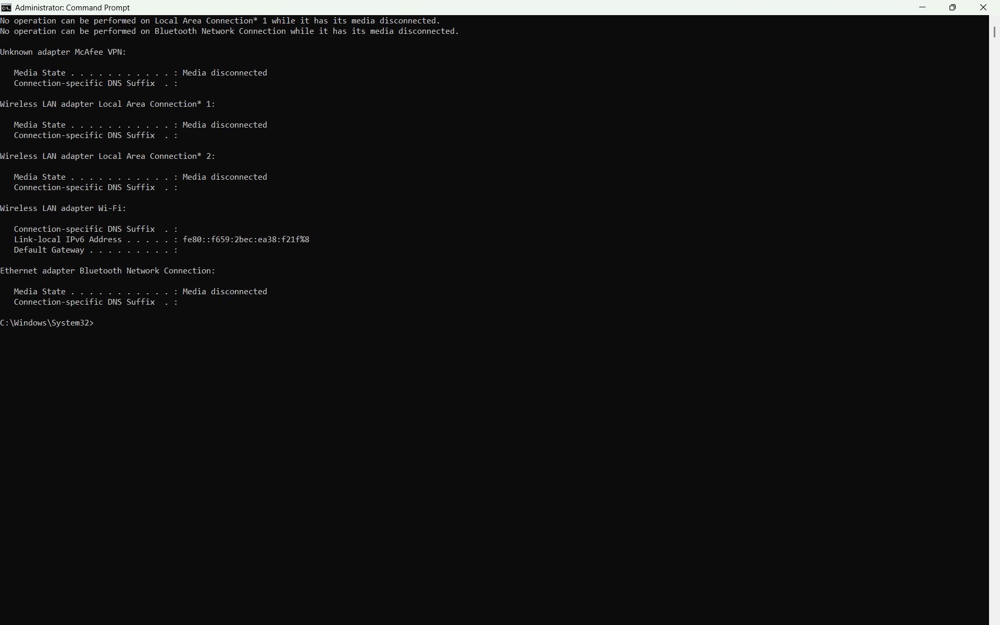
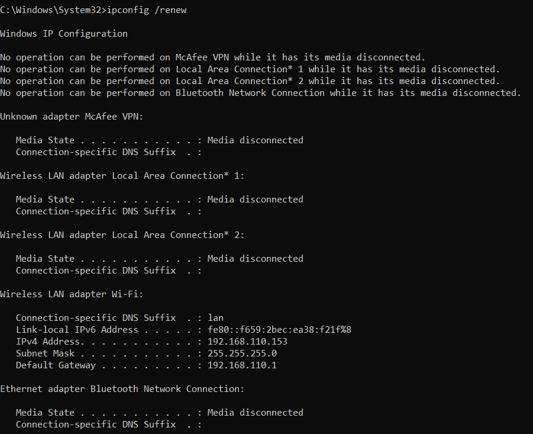
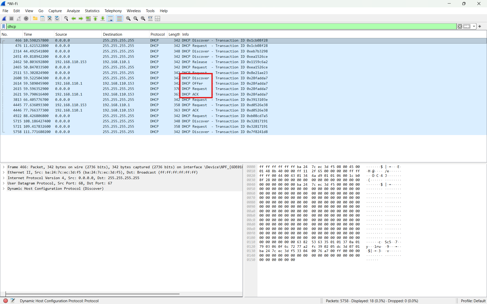
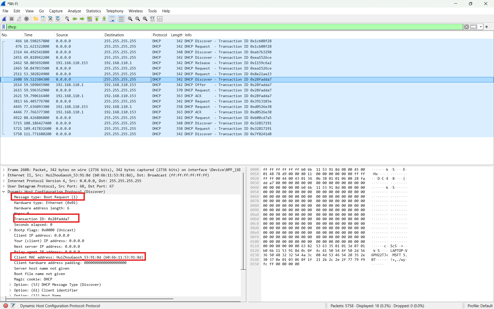
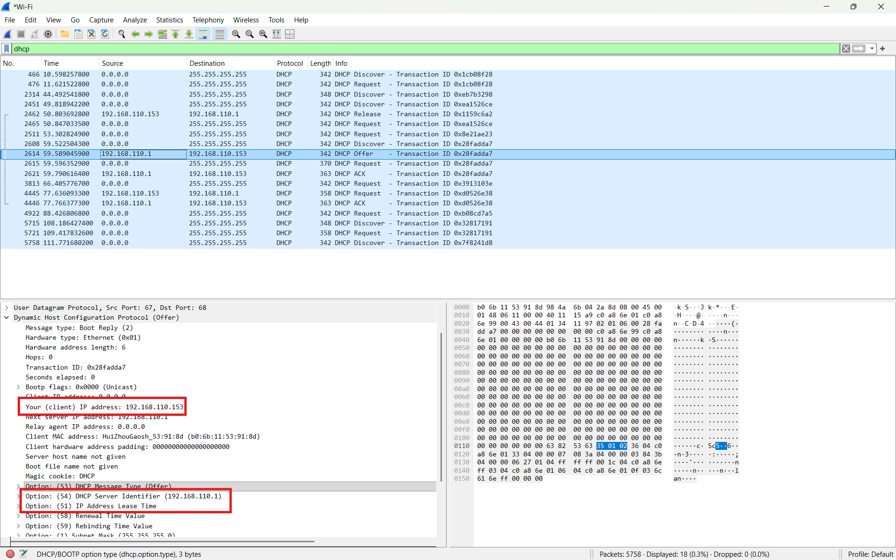
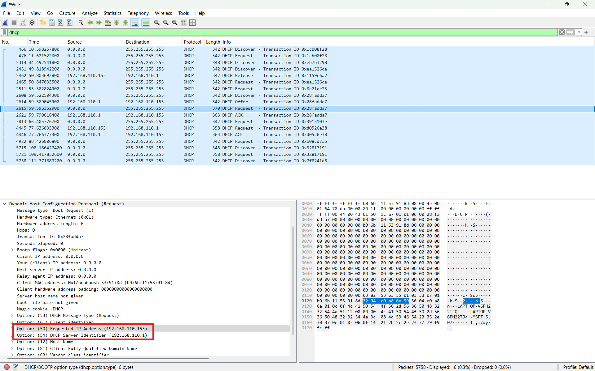
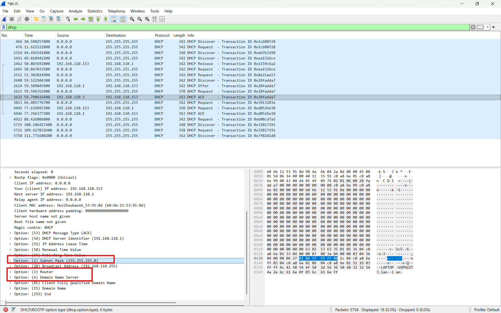

# Laporan Praktikum Jaringan Komputer

## Modul 11: Dynamic Host Configuration Protocol (DHCP)

## 1. Tujuan Praktikum

1. Memahami cara kerja protokol DHCP menggunakan Wireshark.
2. Mengamati proses pemberian alamat IP secara dinamis oleh DHCP server.
3. Menganalisis paket DHCP Discover, Offer, Request, dan ACK.
4. Memahami proses komunikasi antara DHCP client dan DHCP server.

## 2. Alat dan Bahan

* Wireshark
* Command Prompt / Terminal
* Koneksi jaringan
* Sistem operasi Windows/Linux/MacOS

## 3. Langkah Percobaan

### 3.1 Melepaskan Alamat IP Lama

Pada Windows digunakan perintah berikut:

```bash
ipconfig /release
```


Perintah tersebut digunakan untuk melepaskan alamat IP yang sedang digunakan oleh komputer.

### 3.2 Menjalankan Wireshark

1. Membuka aplikasi Wireshark.
2. Memilih interface jaringan yang aktif.
3. Memulai proses capture paket.

### 3.3 Meminta Alamat IP Baru

Pada Windows digunakan perintah:

```bash
ipconfig /renew
```

Perintah ini menyebabkan komputer meminta alamat IP baru dari DHCP server.

### 3.4 Menggunakan Filter DHCP

Pada Wireshark digunakan filter:

```text
dhcp
```

agar hanya paket DHCP yang ditampilkan.

## 4. Hasil dan Pembahasan

### 4.1 Filter DHCP pada Wireshark



Pada gambar di atas terlihat bahwa Wireshark berhasil menangkap paket DHCP menggunakan filter:

```text
dhcp
```

Filter ini digunakan agar paket yang ditampilkan hanya paket DHCP, sehingga proses analisis menjadi lebih mudah. DHCP bekerja menggunakan protokol UDP, yaitu:

| Port   | Fungsi                     |
| ------ | -------------------------- |
| UDP 67 | Digunakan oleh DHCP server |
| UDP 68 | Digunakan oleh DHCP client |

Pada proses DHCP, client awalnya belum memiliki alamat IP. Karena itu, beberapa pesan DHCP dikirim secara broadcast agar dapat diterima oleh DHCP server yang berada dalam jaringan yang sama.

Proses DHCP terdiri dari empat tahapan utama yang dikenal dengan istilah **DORA**, yaitu:

```text
Discover → Offer → Request → ACK
```

### 4.2 DHCP Discover



Paket pertama yang dikirim oleh client adalah **DHCP Discover**. Paket ini dikirim ketika client belum memiliki alamat IP dan ingin mencari DHCP server pada jaringan.

Pada tahap ini, client belum mengetahui alamat IP DHCP server. Oleh karena itu, client mengirim pesan secara broadcast.

Ciri-ciri DHCP Discover:

| Bagian           | Nilai / Keterangan |
| ---------------- | ------------------ |
| Sumber           | Client             |
| Tujuan           | Broadcast          |
| Source IP        | `0.0.0.0`          |
| Destination IP   | `255.255.255.255`  |
| Source Port      | UDP 68             |
| Destination Port | UDP 67             |
| Message Type     | DHCP Discover      |

Alamat `0.0.0.0` digunakan karena client belum memiliki alamat IP. Sedangkan alamat `255.255.255.255` digunakan karena client mengirim pesan ke seluruh perangkat dalam jaringan lokal.

Tujuan dari DHCP Discover adalah mencari server DHCP yang tersedia dan meminta penawaran konfigurasi jaringan.

### 4.3 DHCP Offer



Setelah DHCP server menerima paket Discover, server akan membalas dengan paket **DHCP Offer**. Paket ini berisi penawaran alamat IP yang dapat digunakan oleh client.

Ciri-ciri DHCP Offer:

| Bagian           | Nilai / Keterangan               |
| ---------------- | -------------------------------- |
| Sumber           | DHCP Server                      |
| Tujuan           | Client / Broadcast               |
| Source Port      | UDP 67                           |
| Destination Port | UDP 68                           |
| Message Type     | DHCP Offer                       |
| Isi utama        | Penawaran alamat IP untuk client |

Pada paket Offer, DHCP server biasanya memberikan beberapa informasi konfigurasi jaringan, seperti:

* alamat IP yang ditawarkan
* subnet mask
* default gateway
* DNS server
* lease time
* alamat DHCP server

Field penting pada DHCP Offer adalah **Your IP Address (yiaddr)**. Field ini menunjukkan alamat IP yang ditawarkan oleh DHCP server kepada client.

Dengan adanya DHCP Offer, client mengetahui bahwa ada DHCP server yang bersedia memberikan konfigurasi jaringan.

### 4.4 DHCP Request



Setelah menerima DHCP Offer, client mengirimkan paket **DHCP Request**. Paket ini digunakan untuk meminta secara resmi alamat IP yang telah ditawarkan oleh DHCP server.

Ciri-ciri DHCP Request:

| Bagian           | Nilai / Keterangan         |
| ---------------- | -------------------------- |
| Sumber           | Client                     |
| Tujuan           | DHCP Server / Broadcast    |
| Source Port      | UDP 68                     |
| Destination Port | UDP 67                     |
| Message Type     | DHCP Request               |
| Isi utama        | Permintaan resmi alamat IP |

Pada tahap ini, client memilih salah satu alamat IP yang ditawarkan. Jika terdapat lebih dari satu DHCP server, pesan Request juga berfungsi untuk memberi tahu server lain bahwa client telah memilih salah satu tawaran.

Biasanya pada DHCP Request terdapat field:

* **Requested IP Address**, yaitu alamat IP yang diminta client.
* **Server Identifier**, yaitu alamat DHCP server yang dipilih client.
* **Client Identifier**, yaitu identitas client yang meminta alamat IP.

Paket ini penting karena menjadi tanda bahwa client menyetujui konfigurasi yang ditawarkan oleh DHCP server.

### 4.5 DHCP ACK



Tahap terakhir adalah **DHCP ACK**. Paket ini dikirim oleh DHCP server sebagai konfirmasi bahwa alamat IP dan konfigurasi jaringan resmi diberikan kepada client.

Ciri-ciri DHCP ACK:

| Bagian           | Nilai / Keterangan             |
| ---------------- | ------------------------------ |
| Sumber           | DHCP Server                    |
| Tujuan           | Client / Broadcast             |
| Source Port      | UDP 67                         |
| Destination Port | UDP 68                         |
| Message Type     | DHCP ACK                       |
| Isi utama        | Konfirmasi pemberian alamat IP |

Setelah menerima DHCP ACK, client dapat menggunakan alamat IP yang diberikan untuk berkomunikasi di jaringan.

Pada paket ACK biasanya terdapat informasi konfigurasi lengkap seperti:

* IP address client
* subnet mask
* router/default gateway
* DNS server
* lease time
* renewal time
* rebinding time

Pesan ACK menandakan bahwa proses DHCP berhasil. Setelah tahap ini selesai, komputer client sudah memiliki konfigurasi jaringan yang valid.

### 4.6 Analisis Urutan DORA

Proses DHCP yang terlihat pada Wireshark menunjukkan urutan:

```text
DHCP Discover → DHCP Offer → DHCP Request → DHCP ACK
```

Urutan tersebut disebut proses **DORA**.

| Tahap    | Pengirim    | Penerima                | Fungsi                              |
| -------- | ----------- | ----------------------- | ----------------------------------- |
| Discover | Client      | Broadcast / DHCP Server | Mencari DHCP server                 |
| Offer    | DHCP Server | Client                  | Menawarkan alamat IP                |
| Request  | Client      | DHCP Server             | Meminta alamat IP yang ditawarkan   |
| ACK      | DHCP Server | Client                  | Menyetujui dan memberikan alamat IP |

Dari hasil capture, dapat dilihat bahwa DHCP memungkinkan client mendapatkan alamat IP secara otomatis tanpa konfigurasi manual. Proses ini sangat berguna pada jaringan yang memiliki banyak perangkat, karena administrator tidak perlu memberikan alamat IP satu per satu.

### 4.7 Analisis Header DHCP

Pada paket DHCP terdapat beberapa field penting yang digunakan selama proses komunikasi client dan server.

| Field              | Fungsi                                                                                            |
| ------------------ | ------------------------------------------------------------------------------------------------- |
| Transaction ID     | Menandai satu proses transaksi DHCP agar paket Discover, Offer, Request, dan ACK dapat dicocokkan |
| Client MAC Address | Identitas perangkat client yang meminta alamat IP                                                 |
| Your IP Address    | Alamat IP yang ditawarkan atau diberikan kepada client                                            |
| DHCP Message Type  | Menunjukkan jenis pesan DHCP, seperti Discover, Offer, Request, atau ACK                          |
| Server Identifier  | Menunjukkan alamat DHCP server yang memberikan penawaran                                          |
| Lease Time         | Lama waktu alamat IP dapat digunakan oleh client                                                  |
| Subnet Mask        | Menentukan bagian network dan host dari alamat IP                                                 |
| Router / Gateway   | Alamat gateway yang digunakan untuk keluar jaringan lokal                                         |
| DNS Server         | Server DNS yang digunakan untuk menerjemahkan nama domain                                         |

Field **Transaction ID** penting karena seluruh paket dalam satu proses DHCP memiliki ID transaksi yang sama. Dengan demikian, client dan server dapat mengetahui bahwa paket-paket tersebut merupakan bagian dari satu proses permintaan alamat IP yang sama.

Field **Client MAC Address** digunakan karena pada awal proses DHCP client belum memiliki alamat IP, sehingga identitas perangkat dikenali melalui alamat MAC.

### 4.8 Analisis Cara Kerja DHCP

DHCP bekerja secara otomatis untuk memberikan konfigurasi jaringan kepada client. Ketika komputer baru terhubung ke jaringan, komputer tersebut belum mengetahui alamat IP yang dapat digunakan. Oleh karena itu, komputer mengirim DHCP Discover secara broadcast.

DHCP server kemudian membalas dengan DHCP Offer yang berisi alamat IP dan konfigurasi jaringan. Client memilih tawaran tersebut dan mengirim DHCP Request. Setelah itu DHCP server mengirim DHCP ACK sebagai tanda bahwa alamat IP telah disetujui.

Dengan mekanisme ini, DHCP membantu menghindari konflik alamat IP karena alamat IP dikelola oleh server. DHCP juga mempermudah konfigurasi jaringan karena informasi seperti gateway dan DNS dapat dikirim secara otomatis.

### 4.9 Pembahasan Hasil Praktikum

Berdasarkan hasil capture Wireshark, proses DHCP berhasil diamati. Paket-paket DHCP yang muncul menunjukkan bahwa client melakukan proses permintaan alamat IP secara otomatis.

Urutan paket yang tertangkap sesuai dengan konsep DHCP pada modul, yaitu:

1. Client mengirim DHCP Discover.
2. Server membalas dengan DHCP Offer.
3. Client mengirim DHCP Request.
4. Server mengirim DHCP ACK.

Hal ini membuktikan bahwa DHCP bekerja dengan mekanisme request-response antara client dan server. Pada awal komunikasi, client menggunakan broadcast karena belum memiliki alamat IP. Setelah menerima ACK, client dapat menggunakan alamat IP yang diberikan oleh DHCP server.

## 5. Kesimpulan

Berdasarkan hasil praktikum, protokol DHCP digunakan untuk memberikan alamat IP dan konfigurasi jaringan secara otomatis kepada client. Proses DHCP terdiri dari empat tahap utama yaitu Discover, Offer, Request, dan ACK. Dengan menggunakan Wireshark, proses komunikasi antara DHCP client dan DHCP server dapat diamati secara detail melalui paket-paket DHCP yang ditangkap.
