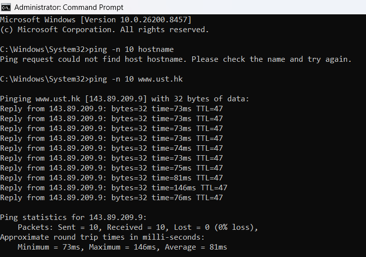
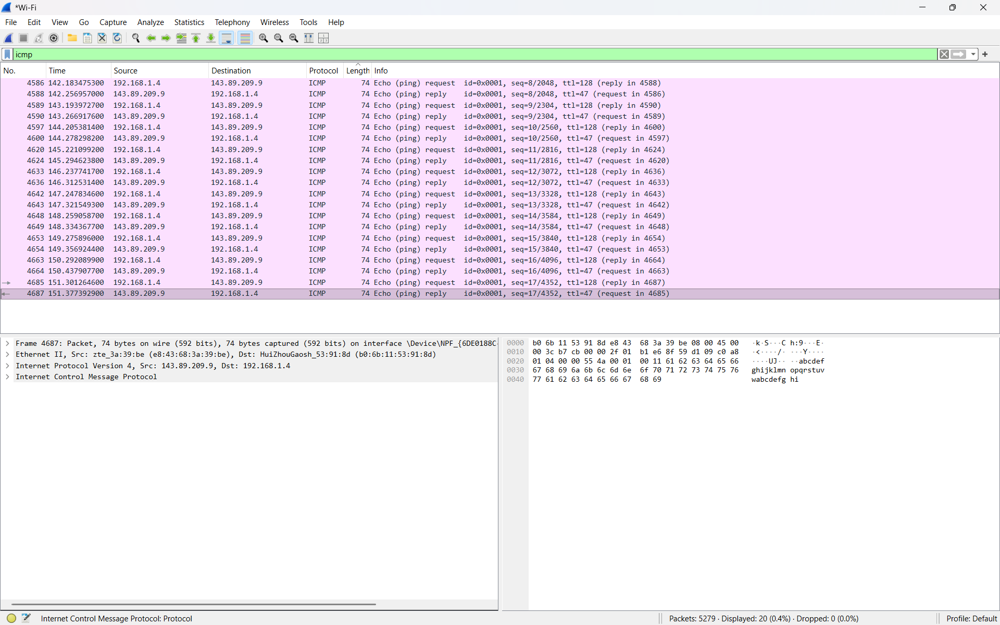
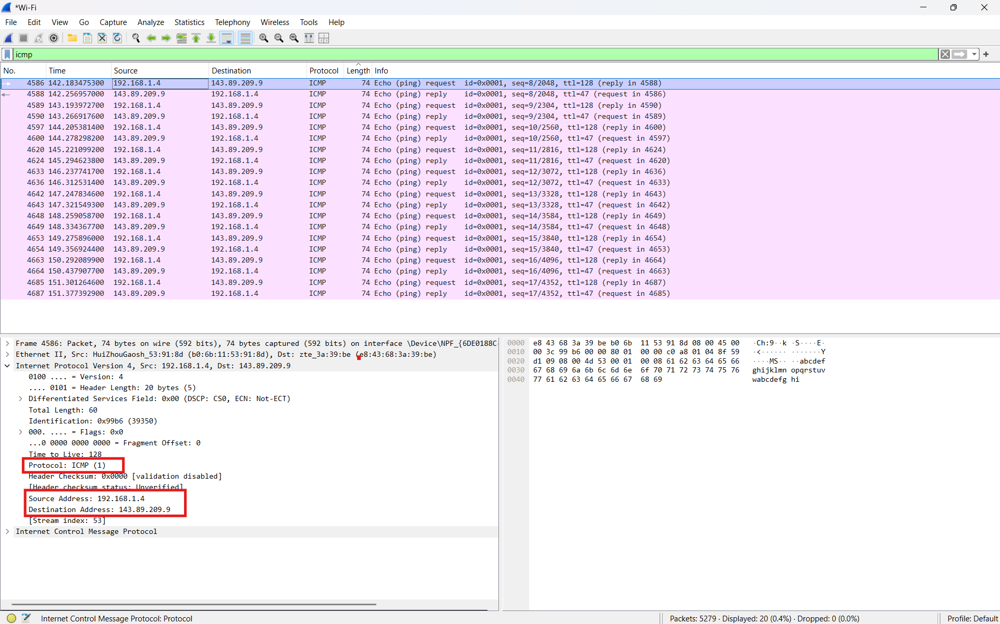
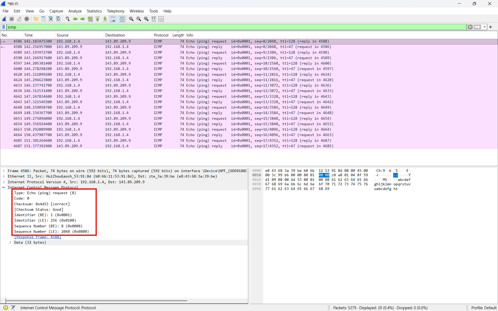
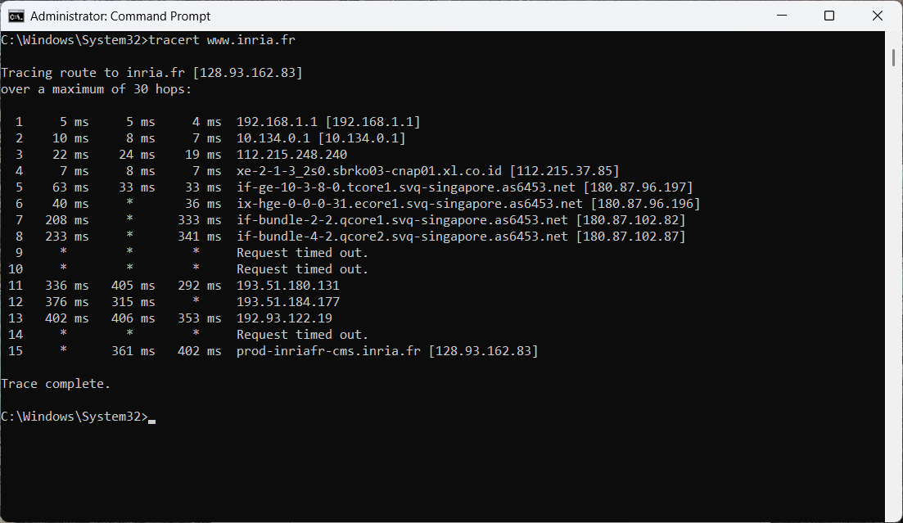
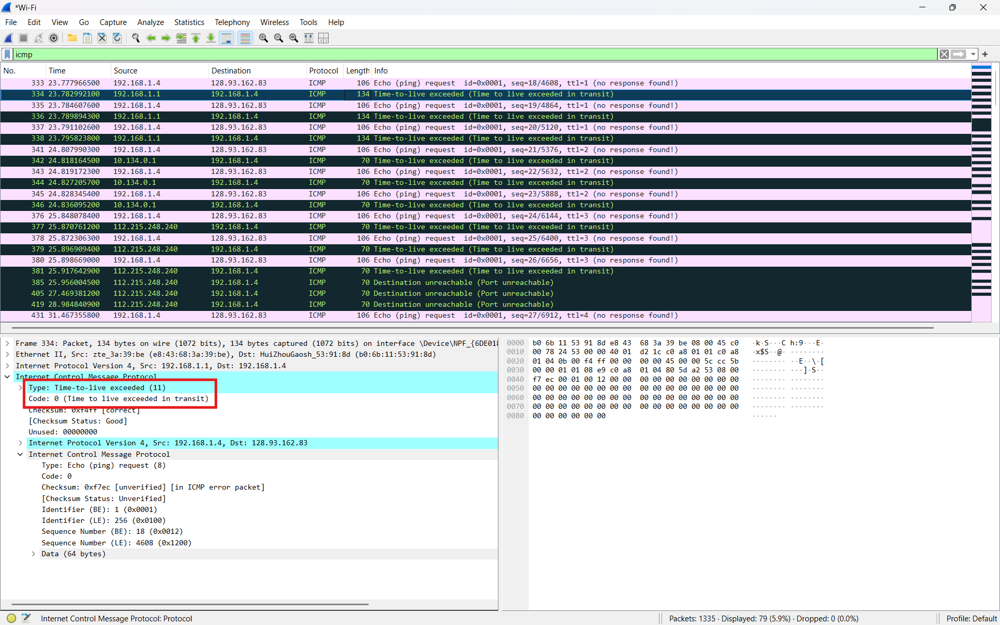
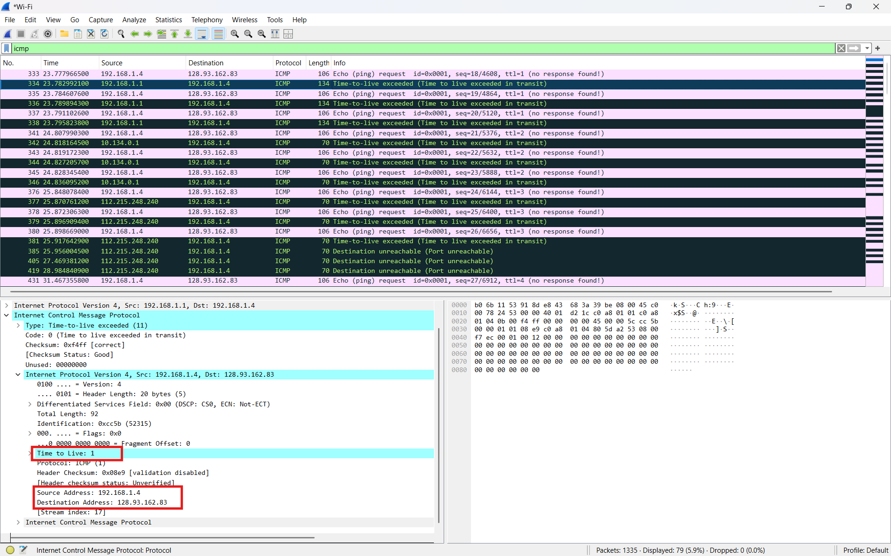

# Laporan Praktikum Jaringan Komputer

## Modul 12: ICMP dan Asistensi Tugas Besar

## 1. Tujuan Praktikum

1. Memahami cara kerja protokol ICMP menggunakan Wireshark.
2. Mengamati paket ICMP yang dihasilkan oleh program Ping.
3. Mengamati paket ICMP yang dihasilkan oleh program Traceroute.
4. Memahami format dan isi paket ICMP.

## 2. Alat dan Bahan

* Wireshark
* Command Prompt / Terminal
* Koneksi internet
* Sistem operasi Windows

## 3. Langkah Percobaan

### 3.1 Menjalankan Ping

Pada Windows digunakan perintah:

```bash
ping -n 10 www.ust.hk
```

Perintah tersebut digunakan untuk mengirim 10 paket ICMP Echo Request ke host tujuan.

### 3.2 Menjalankan Wireshark

1. Membuka aplikasi Wireshark.
2. Memilih interface jaringan yang aktif.
3. Memulai proses capture paket.
4. Menjalankan perintah ping dan tracert.
5. Menghentikan capture setelah proses selesai.

### 3.3 Menjalankan Traceroute

Pada Windows digunakan perintah:

```bash
tracert www.inria.fr
```

Perintah tersebut digunakan untuk mengetahui jalur router menuju host tujuan menggunakan paket ICMP.

## 4. Hasil dan Pembahasan

### 4.1 Hasil Ping pada Command Prompt



Pada gambar di atas terlihat hasil perintah ping yang mengirim paket ICMP ke host tujuan.

Program Ping bekerja dengan mengirim paket:

```text
ICMP Echo Request
```

ke host tujuan. Jika host aktif, maka host tujuan akan membalas dengan:

```text
ICMP Echo Reply
```

Dari hasil ping terlihat bahwa semua paket berhasil dikirim dan diterima kembali.

Selain itu juga terlihat nilai RTT (Round Trip Time), yaitu waktu yang dibutuhkan paket untuk pergi ke host tujuan dan kembali lagi ke pengirim.

### 4.2 Paket ICMP pada Wireshark



Pada Wireshark terlihat paket ICMP hasil proses ping.

Paket yang terlihat terdiri dari:

* ICMP Echo Request
* ICMP Echo Reply

Setiap paket ICMP dikirim menggunakan protokol IP dengan nomor protokol:

```text
1
```

Nomor protokol 1 menunjukkan bahwa payload datagram IP adalah paket ICMP.

### 4.3 Header IPv4 pada Paket ICMP



Pada paket ICMP terdapat header IPv4 yang berisi beberapa field penting:

| Field               | Fungsi                       |
| ------------------- | ---------------------------- |
| Version             | Versi IP yang digunakan      |
| Header Length       | Panjang header IP            |
| Total Length        | Panjang keseluruhan datagram |
| TTL                 | Batas hop paket              |
| Protocol            | Jenis protokol layer atas    |
| Source Address      | Alamat IP sumber             |
| Destination Address | Alamat IP tujuan             |

Field Protocol bernilai:

```text
1
```

yang menunjukkan bahwa protokol yang digunakan adalah ICMP.

### 4.4 ICMP Echo Request (Type 8)



Pada gambar di atas terlihat paket:

```text
ICMP Echo Request
```

Paket ini memiliki:

| Field | Nilai |
| ----- | ----- |
| Type  | 8     |
| Code  | 0     |

Type 8 menunjukkan bahwa paket merupakan Echo Request.

Paket ini dikirim oleh host pengirim untuk mengecek apakah host tujuan aktif atau tidak.

Pada paket ICMP juga terdapat field:

* Checksum
* Identifier
* Sequence Number

Sequence Number digunakan untuk mencocokkan Echo Request dengan Echo Reply yang diterima.


### 4.5 Hasil Traceroute



Pada gambar di atas terlihat hasil perintah:

```bash
tracert www.inria.fr
```

Traceroute digunakan untuk mengetahui jalur router yang dilewati paket menuju host tujuan.

Program traceroute bekerja dengan mengirim paket menggunakan nilai TTL yang berbeda-beda.

Contoh:

| Paket         | TTL |
| ------------- | --- |
| Paket pertama | 1   |
| Paket kedua   | 2   |
| Paket ketiga  | 3   |

Setiap router akan mengurangi nilai TTL sebesar 1.

Jika nilai TTL menjadi 0, router akan mengirim pesan:

```text
ICMP Time Exceeded
```

kepada host pengirim.

Dengan mekanisme tersebut, traceroute dapat mengetahui router-router yang dilewati paket.

### 4.6 ICMP Time Exceeded (Type 11)



Pada gambar di atas terlihat paket:

```text
ICMP Time Exceeded
```

Paket ini dikirim oleh router ketika nilai TTL paket mencapai nol.

Paket ICMP tersebut memiliki:

| Field | Nilai |
| ----- | ----- |
| Type  | 11    |
| Code  | 0     |

Type 11 menunjukkan pesan:

```text
Time To Live Exceeded
```

Pesan ini digunakan router untuk memberitahu host pengirim bahwa paket dibuang karena TTL habis.

Mekanisme inilah yang dimanfaatkan oleh traceroute untuk mengetahui jalur router menuju tujuan.

### 4.7 Header ICMP



Pada header ICMP terdapat beberapa field penting:

| Field           | Fungsi                           |
| --------------- | -------------------------------- |
| Type            | Menunjukkan jenis pesan ICMP     |
| Code            | Menjelaskan detail pesan ICMP    |
| Checksum        | Digunakan untuk pengecekan error |
| Identifier      | Identitas paket ICMP             |
| Sequence Number | Nomor urut paket ICMP            |

Field Type dan Code digunakan untuk menentukan jenis pesan ICMP.

Contoh:

* Type 8 = Echo Request
* Type 0 = Echo Reply
* Type 11 = Time Exceeded

### 4.8 Analisis Cara Kerja ICMP

ICMP (Internet Control Message Protocol) digunakan untuk mengirim pesan kontrol dan error pada jaringan IP.

ICMP tidak digunakan untuk mengirim data aplikasi, tetapi digunakan untuk:

* pengecekan koneksi jaringan
* pelaporan error
* diagnostik jaringan
* traceroute

Pada praktikum ini diamati beberapa jenis pesan ICMP:

| Type | Nama          |
| ---- | ------------- |
| 0    | Echo Reply    |
| 8    | Echo Request  |
| 11   | Time Exceeded |

Program Ping menggunakan pesan Echo Request dan Echo Reply untuk mengukur RTT dan mengecek koneksi jaringan.

Program Traceroute menggunakan pesan Time Exceeded untuk mengetahui router yang dilewati paket.

## 5. Kesimpulan

Berdasarkan hasil praktikum, protokol ICMP digunakan untuk pengiriman pesan kontrol dan error pada jaringan IP. Program Ping memanfaatkan ICMP Echo Request dan Echo Reply untuk mengukur koneksi jaringan dan RTT. Program Traceroute memanfaatkan pesan ICMP Time Exceeded untuk mengetahui jalur router menuju host tujuan. Dengan menggunakan Wireshark, paket-paket ICMP dapat dianalisis secara detail, mulai dari header IPv4, header ICMP, hingga jenis pesan ICMP yang digunakan.
