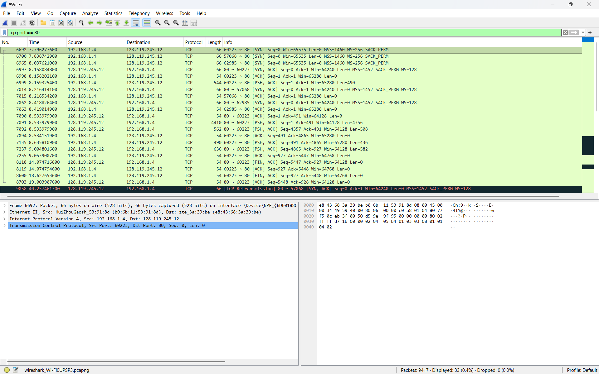
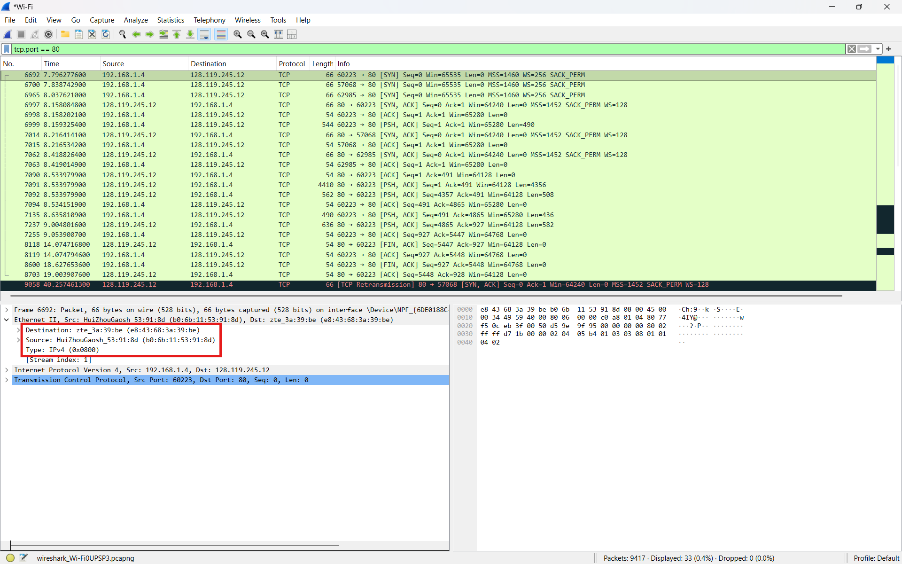
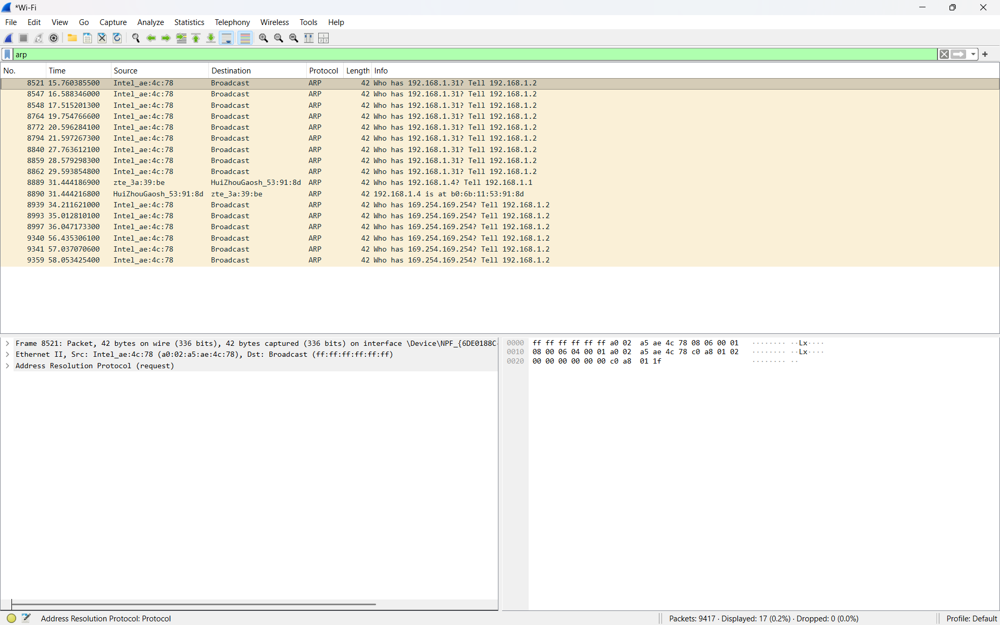
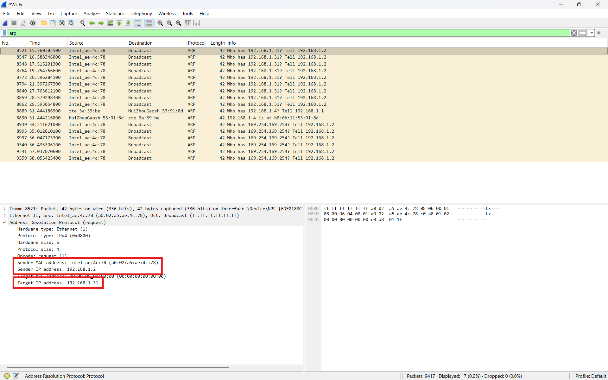

# Laporan Praktikum Jaringan Komputer
## Modul 13: Ethernet dan ARP


## 1. Tujuan Praktikum
1. Memahami cara kerja protokol Ethernet menggunakan Wireshark.  
2. Mengamati struktur frame Ethernet.  
3. Memahami cara kerja Address Resolution Protocol (ARP).  
4. Mengamati proses ARP Request dan ARP Reply pada jaringan komputer.  


## 2. Alat dan Bahan
- Wireshark  
- Web browser  
- Command Prompt / Terminal  
- Koneksi internet  


## 3. Langkah Percobaan

### 3.1 Membuka Halaman Web
1. Membuka browser.  
2. Mengakses halaman:

```text
http://gaia.cs.umass.edu/wireshark-labs/HTTP-wireshark-lab-file3.html
````

3. Mengamati halaman web yang berhasil dimuat.

### 3.2 Menjalankan Wireshark

1. Membuka aplikasi Wireshark.
2. Memilih interface jaringan aktif.
3. Memulai proses capture paket.
4. Membuka halaman web pada browser.
5. Menghentikan capture setelah halaman selesai dimuat.

### 3.3 Menggunakan Filter TCP Port 80

Pada Wireshark digunakan filter:

```text
tcp.port == 80
```

Filter digunakan untuk menampilkan paket TCP yang menggunakan port HTTP.

### 3.4 Menggunakan Filter ARP

Pada Wireshark digunakan filter:

```text
arp
```

Filter digunakan untuk menampilkan paket Address Resolution Protocol.

## 4. Hasil dan Pembahasan

### 4.1 Halaman Web yang Diakses


Pada gambar di atas terlihat halaman web:

```text
http://gaia.cs.umass.edu/wireshark-labs/HTTP-wireshark-lab-file3.html
```

Halaman berhasil dimuat melalui komunikasi antara browser dan server menggunakan protokol TCP/IP dan Ethernet.

### 4.2 Filter TCP Port 80



Pada praktikum ini paket HTTP tidak dapat langsung ditampilkan menggunakan filter:

```text
http
```

Hal tersebut terjadi karena Wireshark tidak mendeteksi paket sebagai protokol HTTP secara otomatis. Oleh karena itu digunakan filter:

```text
tcp.port == 80
```

Filter tersebut digunakan karena protokol HTTP umumnya berjalan pada port TCP 80.

Dengan filter tersebut, paket-paket TCP yang menggunakan port 80 dapat ditampilkan, termasuk komunikasi antara client dan server `gaia.cs.umass.edu`.

Pada gambar terlihat proses komunikasi TCP seperti:

* SYN
* SYN ACK
* ACK
* PSH ACK
* FIN ACK

yang merupakan bagian dari proses koneksi TCP.

### 4.3 Analisis Frame Ethernet II



Pada gambar di atas terlihat detail frame Ethernet II.

Frame Ethernet terdiri dari beberapa field penting:

| Field       | Fungsi                    |
| ----------- | ------------------------- |
| Destination | MAC Address tujuan        |
| Source      | MAC Address pengirim      |
| Type        | Jenis protokol layer atas |

Pada hasil capture terlihat:

| Field           | Nilai             |
| --------------- | ----------------- |
| Destination MAC | e8:43:68:3a:39:be |
| Source MAC      | b0:6b:11:53:91:8d |
| Type            | IPv4 (0x0800)     |

Field Type bernilai:

```text
0x0800
```

yang menunjukkan bahwa payload frame Ethernet adalah paket IPv4.

Ethernet bekerja pada layer Data Link dan digunakan untuk komunikasi antar perangkat dalam satu jaringan lokal.

### 4.4 Analisis MAC Address

Pada frame Ethernet terdapat:

* Source MAC Address
* Destination MAC Address

MAC Address merupakan alamat fisik perangkat jaringan yang bersifat unik.

Contoh format MAC Address:

```text
00:1A:2B:3C:4D:5E
```

Switch jaringan menggunakan MAC Address untuk menentukan jalur pengiriman frame menuju perangkat tujuan.

Source MAC menunjukkan perangkat pengirim frame, sedangkan Destination MAC menunjukkan perangkat penerima frame.

### 4.5 ARP Request dan ARP Reply



Pada gambar di atas terlihat paket ARP Request dan ARP Reply.

ARP Request digunakan untuk mencari alamat MAC dari suatu alamat IP.

Contoh isi pesan:

```text
Who has 192.168.1.31? Tell 192.168.1.2
```

Pesan tersebut berarti perangkat dengan IP:

```text
192.168.1.2
```

ingin mengetahui alamat MAC dari perangkat:

```text
192.168.1.31
```

ARP Request dikirim menggunakan broadcast MAC Address:

```text
ff:ff:ff:ff:ff:ff
```

karena pengirim belum mengetahui MAC Address tujuan.

Setelah perangkat tujuan menerima ARP Request, perangkat tersebut akan mengirim ARP Reply yang berisi alamat MAC miliknya.

### 4.6 Detail Paket ARP



Pada detail paket ARP terlihat beberapa field penting:

| Field              | Fungsi               |
| ------------------ | -------------------- |
| Sender MAC Address | MAC Address pengirim |
| Sender IP Address  | IP Address pengirim  |
| Target MAC Address | MAC Address tujuan   |
| Target IP Address  | IP Address tujuan    |

Pada hasil capture terlihat:

| Field              | Nilai             |
| ------------------ | ----------------- |
| Sender MAC Address | a0:02:a5:ae:4c:78 |
| Sender IP Address  | 192.168.1.2       |
| Target IP Address  | 192.168.1.31      |

Target MAC Address masih bernilai:

```text
00:00:00:00:00:00
```

karena pengirim belum mengetahui MAC Address tujuan.

ARP bekerja dengan cara menerjemahkan alamat IP menjadi MAC Address agar frame Ethernet dapat dikirim ke perangkat tujuan.

### 4.7 Analisis Cara Kerja ARP

ARP (Address Resolution Protocol) digunakan untuk menerjemahkan alamat IP menjadi alamat MAC.

Tahapan kerja ARP:

1. Host mengetahui alamat IP tujuan.
2. Host memeriksa ARP cache.
3. Jika MAC Address belum tersedia, host mengirim ARP Request broadcast.
4. Perangkat tujuan mengirim ARP Reply.
5. Host menyimpan hasil translasi pada ARP cache.

Dengan mekanisme tersebut perangkat dapat mengetahui alamat MAC tujuan sebelum mengirim frame Ethernet.

### 4.8 Hubungan Ethernet dan ARP

Ethernet dan ARP saling berkaitan dalam komunikasi jaringan lokal.

Ethernet digunakan untuk mengirim frame pada jaringan lokal, sedangkan ARP digunakan untuk mencari MAC Address tujuan sebelum frame dikirim.

Alur komunikasi:

1. Host mengetahui alamat IP tujuan.
2. ARP mencari MAC Address tujuan.
3. Ethernet mengirim frame menggunakan MAC Address tersebut.

Tanpa ARP, perangkat tidak dapat mengetahui alamat fisik tujuan pada jaringan lokal.

## 5. Kesimpulan

Berdasarkan hasil praktikum, Ethernet bekerja pada layer Data Link dan digunakan untuk mengirim frame antar perangkat pada jaringan lokal. Setiap frame Ethernet memiliki Source MAC dan Destination MAC Address. Protokol ARP digunakan untuk menerjemahkan alamat IP menjadi MAC Address sehingga frame Ethernet dapat dikirim ke perangkat tujuan. Dengan menggunakan Wireshark, proses ARP Request, ARP Reply, serta struktur frame Ethernet dapat diamati secara detail.