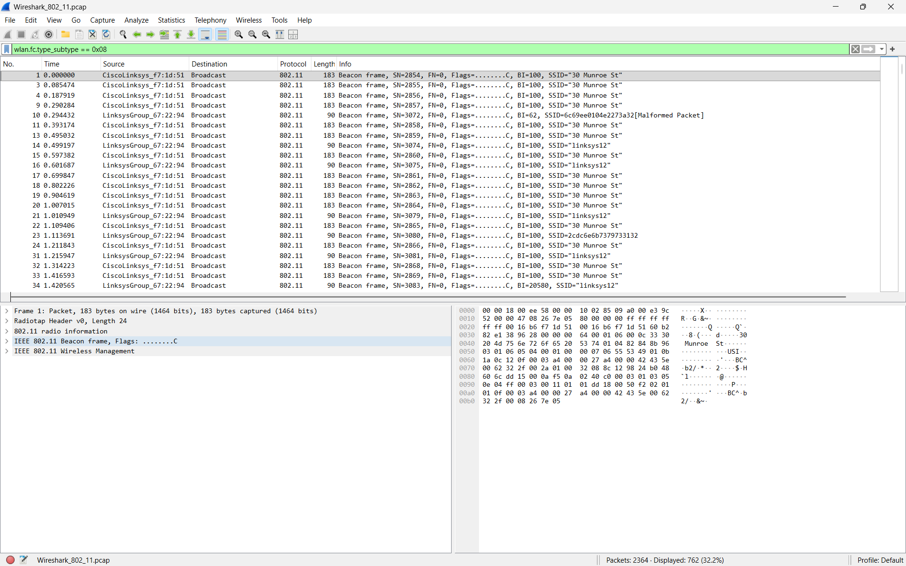
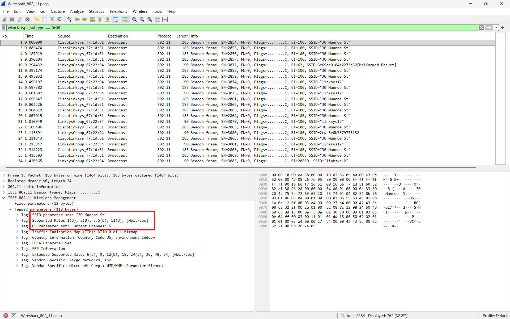
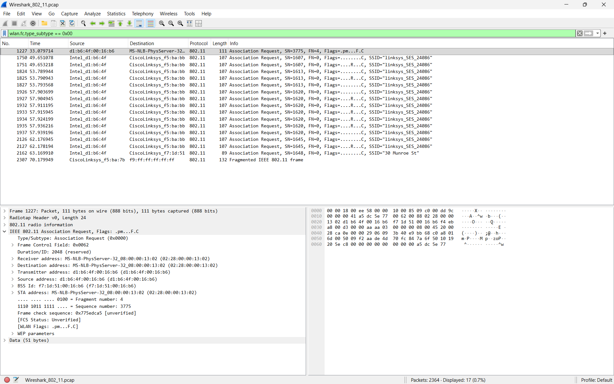
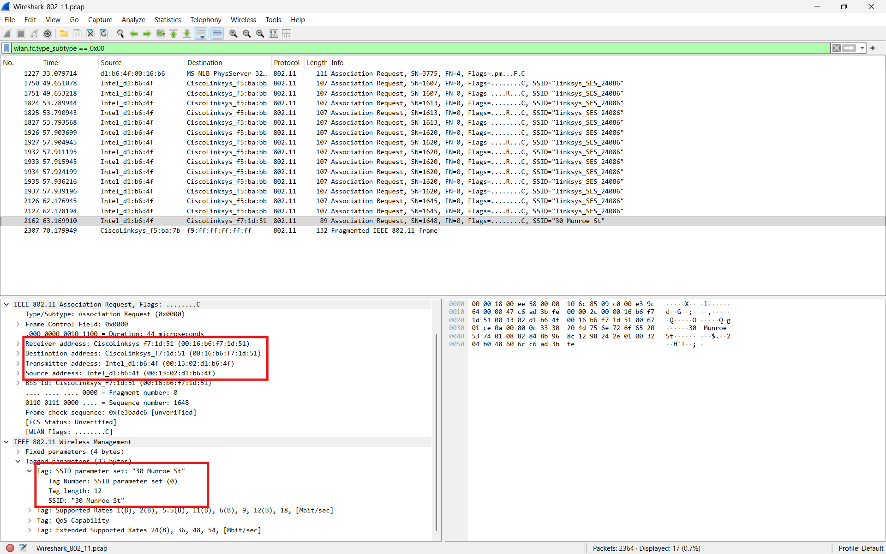
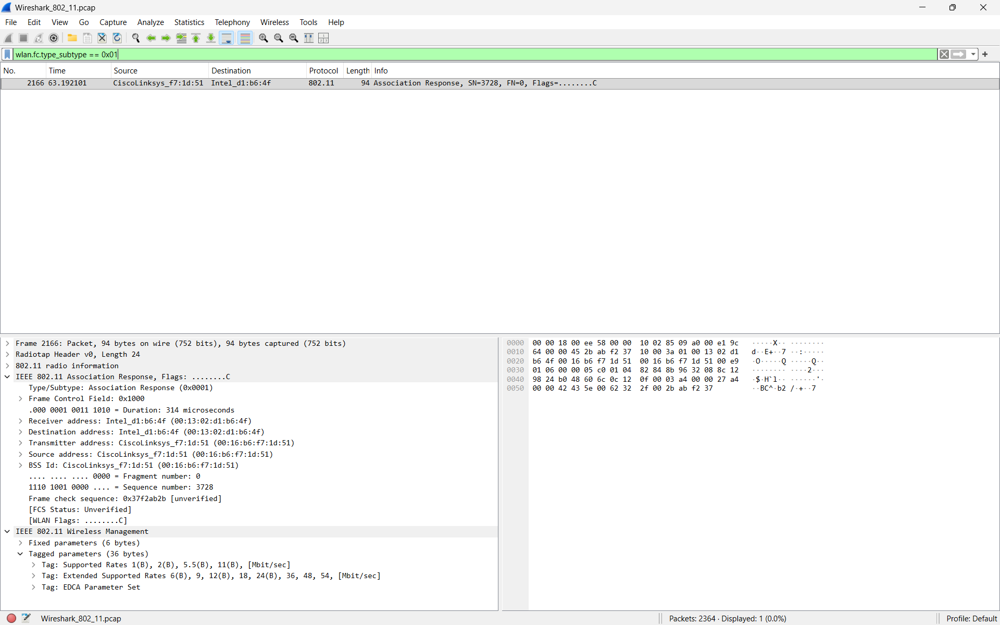
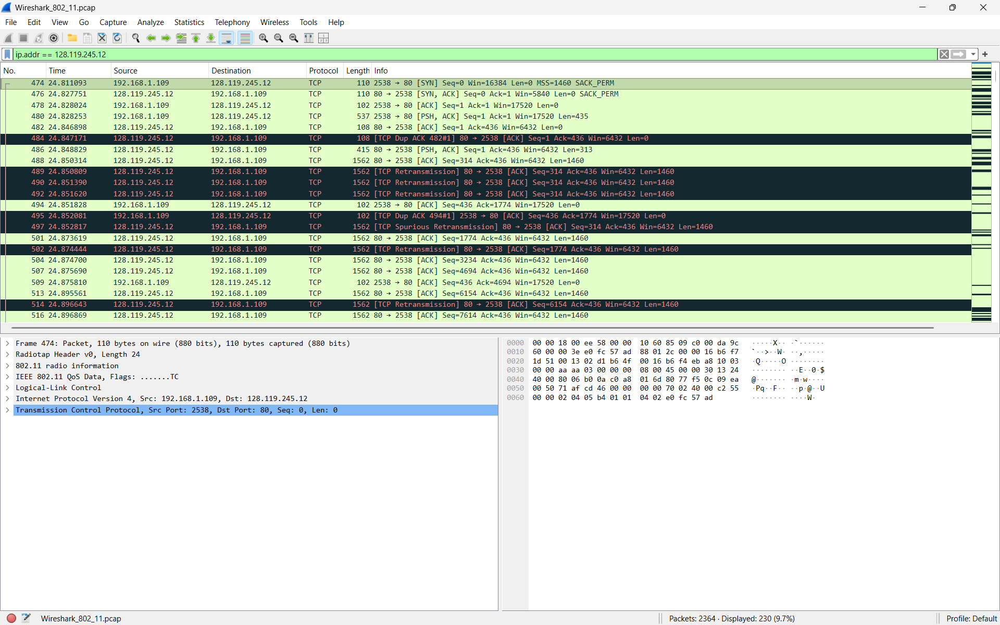
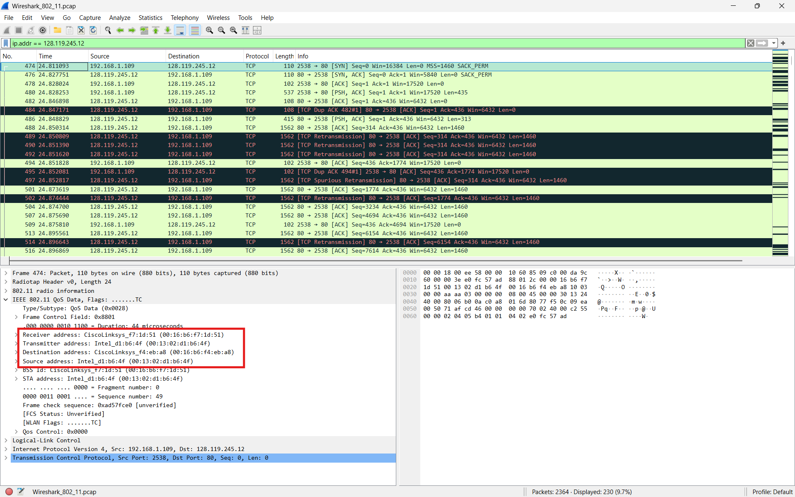

# Laporan Praktikum Jaringan Komputer
## Modul 14: IEEE 802.11 WiFi


## 1. Tujuan Praktikum
1. Mahasiswa dapat menginvestigasi cara kerja protokol WiFi IEEE 802.11 menggunakan Wireshark.  
2. Mahasiswa dapat memahami proses komunikasi wireless pada jaringan WiFi.  
3. Mahasiswa dapat menganalisis Beacon Frame, Data Transfer, dan Association pada jaringan 802.11.  


## 2. Alat dan Bahan
- Wireshark  
- File trace `Wireshark_802_11.pcap`  
- Sistem operasi Windows/Linux/MacOS  


## 3. Langkah Percobaan

### 3.1 Membuka File Trace
1. Mengunduh file:

```text
http://gaia.cs.umass.edu/wireshark-labs/wireshark-traces.zip
````

2. Mengekstrak file trace:

```text
Wireshark_802_11.pcap
```

3. Membuka file tersebut menggunakan Wireshark.

### 3.2 Analisis Beacon Frame

Menggunakan filter:

```text
wlan.fc.type_subtype == 0x08
```

Filter tersebut digunakan untuk menampilkan Beacon Frame.

### 3.3 Analisis Association Request

Menggunakan filter:

```text
wlan.fc.type_subtype == 0x00
```

Filter digunakan untuk menampilkan Association Request.

### 3.4 Analisis Association Response

Menggunakan filter:

```text
wlan.fc.type_subtype == 0x01
```

Filter digunakan untuk menampilkan Association Response.

### 3.5 Analisis Data Transfer

Menggunakan filter:

```text
ip.addr == 128.119.245.12
```

Filter digunakan untuk menampilkan proses transfer data menuju server `gaia.cs.umass.edu`.

## 4. Hasil dan Pembahasan

### 4.1 Beacon Frame



Pada gambar di atas terlihat beberapa Beacon Frame yang dikirim oleh Access Point secara broadcast.

Beacon Frame digunakan oleh Access Point untuk mengumumkan keberadaan jaringan WiFi kepada perangkat di sekitarnya.

Pada hasil capture terlihat SSID:

```text
30 Munroe St
```

Beacon dikirim secara periodik agar perangkat wireless dapat mendeteksi jaringan WiFi yang tersedia.

### 4.2 Detail Beacon Frame



Pada detail Beacon Frame terlihat beberapa informasi penting:

| Field              | Fungsi                                |
| ------------------ | ------------------------------------- |
| SSID parameter set | Nama jaringan WiFi                    |
| Supported Rates    | Kecepatan transfer data yang didukung |
| DS Parameter Set   | Channel yang digunakan                |
| TIM                | Informasi buffering frame             |

Pada hasil capture terlihat:

* SSID: `30 Munroe St`
* Channel: `6`
* Supported Rates: `1 Mbps, 2 Mbps, 5.5 Mbps, 11 Mbps`

Hal ini menunjukkan bahwa Access Point mengiklankan kemampuan jaringan wireless kepada client.

### 4.3 Association Request



Association Request dikirim oleh client kepada Access Point ketika client ingin bergabung ke jaringan wireless.

Pada gambar terlihat:

* Source Address: perangkat client
* Destination Address: Access Point
* SSID tujuan: `30 Munroe St`

Association Request merupakan langkah penting sebelum client dapat melakukan komunikasi data melalui Access Point.

### 4.4 Detail Association Request



Pada detail Association Request terlihat beberapa field penting:

| Field               | Fungsi               |
| ------------------- | -------------------- |
| Receiver Address    | Alamat Access Point  |
| Transmitter Address | Alamat client        |
| Source Address      | MAC Address pengirim |
| SSID                | Nama jaringan WiFi   |

Pada hasil capture terlihat:

* Receiver Address: `CiscoLinksys_f7:1d:51`
* Transmitter Address: `Intel_d1:b6:4f`
* SSID: `30 Munroe St`

Hal ini menunjukkan bahwa perangkat client mencoba melakukan asosiasi dengan Access Point bernama `30 Munroe St`.

### 4.5 Association Response



Association Response dikirim oleh Access Point sebagai balasan terhadap Association Request.

Jika proses asosiasi berhasil, Access Point akan menerima client untuk bergabung ke jaringan wireless.

Pada hasil capture terlihat:

* Source Address berasal dari Access Point
* Destination Address menuju client

Association Response menunjukkan bahwa proses koneksi wireless berhasil dilakukan.

### 4.6 Data Transfer



Pada gambar di atas terlihat proses transfer data antara client dan server:

```text
128.119.245.12
```

Terlihat beberapa paket TCP seperti:

* SYN
* ACK
* PSH ACK
* Retransmission

Paket tersebut menunjukkan adanya komunikasi HTTP melalui jaringan wireless.

### 4.7 Detail Data Frame



Pada detail frame data terlihat beberapa field penting:

| Field               | Fungsi         |
| ------------------- | -------------- |
| Receiver Address    | Penerima frame |
| Transmitter Address | Pengirim frame |
| Destination Address | Tujuan akhir   |
| Source Address      | Sumber paket   |

Pada hasil capture terlihat:

* Receiver Address: `CiscoLinksys_f7:1d:51`
* Transmitter Address: `Intel_d1:b6:4f`

Hal ini menunjukkan bahwa paket data dikirim dari client menuju Access Point sebelum diteruskan ke jaringan internet.

### 4.8 Analisis Cara Kerja WiFi 802.11

Protokol IEEE 802.11 bekerja pada layer Data Link dan Physical.

Tahapan komunikasi WiFi:

1. Access Point mengirim Beacon Frame.
2. Client mendeteksi jaringan wireless.
3. Client mengirim Association Request.
4. Access Point mengirim Association Response.
5. Setelah asosiasi berhasil, data dapat ditransmisikan.

Pada praktikum ini terlihat bahwa komunikasi wireless melibatkan banyak frame manajemen sebelum data benar-benar dikirim.

### 4.9 Analisis Perbedaan Ethernet dan WiFi

Pada Ethernet digunakan frame kabel berbasis MAC Address secara langsung.

Sedangkan pada WiFi:

* Terdapat Beacon Frame
* Terdapat proses Association
* Menggunakan frame management tambahan
* Komunikasi berlangsung melalui udara (wireless)

Karena komunikasi dilakukan secara wireless, protokol 802.11 membutuhkan mekanisme tambahan agar perangkat dapat menemukan dan bergabung ke jaringan.

## 5. Kesimpulan

Berdasarkan hasil praktikum, protokol IEEE 802.11 menggunakan berbagai jenis frame seperti Beacon Frame, Association Request, dan Association Response untuk membangun komunikasi wireless. Beacon Frame digunakan Access Point untuk mengiklankan jaringan, sedangkan Association Request dan Association Response digunakan dalam proses koneksi client ke Access Point. Setelah asosiasi berhasil, proses transfer data dapat dilakukan menggunakan frame data 802.11.
