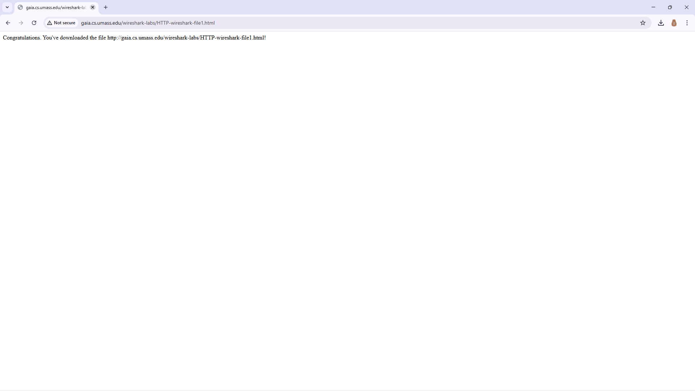
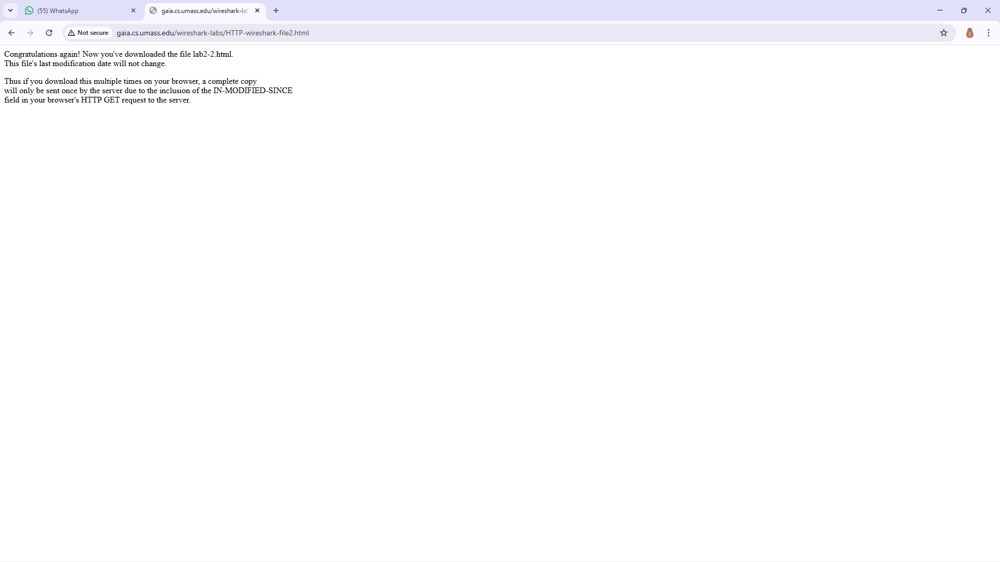
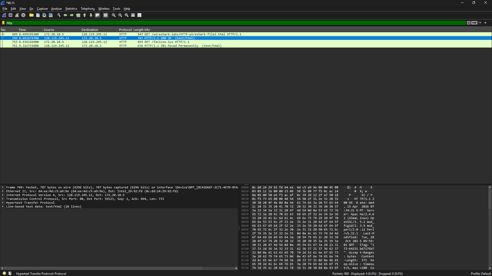
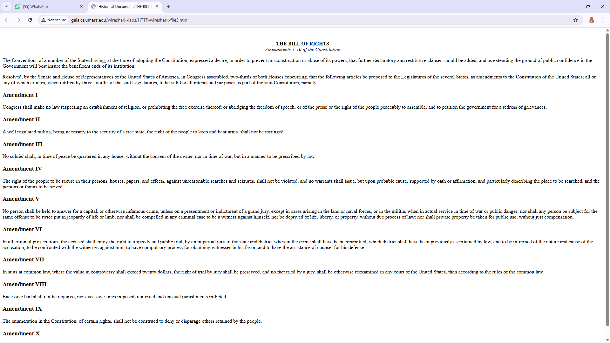
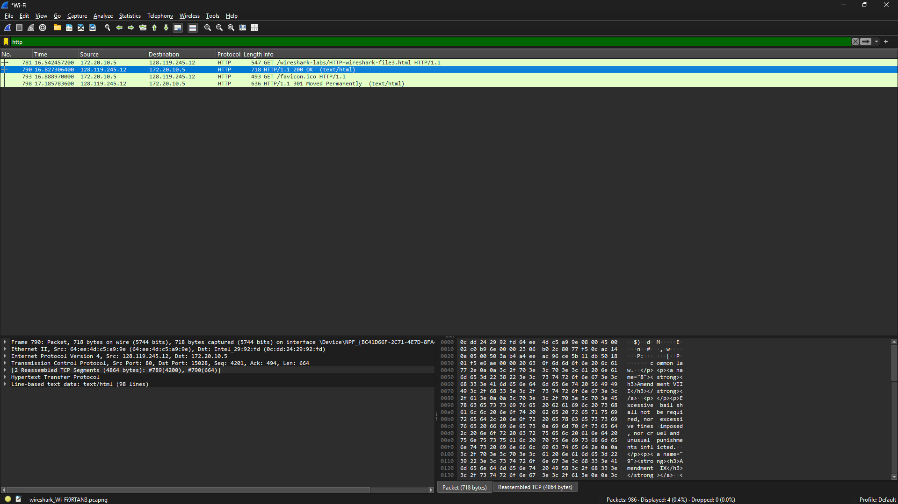
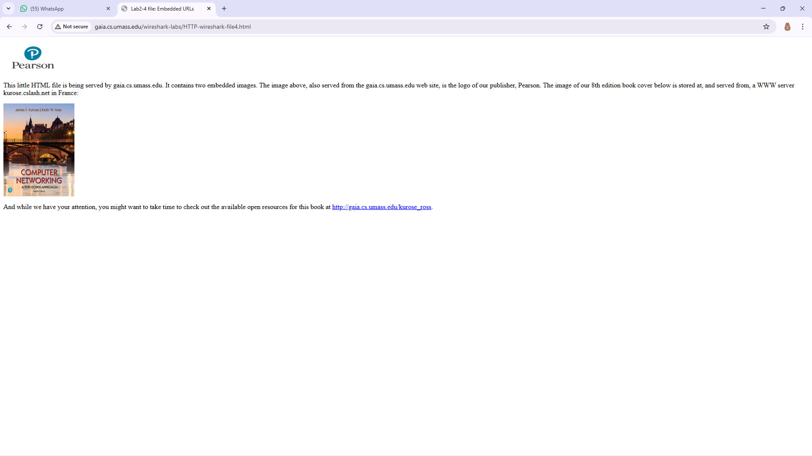
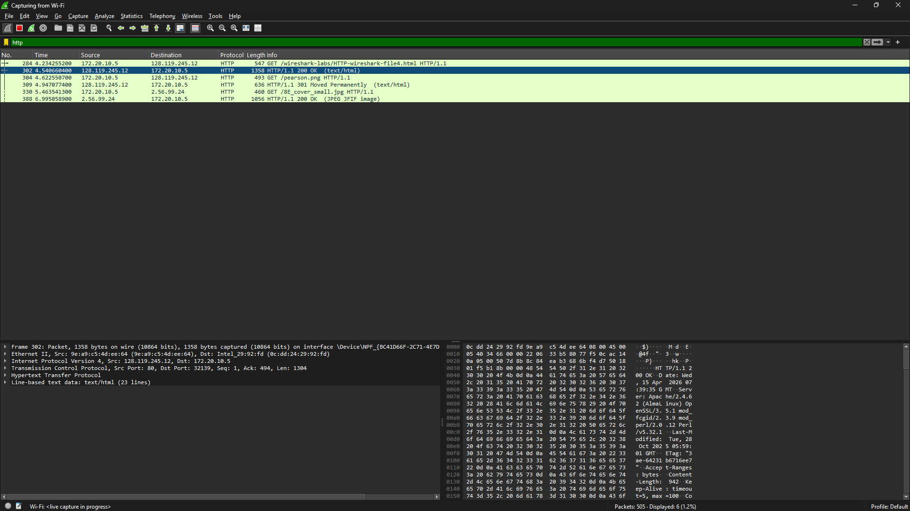
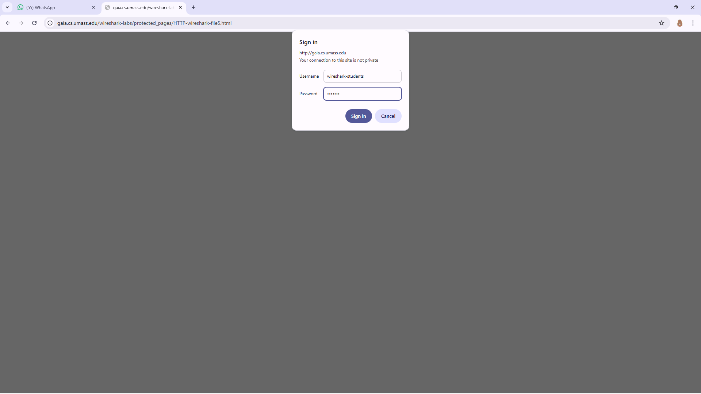
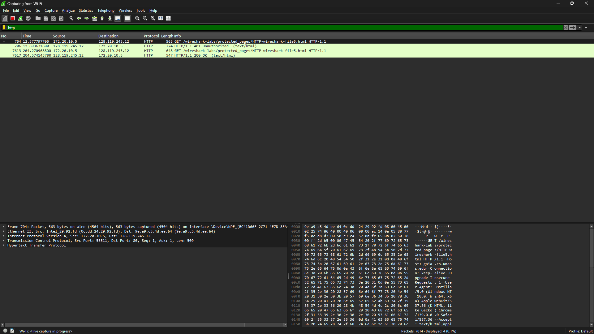

 # Laporan Praktikum Jaringan Komputer
## Modul 3: Analisis Protokol HTTP

## 1. Tujuan Praktikum
1. Memahami mekanisme kerja protokol HTTP melalui pengamatan langsung menggunakan Wireshark.  
2. Mengidentifikasi proses pertukaran data antara client dan server dalam bentuk request dan response.  
3. Mengetahui cara browser memuat halaman web beserta objek pendukungnya.  

## 2. Alat dan Bahan
- Wireshark  
- Web browser  
- Koneksi internet  

## 3. Langkah Percobaan

### 3.1 Basic HTTP Request dan Response
1. Menjalankan aplikasi Wireshark.  
2. Memulai proses capture pada interface jaringan aktif.  
3. Menggunakan filter `http`.  
4. Mengakses halaman:
http://gaia.cs.umass.edu/wireshark-labs/HTTP-wireshark-file1.html
5. Menghentikan proses capture setelah halaman terbuka.  

### 3.2 HTTP Conditional GET
1. Menghapus cache browser.  
2. Menjalankan Wireshark dan memulai capture.  
3. Mengakses:
http://gaia.cs.umass.edu/wireshark-labs/HTTP-wireshark-file2.html
4. Melakukan refresh beberapa kali.  
5. Menghentikan capture.  

### 3.3 Pengambilan Dokumen Berukuran Besar
1. Membersihkan cache browser.  
2. Memulai capture di Wireshark.  
3. Mengakses:
http://gaia.cs.umass.edu/wireshark-labs/HTTP-wireshark-file3.html
4. Menghentikan capture setelah halaman dimuat.  

### 3.4 HTML dengan Objek Tambahan
1. Menjalankan capture di Wireshark.  
2. Membuka:
http://gaia.cs.umass.edu/wireshark-labs/HTTP-wireshark-file4.html
3. Mengamati objek tambahan pada halaman.  
4. Menghentikan capture.  

### 3.5 HTTP Authentication
1. Memulai capture di Wireshark.  
2. Mengakses:
http://gaia.cs.umass.edu/wireshark-labs/protected_pages/HTTP-wireshark-file5.html
3. Login menggunakan:
- Username: wireshark-students  
- Password: network  
4. Menghentikan capture setelah berhasil masuk.  

---

## 4. Hasil dan Pembahasan

### 4.1 Basic HTTP Request/Response
  
  

Browser mengirimkan permintaan HTTP ke server, kemudian server merespon dengan status **200 OK** yang menandakan permintaan berhasil diproses.

---

### 4.2 HTTP Conditional GET
  
  
  

Server memberikan respon **304 Not Modified**, yang berarti data tidak berubah sehingga browser menggunakan data dari cache.

---

### 4.3 Pengambilan Dokumen Besar
  
  

Dokumen dikirim dalam beberapa segmen karena ukuran file cukup besar, sehingga tidak dapat dikirim dalam satu paket.

---

### 4.4 HTML dengan Embedded Objects
  
  

Browser mengirim beberapa request HTTP untuk mengambil setiap objek (gambar/elemen) yang ada pada halaman web.

---

### 4.5 HTTP Authentication
  
  
  
  

Terlihat adanya header **Authorization: Basic** yang berisi informasi login dalam bentuk encoding Base64. Data ini masih dapat dikembalikan ke bentuk asli sehingga kurang aman tanpa penggunaan HTTPS.

## 5. Kesimpulan
Berdasarkan hasil praktikum, protokol HTTP berperan dalam komunikasi antara client dan server untuk mengakses halaman web. Melalui Wireshark, proses pertukaran data dapat diamati secara detail, mulai dari request, response, penggunaan cache, hingga proses autentikasi.
